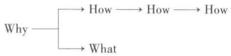

# 第一章 心理现象学

心理学这个词汇所包含的领域分支时常超出我们的预想。不仅在不同的领域存在着各种各样的心理学，即使在相同领域，因为观点、方法论的不同也时常会产生出不同的心理学。我们下边要讲到的分析心理学(AnalyticalPsychology)是由瑞士精神医学家荣格所创立，其观点跟一般心理学相当不同，因此我们一开始就把这个问题说清楚比较好。所以这一章，我们的主要意图在于搞清楚：分析心理学的对象是什么?其体系是站在什么样的立场上构架起来的?想要强调的要点在哪里？

## 1. 心理治疗师的作用

首先，我们想强调的是分析心理学与心理治疗有着密切的联系(可能有人对称“分析心理学”为心理学本身就持反对意见)。当我们的面前站着一位有心理疾患的人，分析心理学是一种思考如何去帮助他的心理学。也就是说，分析心理学并不以精密、明确的理论体系为骄傲，而是首先致力于探求在实际治疗现场更有效果的方法。就像修车的人必须了解汽车的工作原理，给人们看病的医生必须了解人的身体一样，我们这些心理治疗师—荣格倾向于称为“心灵的医生”(Seelenarzt)—则必须了解人类的心灵。荣格心理学就是构筑给予我们这种知识的心理学。

仅仅看到这里，读者可能就有很多疑问涌上心头。比如说，心灵真的存在吗？关于心灵的知识到底是指什么？心理疾病能治好吗？治疗心理疾病与治疗身体疾病的方法一样吗？我们不着急马上就扑上去解决这些难度很大的问题，先来看看心理治疗的现场究竟在发生些什么事情。

接受心理治疗的来访者，首先说出来的应该是自己的症状、苦恼等等。把这些都说出来了以后，可以说毫无例外地都会问：“先生，我到底该怎么办才好呀?”面对这样的问题，治疗师保持沉默—真实情况或许是什么都说不出来。接下来，疑问又会出来：“事情到底怎么会变得这么糟糕呢?”这个疑问来自一种逻辑推理：自己的困境一定是有原因的，找到原因，除去产生问题的原因，自己的烦恼也就解决了。思考过程实在是逻辑清晰、简单明了。基于这种想法，来访者把折磨自己的苦恼说给“有名的老师”“心理学专家”听，以为请教一下专家到底是什么原因，然后就可以解决问题。抱着类似期待来访的人很多。暂且搁置一下这种简单明了的想法在心理治疗方面的有效性，我们先来想想，在治疗现场人们时不时地发出的“为什么?”“怎么会?”,这些疑问究竟意味着什么?

一位女性马上就要举行婚礼的时候，最爱的人因为交通事故去世。这个人一定也会问“为什么？”。“为什么他会死了?”面对这样的疑问，医生可能会解释“因为头部外伤”等等，回答完全没有毛病。可是这位女性能够从回答中得到慰藉吗?为什么一个医学上很正确的回答没办法满足人的需求呢?因为,这类回答无意中把一个“为什么”(Why)的问题转换为“如何”(How),所以答非所问。医生只不过在回答:“How did he died?”(他是怎么死的?)这不禁令我想起亥姆霍兹1的名言:“物理学不是为什么的学问,而是如何的学问。”为什么会下雨?为什么会刮风?不要企图去思辨这些，而要精确地记述雨是怎么下来的、风是怎么刮起来的等现象，基于这种态度，近代物理学得到发展。说得极端一点，正是依赖于把“Why”转换为“How”，自然科学才取得了今日的辉煌成就。继而，科学文明带来了原子弹这样的强力武器。只是，这么辉煌的成就，面对患者的“他为什么死掉了”的朴素的“为什么”时，却给不出任何有用的回答。现实世界中，心理治疗师就义不容辞地站在了“为什么”这个难题面前。就算是无法对“为什么”给出直接的答案，面对着在“为什么”的路上苦苦追寻的某一位悲伤生灵，治疗师陪同在身边的姿态却绝不会松懈。仅从这一点来看我们不得不预感到，当心理治疗师面对人类心灵苦境时，仅仅具有纯粹自然科学性质的心理学，是难以担当重任的。

  
图1

那么,现实中无法满足于“How”的解答的人,会转换自己的思路，把“Why”置换成“What”。比如说刚才的例子当中，在“为什么死掉了”的疑问得不到满意的解答时，很多人会转换思路，进而去思考：“死，究竟是什么？”但是，“把我们这样深爱的人分开的死，究竟是什么？”这个问题，治疗师依然是很难给出令人信服的回答的。这时候，我们可以说“问题已经超出了我所能及的范围，请到宗教家或者哲学家那里寻求解答”吗？或许存在这样的做法，但现实中经常还是在不知道解答究竟是什么的情况下不得不继续治疗下去。

或者说，治疗师通常会抱有一种希望继续下去的意愿。心理治疗师就是这么不断负重前行的一类人。可是，“What”也是不能轻易找到答案的难题，我们把目光先转换到“How”去看看。

当小孩子问母亲:“树叶为什么会摇晃呢?”妈妈可能回答：“因为在刮风呀。”这时候经常会有孩子打破砂锅问到底：“为什么会刮风呢？”一直这么问下去，可以想到“为什么”的链条会无限地持续下去，没有尽头。对任何一个答案，都可以继续问“为什么”，而母亲则继续把问题转化为“How”。现实中，可以在适当的时机切断永续无尽的“How”的链条,这个事实教会了我们去注意看上去像是知识性的问题深处存在的情绪变动。也就是说，我们可以想到，当孩子在发问“树叶为什么会晃动？”的时候，疑问并不局限于知识层面，背后有着一种惊奇和某种内心感情的高扬。在母亲一步一步的回答中，孩子的情绪得以平静，慢慢回到平衡状态，从而心理得到满足。这么看来，“Why”的疑问，同时包含了知识面和情绪面的内容，在构建“刮风引起树叶晃动”的知识体系的同时，伴随着情绪的高扬和回归平静的过程。一度达到平衡状态后，依然会有新的“为什么”发生，带来知识体系的不断扩大。

这么看来，总是让人类苦恼的“为什么”，自夏娃吃了禁果——也就是人类有了意识(consciousness)——以来，成为人类构筑意识体系的一个力矩。靠着这个力矩，我们附着在某一种事象上的情绪高扬归于平静，在保持平衡的同时，新的内容被整合进自己的意识体系。这些，我们只要看看不知道在适当的时机切断“How”的链条的人怎么惹怒别人，就可以明白。比如说，听到因为刮风所以树叶晃动的回答以后，孩子继续问：“为什么会刮风？”妈妈火上来了：“烦死了！”结果孩子被妈妈训斥一顿。也就是说，新的提问打破了刚刚获得的平衡，妈妈忍不住发火就是在拒绝能够预想到的威胁平衡状态的局面。我们领悟到“How”背后的情感波动的因素，自然就会想到同样的思考能不能适用于“What”呢?对于患者的“死究竟是什么?”的疑问,治疗师同样也给不出直接的答案。我们把注意力从问题本身移开，专注于背后的情感波动。也就是说，面对因爱人的突然死亡而感情激烈起伏的患者，我们应致力于陪同患者共同走过恢复平衡状态的过程。这或许是一种通向解决问题的道路。没有宗教的、哲学的答案，也能够伴同患者走上通往解决问题的道路。作为心理学家，不应去追求哲学意义的“死究竟是什么?”在“死究竟是什么”的问题背后，情感如何激昂、通过什么样的过程能够达到新的平衡，这些心理现象才是我们需要面对的课题，是我们应该追求的目标。而且，这样的认知在心理治疗现场是有着实际意义的。当然，这并不意味着心理治疗师不需要了解宗教性，以及哲学性的关于死的知识和观点，但确实不能指望这些知识和观点能直接对心理治疗现场有实际的帮助。我们面前有一个人，面对“死”苦不堪言，在挣扎、在思索，这时候他最需要的是绝不松懈地陪同他走下去的姿态，即在如何从现在的局面引导向新的平衡点的心理学知识的框架中实施心理治疗。当患者迫于选择A或者B时，即使我们自己也无法给出任何知识性的解答，但坚持与患者共同体验其苦恼，并在此过程中，让患者自己找到超越A和B的解决方法，促进其动荡的情感归于更高层次的平衡，这就是心理治疗的过程。

最初我们就说到，面对患者发出的“Why”的哀号时,不随意地把它置换成“How”，而是勇敢站在赤裸裸的“Why”面前，所谓心理治疗师，就是这样一种人。综合上边讨论的内容，可以说心理治疗师虽然不能直接对“Why”给出答案，但尽量扩展视野，也就是说把视线扩展到背后的情绪变动的波澜，就能够看到不同维度的“How”。以人类心灵动态知识为基础，沿着患者编织出的“Why”的锁链，与患者携手共进，到达更高维度的平衡状态。这样我们就能逃脱“Why”的桎梏,找到通向“How”的路径,继而采用与物理学类似的自然科学手法找到建立心理学体系之路。实际上，在这个过程中，扩展视野的行为不就意味着一脚踏进了广袤无边的危险地带吗？前边说到,我们需要执行的问题背后存在着捉摸不定的情绪动态。时至今日，背后的这个存在一直是难以对付的领域，踏进去一步，内心都不由充满畏惧。因扩大视野而引发的问题，我们在下一节里详尽讨论。

## 2. 心理现象学

前一节讲到，心理治疗师即“扩大视野”观察事象的人。但是我们把视野扩展到知识体系背后的情感波澜，这个行为究竟意味着什么？面对一个活生生的人，她在讲述着爱人的突然死亡，我们敞开心扉、静心倾听，治疗师顺应着对方的语言、表情和两人之间流动着的情感互动，感觉到自己的内心也开始激昂、不安、恐慌……这早已超出了观察事象的范围，不得不说治疗师在以自己的方式体验事象。治疗师一边体验着事象，一边观察着，而患者也能观察到治疗师的态度、内心的波动，体验到因此而诱发出的自己内心新的活动。表面看上去，只是一个人在诉说烦恼，另一个人在听着；或者一个人在烦恼，另一个人在观察。实际上，这种人际关系的主体和客体微妙地交叉混合在一起，构建起一个无止境的动态场。这种现象看上去简单，实际上实现非常困难，需要治疗者充分地敞开心扉倾听患者的叙述，并不是什么情况下都能达到期待的效果。但有一点非常明确，正因为想要把握内心现象的治疗师自己也有着自我的内心世界，才会产生如此复杂的现象。当我们想把握一种现象时，如果自己也不得不成为“现象的一部分”，那么作为局外人的观察就不可能成立。我们为追求“How”的方法而将视野扩展到把自己也包含进去以后，就不可能与观察苹果落下来的牛顿持有同样的立场。这时候我们更像是手提白刃站在敌人面前的剑士，对方和自己的任何动静都有着微妙的牵连，瞬息万变中甚至潜藏着失去生命的危险。我们就是在这样的场景中求生存。

最初，我们仅仅以“扩展视野”为出发点，接着引起了主体的参与、主体和客体的错综变换等重大后果。结果，就无法把心理治疗视同立足于客观性的科学观察。试图努力遵从客观科学框架的人，走到充满危险的这一步可能就会放弃。但是，只要以“在心理治疗现场有实际作用的心理学”为目标，就不得不挺身踏入这个危险领域。所以，本书的开头我们就讲清楚：“分析心理学并不以精密、明确的理论体系为骄傲，而是首先致力于探求在实际治疗现场更有效果的方法。”因而，需要强调的是，我们这里要讲的学问与历来站在客观立场的科学生而相异。针对这种状况，浮现出了现象学(phenomenology)这个词汇。

在解释什么是现象学之前，我们先来思考一下“扩展视野”带来的另一个问题。具有主体性参与的“扩展视野”，渐渐会遭遇到很多我们的意识体系、因果律等等观念无法接受的场面。

几年前，治疗一个尿床症的小学生时，我采用了游戏疗法。和孩子一起玩的过程中，孩子对坏了的玩具和洗衣机等发生了兴趣，开始修理这些东西。经过几次治疗的过程，洗衣机能够顺畅地排水了，很巧合，这时候孩子的尿床症也完全治愈。

要把这种现象整合进“How”的模式中，或者找出其中的因果关系，实在是件很困难的事情。我们能说“因为修好了洗衣机的排水功能，所以不尿床了”吗？从这里短路地推导出一套“洗衣机式尿床症治疗法”，显然是荒诞无稽的。反过来单纯地把它作为一种“偶然”，从此弃之不顾，倒是最轻松的做法。但是，把一个现象简单粗暴地归结为“偶然”，则完全与“视野扩展”的原则背道而驰。说它偶然也罢，付诸一笑也罢，事实就在那里存在着，不可动摇。

还有，我们在心理治疗现场了解过很多可以称为“预知梦”的体验(有关梦,第七章会有详细论述)。预知梦，指梦中出现了今后会发生(或者几乎同时发生)的事情。比如说梦到伯父之死，醒来后就收到通报伯父去世的电报。对这样的现象，一般有两种态度。一种认为不过是毫无意义的巧合，毫不在意；还有一种，被这种现象感动，开始相信“梦的预告”，或者进一步用精神电流等等念头企图对现象做出“科学的”解释。我们前一节说到过，人在遇到未知事项时，会努力试图把它整合进自己已有的意识体系。无论如何努力也无法嵌入时，人们就会把它逐出意识体系之外，常用的手法有忘却、无视。碰到对自己不利的事情，人们是如何忘掉它的，这些手法经常巧妙得令人吃惊。不例外，人们对“预知梦”也有着同样的态度，要么把它作为目前为止的因果律等合理的思维范畴无法接受的内容，嗤之以鼻；要么虽不排斥，但为了把新事象整合进自己原有的意识体系中，不惜构筑起伪科学。这种思维方法的谬误之处稍有些逻辑思维就能够判断，比如说精神电流的假说。世上存在很多梦见伯父死去可伯父活得好好的例子，无法用这么简单的概念来说明。与模棱两可、含糊不清的伪科学划清界限，非常重要。但是因此完全否定“预知梦”现象的意义，也是不可取的。

在这里没能举出很多实例，但可以说要把上述现象整合进我们的“How”模式是非常困难的。现实的结果是，现代有不少具有客观科学性质的心理学学派，对这些现象视而不见，以保持自身的科学性。这种状况也和罗素对物理学的观点相似：“物理学并不是因为我们熟知物理世界而呈现数学性质，反倒是因为我们对物理世界毫无所知才具有数学性质。我们能够发现的仅限于其数学性质而已。”(1)在这里，我丝毫没有贬低具有客观科学性质的心理学的企图，内心反倒是非常认可这种心理学的价值。问题在于，我们面对在心理治疗现场遭遇到的种种现实，仅仅依赖保持着客观科学性的心理学会常常陷于困境、束手无策。像罗素指出的那样，客观科学性能够成立的前提在于限定一个适当的领域。就像刚才说到的情形，我们不能让观察者的主体与事象发生关联，需要把用因果律无法解释的事象统统排除在对象之外，才能够维持心理学作为自然科学的科学性。但事实上，我们是否在“扩展视野”的同时又意图保持科学性?既要限定涉足的对象领域，同时又想去扩展它？我们日常的困难就存在于这些纠葛当中。

那么，当对某件事情无法给出科学的说明，但同时又需要得到解释时，我们就可以说人有精神和灵验吗？现实中，好像人们更喜欢将人类的感情、思维等等归结于荷尔蒙、脑髓的功能，试图在科学地研究这些课题的同时回答伴随着的心理问题。比起“以一切归属为上帝的意志为出发点，一直解释到物质”，显然“从物质开始论说一直延伸到上帝”的思维方式更符合现在的时代精神。但是，时代精神到底又是什么呢?战时以战斗为第一道义,现在为了和平做什么都行。为了和平，可以实施任何杀戮，这样的动漫充斥着电视屏幕，我们不正在为这样的主人公拍手喝彩吗?对于时代精神，荣格说到,时代精神“是与理性没有任何关系的信条，却成为所有真理的绝对基准，总是被认为与良知为伍而碾压一切。时代精神以这种不愉快的事实为特征”(2)。荣格强调，不要沦为一个搭时代精神顺风车的人，而要做一个尽可能尊重事实的科学家。对精神和物质究竟该如何取舍?荣格给了我们如下的回答(3):

作为解答这个问题的尝试，我是这么思考的。自然和精神(nature and spirit)的纠葛，正是心灵存在中悖论的反映。正因为我们对心灵的存在一无所知，它才对我们呈现出相互矛盾的精神面和物质面。对自己根本没有完全掌握的事象，我们试图以人的理解能力发言。只要我们还是诚实的，就不能厌弃由此带来的矛盾。

论述中展现的不是简单地对物质或是精神的取舍，而是努力去接受充满矛盾的心理现实的姿态。产生这样的矛盾，正如我们在这一节开头时说的那样，来自“主体的参与”。也就是说意欲把握“心理现象”的我们同样有着“心灵”，可以认为正是这个事实带来了根本的矛盾。荣格说道，在充满了难以把握的矛盾的领域里，我们能够依靠的现实只有“心理现实”(psychic reality)。我们用荣格举的一个例子来具体说明一下心理现象4)。比如玛利亚的处女怀胎。欧洲是合理主义的代表，日本人非常崇拜欧洲，但对日本人来说非常不可思议的是，合理主义的欧洲人竟然世世代代相信处女怀胎！作为心理学家，我们并不去讨论处女怀胎的非科学性，反过来也不力图去科学性地证明其存在的可能性。作为存在事实，我们不认可处女怀胎，但努力思考存在处女怀胎思想的意义，并将这种思想当作心理现象来讨论。众多人共同信仰处女怀胎，而把这个现象当作一种心理现象追求其意义，就是我们所要采取的态度。在这方面,荣格遭到了不少很表面的误解，好像他相信存在着处女怀胎、炼金术等事实一样。荣格绝对没有把这些当作事实去相信，他所关注的是人们信仰这些或者试图信仰这些的心理现实。这一点我们需要强调一下。就算荣格不是一个合理主义者，但他也绝对不是一个非合理主义者。

上面从心理治疗师追求解决实际问题出发，延伸到“扩展视野”，引出了“主体的参与”这个重大的问题，通过主体参与把握到的心理现象、心理现实，得出用普通的因果律难以理解，难点丛生。这种逼近现象的方法与客观科学大相径庭，我们抽取此特点，将其称为“现象学”。关于现象学的概观以及笔者的一些思考，将在下一节讨论。

## 3. 现象学概观

笔者早期就试图采用现象学的逼近法，作为临床心理学领域的方法论(5)。近来，日本很多临床心理学家渐渐对这个方法显示出兴趣，真让人高兴。但是，简单地说现象学这个词，每个学者可能都有自己不同的解释，我们首先厘清一些相关事项。

提到现象学，我们脑海里首先浮现的是雅斯贝尔斯的名字吧。面对客观事实，根据患者内部的主观体验，描绘出在意识当中存留、发生的事项，他命名该手法为现象学。用刚才讨论的模式来叙述的话，可以陈述为：在将观察的目光转向内心世界的同时，将“Why”转换成“What”。参考前一节的内容，我们知道只要考虑到“主体的参与”，仅仅一个“现象的记述”就变得相当复杂，不可能是单纯地记述外部事象，记述下来的只能是通过自己的主体干预以后的事象。针对这个问题，雅斯贝尔斯主张尽可能排除观察者的参与程度，贯彻纯粹记述的原则。因此他的记述非常明晰，也正因为如此，他的方法阻塞了与患者接近的道路，使得心理治疗变得几无可能。确实，他对弗洛伊德的批判非常尖锐，自己的记述也非常明晰易懂，但我们不得不遗憾地看到，从他的方法中并没有产生出心理治疗的可能性。

那么，相对于雅斯贝尔斯的现象学，在主体参与方面应该还存在着稍有不同的现象学吧。实际上，现象学家，各自都有着不同的地方。下边我们稍微详细地讲述一下。

我们可以认为重视现象学逼近法的人们有一个共同点，就是对个人的内心世界、主观世界的尊重。

弗洛伊德开创的精神分析(可参照下一章的相关内容)来自临床现场的需要。以患者具体人格形象得到的现象学事实(phenomenologicalfacts)为出发点，渐渐逼近并结合生物学客观的研究成果,进而产生出精神分析方法。弗洛伊德受欧洲19世纪强大的客观科学至上精神的影响，甚至执着于浪漫主义对“How”的无止境追求，才孕育出具有开拓性的成果。弗洛伊德的两面性，受到了雅斯贝尔斯的痛击，也正是其学说的决定论色彩，使得持批判态度的阿德勒和荣格相继远离(参照下一章)。荣格一边批判弗洛伊德的决定论色彩，一边屡屡强调自己作为“经验论者”，是重视经验的科学者(对东方文化抱有浓厚兴趣的荣格，同样强烈地执着于“How”,真实地反映出了东方和西方思想之差别)。相对于此,与海德格尔的存在主义有着紧密关系的博斯(Boss,M.，1903—)对荣格的态度提出批判，强调只有通过本质直观才能够接近事象本身。也就是说，对现象排除一切价值判断，对现象的原因、背景相关的一切不做任何肯定，甚至排除主观和客观的区别。但是，彻底做到这一步的话，记述本身就伴随着极端困难，努力往往反倒使外界感受到强烈的主观性，或者陷于一无所获的境地。

在欧洲发展起来的现象学，近来在美国得到重视，创造出美国流派的成果(7)。罗洛·梅1等与欧洲的学者还没什么差异，而罗杰斯²的思想就具备了浓厚的美国特征。这些都被详细地介绍到日本,不做赘述8。我们在前边说到的弗洛伊德具有两面性的精神分析，传到美国以后，其现象学的色彩渐渐淡化，反倒作为客观科学受到追捧。面对如此现实，作为对照产生了罗杰斯的理论体系9。这一点，我们不能忽视。精神分析的思想被美国的心理学家交口称赞，派生出很多浅薄的解释和技法，流行于世。这时候出现了罗杰斯，比起解释的技术问题，他更加重视强调心理治疗现场的治疗师的态度，可谓功绩卓著。另一方面，由于美国普遍对外部现实的极端尊重，罗杰斯的现象学并没有像荣格等欧洲的现象学者所瞩目的那样扩展到心灵领域，而是基本上止步于对内省的尊重，或者说过于偏重患者的现象场，忽视了对治疗师人格的考虑。不过，最近又渐渐开始强调治疗师与来访者的相遇、相互作用等等。正是在这个时候，罗杰斯的学说被介绍到日本，“对来访者，不拘泥于任何条条框框，见了再说”的倾向越来越强烈。

笔者既不是宗教家，也不是教育者和哲学家，再次仅站在实际从事心理治疗人士的立场做一个探讨。“对来访者，不拘泥于任何条条框框，见了再说”，其勇气可嘉，但笔者作为一个实际在现场工作的人对此只能持两可的态度。也就是说，笔者虽极力在解释现象学逼近法，但还是不敢“不拘泥于任何条条框框”。现实当中，我认为还是需要掌握了一定程度体系化的知识再去见患者。我的看法可能会受到指责:这不还是带着条条框框吗?说是条条框框，但这是我们抱着前述的态度通过努力得到的主体经验的成果，跟单纯概念性的条条框框完全不可等同(具体到笔者本人，指的就是荣格心理学)。无论如何，在体系化的知识体系(我们称其为框架吧)背景下面对现象时，我们必须持有一种比照现象进而改进框架的柔软姿态。正因为依赖着框架才有了接近现象的手段，才有可能在把握现象以后认识到修正框架的必要性，在充分考虑两方关联性的基础上来讨论框架。从这一点来看，如果海德格尔的现象学才算得上真正的现象学的话，笔者掌握的现象学则有着逼近的性质，与其说它是“现象学的逼近法”，可能称其为“向现象学逼近”更为合适。也正因为这样，才能找到传达的可能性，并且打开“How”的窗口，在工作中找到可以依靠的依据。在治疗的实际现场，“赤膊上阵”式的努力如果被无意识的自卫本能搅扰而空转，尽管语言层面或许显示出海纳百川的态度，但无法带来实质性的发展，心理咨询现场也就演变成为一块不毛之地。这种状况时有发生，因而笔者深切地感觉到选择一个适合自己的框架的重要性。关于这一点，罗洛·梅在强调逼近式现象学治疗的重要性的同时，指出：“（它的)大前提是心理治疗师在训练中对技术知识和心理动态的缜密研究。”(10)和我们这里说的完全是一个意义。前边提到的博斯，也采用了自由联想法等精神分析的技法。而罗杰斯学派的人们则仅仅表现出比较重视具有现象学特征的研究的态度，笔者正因为赞同这个态度，因而更加觉得止步于此非常可惜。

有关现象学我们已经讨论了很多，下面有必要解释清楚笔者自己的立场。在这里，笔者不仅是一个荣格心理学的应用者，同时也是临床心理学方法论的提供者，以此身份表明自己对现象学的思考结果。对笔者来说，所谓现象学，就是“在尽最大可能努力扩展自己的视野的同时，以自己的主体参与进事象的方式，尽可能准确地把握通过主观和客观认识到的一种布局”。

一般说明现象学时经常会用到“排除一切前提”“主观和客观分离之前”以及“现象的记述”等表达，笔者在此逐个做些许置换，表达站在实际治疗现场的思考。

这样对现象学思考下来，笔者想起曾经就本章最初谈到的“心理治疗师的作用”与荣格派的比较亲近的人们做过讨论11)。往年对笔者进行心理分析的导师斯皮格尔曼博士给出的解答是“soul’的研究”(study of the soul)。这句话的含义准确地诠释了“心理现象学”。针对心理治疗师的使命，“心理现象学”表达出的意义非常深刻。

## 参考文献：

(1) May, R. , Existential Psychology. Random House, 1961.

(2) Jung, C. G. , Basic Postulate of Analytical Psychology. C. W. \* 8, p. 340.

(3) 同上，p.352。

(4) Jung, C. G. , Psychology and Religion. C. W. 11, p. 6.

(5)河合隼雄「現象学的接近法についてロールシヤッハ法における方法論の問題」『ロールシャッハ研究』V、一九六二年、一五〇一一六一頁。

(6) Jaspers, K., Allgemeine Psychopathologie. 5 Aufl., Springer, 1947.

(7) May, R. et al. , Existence.Basic Book, 1958. 及(1)。

(8)罗杰斯学说在日本有广泛的介绍,著作全集由岩崎学术出版社出版，可参考阅读。

(9)有关精神分析有众多的出版物，在美国，一般大众也有所了解。而日本虽说已多有介绍，但还处于连弗洛伊德都未得到普遍理解的境地。因而，罗杰斯学说在两个国家的意义大不相同。

(10)佐藤幸治訳編『実存心理入門』誠信書房、三十七一三十八頁。

(11)“心理治疗师就是治疗神经症的人”，这种说法非常浅薄。凡是有过心理治疗经验的人应该都能体会到这一点。

\* C. W. : 指 Collected Works of C. G. Jung, Pantheon Books,数字表示全集中第几卷。
