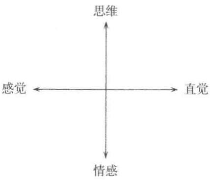
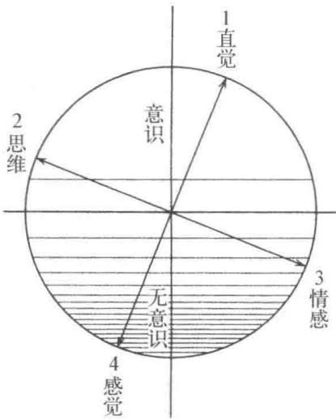

# 第三章 心理类型

1907年，荣格初次见到弗洛伊德，作为合作者他们共同走过了一段路程。后来，荣格1912年发表的《力比多的变迁与象征》呈现了两人思想的差异，以此为界线，与弗洛伊德分道扬镳。分手以后的荣格在寻求自己的道路上艰苦奋斗，最初出版的书是关于人的心理类型的论述1。按照荣格自己的说法，想要说明自己走的路与弗洛伊德和阿德勒有什么不同，就得给自己的思想找准定位，心理类型正是这种努力的产物(2)。前一节我们已经谈到，荣格认为弗洛伊德和阿德勒的不同之处在于两人看待事象的态度不同，因而试图对这样不同的类型做出描述。关注到每个人面对同一事象时个人意识层面的态度不同，对荣格往后努力探明无意识的心理过程起到了很重要的作用。这也恰恰说明在研究无意识的心理过程之前，思考个人意识层面的态度不同的重要性。荣格把意识的态度当作重要课题的同时，时刻不忘无意识的补偿作用(compensation),对两者的互补性、心理整体性一直持有浓厚的兴趣。很明显这里边隐含着荣格贯穿一生倾心研究的自性，也说明了荣格心理类型方面的著作的重要性。

荣格用到了内向(introvert)和外向(extravert)的概念，作为术语，这两个概念无人不知，但其本意应该说并没有得到足够的理解。下边我们遵从荣格的思想来解释一下类型的问题。

## 1. 人的类型

尝试根据性格和气质将人分类，远有希波克拉底的气质论,近有恩斯特·克雷奇默(Kretschmer，E.，1888—1964,德国医学家、精神病学家)的气质分类、谢尔顿(Sheldon，W. H.,1899—1977,美国心理学家)的体型分类等众多的研究成果。但根据类型论来研究人格还是受到很多批判，研究本身也存在很多自相矛盾的内容，所以在讲述荣格的理论之前，先就这一点谈一下我自己的看法。

首先需要强调的是，划分类型的意义在于找出接近某具体个人时需要的坐标轴，而不是为了把人划归到某一类型、装进某个分类的盒子里去。初次接触关于类型的书籍，人们容易犯的错误就是陷入后一种想法，动不动就把人归为A类型或者B类型，轻易地给人贴上标签。这么一来，就把人像昆虫标本一样用针固定在了类型盒子里，忽视了人的活力，对于我们这些心理治疗师来说这种分类毫无意义。实际上，难以想象(至少对正常人来说)现实中存在完全内向的人或者完全外向的人。把类型学当作一个坐标系来看的话，很难找到一个人正好处于坐标轴上，或者一直静止在某个坐标点上。我们通过与坐标轴的偏差、在坐标系里移动的轨迹来找到某一个具体人的特征，应该说这一点的现实意义远远超过了简单的分类。同时还要注意到，关于坐标轴的设定方式，荣格、克雷奇默还有谢尔顿等都有各自的特点和差异，我们具体应用的时候，还要考虑对自己来说哪一种更加合适。

接着我们想考察一下人的基本态度(basic attitude)和外部能够观察到的行动(observable behavior)之间的关系。因为这两者关系的复杂性，引起了类型学中的种种混乱，所以需要专门来谈一下。很多类型学家,特别是欧洲的，有意识、无意识地倾向于把重点放在人的基本态度方面。但进入20世纪后人们对客观主义愈加重视，特别是在美国，于是把注意力放在能够观察到的外部行为上的研究日渐增多。这样引起了一个复杂的问题,即人的基本态度与可观察到的行为并非一一对应。比如说，不能断言内向的人一定不擅长与人交往，缺乏行动力，思想迟迟不能付诸行动。话虽这么说，想要说明基本态度的时候，又总归需要记述某些能观察到的行为，这个难点是无法回避的。因而，如果不用全局的眼光看待描述基本态度的语言，不把它当作示意某种布局当中的要素，而是把每一个词语割裂开来，那么我们在记述某种类型的语言中就会发现互相矛盾的词语，不同类型又会共用相同的词语。

站在僵硬的行为主义的观点来看，这就是一种非常不可思议的情形。这种现象无疑是前边所说的基本态度和外部行动之间的差异引起的，而且人力干预也难有作为。欧洲和美国的类型学，或者说性格学的差异也表现在这里。作为罗夏(Rorschach，H.，1884—1922)测验方法中心概念的经验型思想在美国慢慢变得几乎无人问津。看上去好像是基于荣格内向一外向思想的问答卷方式的向性检查，检查得出的向性与荣格的定义又不怎么吻合。这些都和前边讲到的内容有所关联。关于这一点，在思考人格的类别时就要时刻注意究竟把重点放在前述两种观点的哪一端。

我们不得不指出，荣格时常强调的心理互补性也是给类型论带来混乱的重要因素之一。也就是说，人的心灵内部存在着补偿自身类型片面性的倾向，因而只对人的行为做肤浅的观察，或者仅依赖本人的主观判断，问题会被搅和得越来越混乱。看上去一贯很沉着、有思想的人突然感情冲动地爆发出来，成天缩手缩脚的人某一天很意外地在人前放声高歌，这些例子在日常生活中不难遇到。面对这样的情形，我们如果把目光只放在其中比较引人注目的部分，就会难以做出适当的判断。

实际上，对那些仅凭外部行动难以判断的基本态度，看上去好像也不必过多地给予关注。在从事心理治疗的过程中，甚至可以说这样更加有用。因为如果我们过于关注这种基本态度，自身的主体性就会参与进去，就会将视野扩张到比外部行动更深的层次中去，这与我们第一章中讲到的现象学的逼近法比较接近了。这大概也能说明，为什么尽管得不到美国实验心理学家(包括日本心理学家)的青睐，但对每天实际接触活生生的人的精神病学家和心理治疗师来说，欧洲流派的类型法依然有着不可抗拒的魅力。即使在美国，实际从事临床的芒罗(Munroe，R.，1903—1963)也在自己论述精神分析诸学派的名著中介绍荣格的部分感叹道：如果美国的学生们都能多读一读荣格的著作，就不会把测验的结果直接拿去对应行动，而是能更敏锐地感受到对象的基本倾向(underlyingtrends)，自己也就不会这么费劲了(3)。她还强调了人的基本倾向与能够观察到的外部行动之间的差异，而罗夏测验给出的结果应该更倾向于表明人的基本态度(4)。

我们这么讲下来，并不是要说明通过各种方式把握到的态度与行动是毫无关系的。作为人的基本态度，荣格讨论的内向—外向概念得到了“toughminded型”心理学骁将艾森克(Eysenck,H.J.,1916—1997)的承认(5),这一点具有真正令人瞩目的价值。

下边,在目前讨论内容的基础上继续探讨荣格的类型学。

## 2. 一般态度：内向一外向

前一章中讲到荣格认为弗洛伊德和阿德勒的不同来自两人基本态度的不同。弗洛伊德认为个人表现到外界的人性和事件是规范人的行为的要因，相对于此，阿德勒则把重点放在人的内在因素即对权力的欲望上。这样，即使看到同样的事象，观察者的态度不同都会引起想法、看法的不同。荣格非常重视这一点，提出了人有着两种不同的一般态度的观点。当某一个人的关注点、兴趣在于外界的事物和人，其特征表现为与这些的关系和依存性，这种人被称作是外向的；相反，另一种人的关注点在于人内心的主观因素，则被称为内向的，以区分两者的不同。借用荣格本人的说法如下(6)：

在人世间有这样一群人，对某一种状况做出反应时，嘴上虽然没有明说，但像是在说“否”一样，首先身体向后缩一下，然后才开始反应；而在相同的状况下，存在另外一群人，很明显地能看出来对自己的行动有着明确的自信，立刻走上前来做出反应。这样，前者的特征表现为与客体的某种消极关系，而后者的特征则表现在与客体的积极关系上。……前者对应为内向态度，后者对应为外向态度。

在进入一个新场面时的行动体现了两者的不同特征。这时候，外向的人惯常表现出与场面融洽的行为，而内向的人总归免不了在什么地方显得那么不自在。外向的人不去深想，适当地跟这个人打打招呼、适当地沉默一会儿，简直就像早就很熟悉这个地方一样，能够和整体的场面融为一体。内向的人，一脸迷茫，心里犹豫着说这个会不会被人笑话而保持尴尬的沉默，有时又会觉得“这个场面是不是要搞得气氛热闹一点”，被这个想法驱使着有时又会干出点傻乎乎的事情，然后一个人暗地里后悔得不得了。就这样，外向型的人在新环境下挥洒自如，而内向的人则在自己内心认可的熟悉的环境里发挥力量。在全新的环境里看上去像是个无能儿一样的人，适应了环境以后，慢慢表现出其潜在的能力，可以显示出让周围人大吃一惊的内涵。现实中不难找到这样的例子。

外向的人在孩提时代一般比较占便宜。不管进幼儿园还是上小学，很快就能适应新的环境，察觉到老师和大人的想法，按照大人希望的样子行动。平时很少感觉到不安，在新的环境里积极行动。当然，如果外向的倾向过于强烈，对外界的事情显示出过分的兴趣，喜欢冒险、不安宁，有些喜欢听话的孩子的老师也会头痛。反过来，内向的孩子在幼儿园和小学低年级经常会感觉到适应困难。他们很难交朋友，跟老师也难以亲近。即便有着丰富的才能，也没办法很自然地表现出来，甚至有可能被看作是怪物。因而，内向的孩子经常成为老师、父母心头的负担。但实际上并不需要特别担心他们。这时候既不要热衷于去矫正孩子的性格，也不要给孩子贴上“行为怪异”的标签。过分地热衷于插手干预孩子，反倒容易扭曲孩子的发育过程。即便在这样那样的外界压力下，具有内向才能的人有些还是能够扩展自己的世界，逐渐成才，但仍然有一些人终会陷入失衡的自我世界。尽管掌握着深层的知识，失衡的人格给自己、给他人都带来深深的苦恼。还有些人奋力抵抗外界的压力获得成功以后，开始欺凌别人、报复社会，以发泄怨愤，补偿自己成长过程中受到的伤害。所以，无论如何，为了避免孩子成长过程中的人格失衡，教师把内向性格的孩子看作一个正常的人，接纳其行为特点，就显得非常重要。

外向的人表现为一般所说的擅长社交，兴趣广泛，广交友人，随时随地都能表现出恰当的行为举止，可以与很多人保持着顺畅的人际关系，给日常生活、工作的执行力打下良好的基础。反过来，外向的人的思维往往有肤浅的一面，经常也就显得非常平庸。外向的人在与外人结合的背景下一般都会以适当的自信在行动，但也会在碰到一点外界障碍时受挫，显示出脆弱的一面。在这方面，内向的人总是过度地自我批判，看上去很没有自信，但是拿定主意了以后往往不惧困难、轻易不会畏缩。两种特征的人形成鲜明的对照。内向的人在自己熟悉的领域以外，与客体的关系总是不很顺畅，其中有些人所有的关注点都在充实自己的内心，毫不

关心内心与外界的交流。

当然，这两种不同的一般态度并不以绝对的形式存在，通常一个人总有着两个不同的方面。但大多数都有着基本的倾向，某一种态度习惯性地表露在外，另一种则隐藏在其背后。这样，我们对一个人就可以按外向型、内向型等来做类别划分。这两种类型的特征，荣格认为可以归结为天生的素质。作为证据，首先，可以看到这两者的分布与社会阶层的差别、性别毫无关系；其次，内向、外向的特征在非常幼小的年龄段就能够观察得到；再加上很多实例中可以观察到，如果极力去逆转基于个人素质的不同态度，则当事人会表现出极度疲劳，危及健康。先不谈荣格的观点能不能得到我们全面的赞同，仅仅最后一种现象也值得我们给予特别的关注。现实中，经常能看到的很多神经症患者的事例，可以认为是在环境的强力压迫下扭曲自己固有的一般态度而造成病态的。由外向型父母养育的内向型的孩子，出生于内向型双亲家庭的外向型的孩子，不得不极力迎合父母的一般态度，过程多数都很痛苦。有些孩子的努力取得了一定成功，但因违背自己的天性，随后发生问题；从内向的日本到外向的美国留学的学生，竭尽全力地顺应美国的生活方式，表面上看着取得了某种成功，私下却因为神经症而苦恼。这样的例子不少见。

我们谈到了环境的压力，不得不指出，与这种压力关联的是集团(家庭、社会、当下的时代精神等)有着崇尚某一方的态度、赋予某一方的态度以更高的价值判断的倾向。比如荣格所指出的那样，西方的价值观更崇尚外向态度，对其总是用社交能力强、适应性好等肯定的词汇来描述。反过来，则认为内向型态度过于以自我为中心，甚至是病态的。在魏宁格(Weininger，0.，1880—1903)的性格论的著作中可以看到，他在非常关注内向型性格的同时，使用了“自我性爱型”“以自我为中心”等词汇做表述7。对弗洛伊德来说，内向甚至就简单地意味着自闭、病态。实际上在美国，“内向的”这个词普遍地让人联想到怪物、适应障碍者等含义。相比较而言，东方则一直给予内向型态度很高的评价。因此，在东方世界漫长的历史进程中，人们一直在享受着丰富的内心世界的同时忍受着物质世界的贫穷。到了近代，惊叹于西方文明的飞速进步，至少在日本，对外向型态度给予正面评价的思想慢慢有了地位。当然，这些与西方根本性的外向型价值观比较起来，很多不过是因为对传统内向型价值观的逆反作用引起的对外向态度的过高评价，或者在内向的根基上披了一层浅薄的外向型外衣。总的来说，无论东西，在整个世界都倾向于给外向态度以高度评价的时候，可以说荣格心理学就像是跟全世界唱起了反调。也可能正因为如此，心理治疗才具有了行之有效的意义。

下边，我们想强调的是，内向或外向态度的片面性行动并不一定具有一贯性。比如说，平时缩手缩脚连大声回答问题都做不到的人突然在很多人面前跳起了滑稽舞蹈；平常总是走哪儿都热热闹闹给大家带来欢乐的聚会气氛的人突然没缘由地消沉，这样的例子经常能见到。为了说明这种现象，相对于有意识的态度，荣格提出了无意识的态度，认为这两者呈现互补关系。也就是说，一般情况下，意识态度表现为外(内)向的人，其无意识的态度则具有内(外)向的特征。当过分强调了意识的态度，无意识态度对意识态度就会发生补偿性作用。特别是意识层面态度的片面性过于强烈，无意识态度受到强力压抑后时常会冲破意识态度的控制，表现出病态的性格。从这个观点出发，荣格指出外向型人的神经症经常会表现出歇斯底里(癔症)，而内向型的人多见精神衰弱症(psychasthenia)。

也就是说，癔症是外向型人的特征，日常生活中外向型人会消耗很多精力来吸引外人的注意、努力给外人留下深刻的印象等，具有自我显示倾向，容易受外界影响、接受暗示。外向型人一般比较喜欢说话，为了能得到他人的喜爱，有时甚至不惜编些根本不存在的事情说出来逗大家高兴。但是，肉体的障碍往往作为手段，以制约外向的片面性，极力想把向外部倾泻过头的心理能量拉回内部。无意识层面的机能这样开始活动起来，尤其会使得症状复杂化。继而，带有内向性格特点的空想渐渐旺盛，外向型人慢慢变得毫不顾及周围人的想法，行事总是以自我为中心。

反过来，我们再看一下内向型性格的情况。说明内向型人的神经症，可以举出精神衰弱症的例子。内向型的人平常极力隔断与客体的关系，他们越是贬低客体的价值，无意识的态度就越会成为客体的俘虏。因为这种内心世界相克的搏斗，自己本身的能量渐渐被消耗至枯竭。内向型人对社会上追求的名声、地位等等毫无兴趣，确信自己站在超脱世俗见识的优越位置，但他们无意识的内心活动又渴望着自己看不上的地位、名誉，因而总是体验着不愉快的刺激。从外表看不出当事人有什么具体行动，但其内心的纠结、搏斗慢慢引起了神经症。一方面显示出神经的异常敏感，另一方面又因为极易疲劳而给人迟钝、懒于行动的感觉，这可以说是精神衰弱症的特点。

从我们上边这些叙述中可以看到，针对具体某个人的行动，如果不区分意识态度的表现还是无意识态度的表现，就很难将人分类为某一种类型。而且，观察者自身的类型，也会与观察对象的类型互相牵扯，影响到观察结果。关于这一点，荣格有如下论述(8)：

一般说来，依赖判断能力的观察者比较容易把握意识的性格，而知觉型观察者则更多地受到无意识性格的影响。原因在于，主要依靠判断的人比较关心代表心理过程的意识动机，而知觉则仅仅是记录现象的。

总结一下，无意识态度引起的行动，总归在什么地方表现出偶发、失控、幼稚等特点，有时会给人异常、病态的感觉。从这些特点可以区分出与意识态度行为的不同。只有在区分出两种行为以后，我们才可能判断某一个人的类型。

## 3. 四种心理机能

上边讲到的两种一般态度之外，荣格还提出了每个人具有各自最擅长的心理机能。所谓心理机能，即在种种不同的条件下，原则上保持不变的心理活动形式。荣格举出四种根本的机能类型，分别指思维(thinking)、情感(feeling)、感觉(sensation)、直觉(intuition)。比如说，看到一个烟灰缸，有人注意到它属于陶瓷这一门类，开始思考烟灰缸的易碎性等属性,这属于思维机能；有人关注点在这个烟灰缸一眼看上去印象好不好，这样的人偏重于情感机能；有人精确地把握烟灰缸的形状、颜色的感觉机能非常发达；有些人看到烟灰缸没准儿会联想到和圆有关的某个问题的解答，正是直觉机能带来了这种超出物体本身属性的可能。这些都是各自独立的机能，某个人日常主要依赖于这些类型中的某一种，则称其为思维型、情感型等等。和上一节中讲到的一般态度结合起来，可以组合出内向思维型、外向思维型等八种基本类型。现实中很多人处于这些类型的中间地带。

四种基本机能中，如图2所示，思维与情感、感觉和直觉分别处于对立的两极，这意味着思维机能比较发达的人情感机能相对不发达，反过来，情感机能发达的人思维机能不发达。同样的情况也出现在感觉和直觉构成的两极关系中。现实中我们会遇到思维机能很强的人，他站在一幅画的前面很难表达出喜欢、讨厌等感受，而是马上进入一种因“看不明白是什么”而陷入深思的状态。还有直觉很厉害的人跟别人交谈，直觉让他从对话中联想到很好的事情，但后来他会想不起在哪里遇到这个人、对方穿的什么衣服，有时甚至连人名字也没印象了。我们称某个人平时主要依赖的心理机能为优势机能，而与优势机能相对立的机能为劣势机能。这里需要特别注意的是，劣势机能指尚未分化的机能，并不意味着该机能处于劣势地位。甚至反过来可以说劣势机能虽然尚未分化但力量却比较强烈。比如说，一贯对什么事情都理性地思考、不带任何感情色彩地高效处理事务的人，某一天却对着一件没什么了不起的暖心故事感动不已，流泪、表达同情，让周围人吃惊不已。这种反应，说明情感足够强烈，但并未真正分化，应该说是尚未分化的劣势机能积攒了足够的能量，忽然间冲破了控制体系而表露出来。现实中，劣势机能突破心理防御机制开始活动时，其行为经常可以吓我们一跳，威胁到我们的日常生活。有关这些心理机能的关系，下一节再详细讨论。

  
图2

感觉机能和直觉机能，都是首先要把外部的什么东西纳入自己内部，而思维和情感则是根据外部事物做出判断的机能。任何事物都有自己的色彩和姿态，而且这世界上总归会存在一些没什么道理、拍脑袋定下来的事情，思维和情感则要对这一类事物的存在赋予概念并判断善恶。在这个意义上，荣格称“思维和情感”为合理机能(rationalfunction)、感觉和直觉为非合理机能(irrationalfunction)。这里，非合理机能的意思不是指与合理性背道而驰，而是意味着处于合理性的框架之外。感觉和直觉，是对出现的所有事象，统统按其存在的模样去感知的机能，这是这两种机能的看家本领，既不给外界事象指明方向，也不与某些法则作对照。这里，大家可能对把情感归为合理机能表示难以理解。荣格说的情感机能，我们在后边还会详细讨论，主要指的是对好恶、美丑的判断机能，这种判断对于某一个人来说形成了体系，具有一定的方向性，因而，与思维机能共同归类为合理机能。现实中，有些思维型或情感型的人，自己的体系过于强烈，因而难以按客观原样认知现实。这些人经常发出的典型疑问有：“你怎么样才想到这么好的主意呢?”“怎么会有这么离谱的事情呢?”而感觉型的人或者直觉型的人碰到同样的情况，可能想的是：“管它呢，这么好的主意想到就是了”“已经发生的事，反正也没什么办法了”。思维型和情感型的人经常会忘掉这样一个事实：哀叹、纠结事情的不合理性实际上没什么用，不管你怎么想，现实本来就是这样呀(justso!)。整体描述我们就先说这些,下边来具体讨论一下每一个机能的详细内容。

(1)思维荣格将思维定义为“根据自己的固有法则赋予外界表象以概念性关联的机能”9。思维依存于思维的对象，对象既可以是通过感觉感知到的外部事象，也可以是心灵内部无意识的主观。当前者的要素比较强烈时，称其为外向思维型，后者则被称为内向思维型。

外向思维型的人，努力让自已的生活遵守由理性得出的规则，其思维的导向也基于客观的外部事象。即使对心灵内部的事情、涉及哲学或宗教问题，大多数情况下依然还是把周围人的想法当作出发点，或者吸收了别人的看法。比起独创的思想，这类人更倾向于构建一个万人可以接受的模式，以不允许例外存在的态度坚定地维护既定模式。这种类型发挥正面作用时，针对现实问题能够建立起有效的组织结构，或者为社会提供实用的理论体系。但这种思维趋于僵化时，会在大家都明白的时候也要多插上一句嘴，或者认定别人都跟自己持有同样的观点，把一切事物都要硬性装进一成不变的模式里去。这类人有着明显的抑制感情的倾向，轻视艺术、个人爱好和友人。当与感情有关联的事象难以压抑时，依然很容易看到他们在努力试图把这些装进自己的思维模式中。说起爱好，也必须是兼顾了爱好和实际收益的,或者选择的业余爱好也得是以思维为主体的等等。可是，情感受到过度的压抑后，时常会超越本人意识的控制而浮出表面。比如说，一贯以逻辑性和合理性自豪的学者，某一天突然对持有对立意见的学说发起非常感情用事的攻击;像卫道士一样有着非常执拗的道德观念的人，突然某一天在谁看上去都很不入流的女人身上感受到无法抗拒的魅力，卷进没有廉耻的丑闻当中。即使没有这么戏剧化，一般来说，固执的外向思维型的人经常因为自己绝不容忍不同意见的态度，加上需要透一口气时的未分化的情感反应，让自己的家人吃尽苦头。

内向思维型的人，比起关注新“事实”的知识性，更擅长于发现新的见解。作为内向思维型的典型代表，荣格举出了康德1的例子,成为外向思维型的达尔文2的典型对照。这种类型的人全面独创出的体系，所具有的思维深度无疑散发着闪耀的光芒，但有些人也会陷入完全无法跟外界交流的独善主义。向外界传递思想的困难引起的焦躁，往往与未分化的情感反应相结合，引发具有超乎寻常的破坏性、攻击性的思维和行动。或者，情感反应并没有以攻击性的形式表现出来，只是表现为看上去纯真无邪的冒失、毛手毛脚、丢三落四。非常亲密的人能够接触到这类人思维的深度，因而常有着深层的理解和敬仰，并且被感化。而对一般人来说，这样的人难以成为一名好的教师，或者说大多数情况下,本人对教育根本就毫无兴趣。叔本华1的一个趣闻(10)形象地说明了这种类型的人与众不同的感觉。有一天，叔本华沉溺于自己的冥想走进公园的花坛，园丁看见以后大吼了一顿：“你知道自己在干什么吗?!你知道自己是谁吗?!”叔本华感叹道：“啊，我要真能知道这些答案该有多好！”

(2)情感 按照荣格的定义,情感机能即针对被给出的内容，赋予该内容接受或是排斥的特定价值的机能。因而情感机能起一种判断作用，相对于思维试图赋予事物概念性的联系，情感机能则单纯依据主观目的产生“喜好或厌恶”“愉快或不愉快”等判断，与理性的判断有本质区别。

外向情感型的人基本遵从自己的心情生活，但并不与外界过多冲突。一般来说本人的意愿与外界环境的要求相当契合，基本上大家觉得好的事情，这一类型的人也会表现出个人喜好，所以个人行动总是比较合群合拍。荣格认为，通常男性多见思维型，女性多为情感型。像这样外向情感型的女性，是聚会中不可或缺的角色。她们在多人相聚的场面能酿造出和谐愉快的氛围，其心理机能起了根本性的作用。销售人员必备的能力之一就是给初次见面的人留下好印象并建立起“适当的”人际关系，可以看到该领域非常适合外向情感型的人充分发挥才能。现实中，这样类型的女性无论在职场还是家庭内部均能够建立起愉快的人际关系，随机应变、温柔和蔼，总是受到大多数人的喜爱。反过来，外向的程度超过了一定限度，过于强调客体的意义会引起本人主体意识的丧失，情感中最具魅力的个性也遗失殆尽。这时候这类人看上去像是为了刻意讨好别人而显露出浅薄的一面，难以为继。为了纠偏过于强调的客体意义，受到压抑的未分化的思维机能趁机抬头，这类人开始用“这也不过是………罢了”的句式贬低以前非常重视的情感价值，拿着“妻子不过是共同过性生活的保姆罢了”等等说法来践踏以往人生中的重要价值。PTA(家长教师协会)的聚会本来应该是很愉快地聊天的场合，一旦有人启动了这种思维机能，场面顿时就会演变为讨论和演说，劣势的思维机能在情感的支配下开始活跃。本人一方面尽情发挥了自己都未曾觉察到的新才能，体验到未曾有的快感，另一方面感觉不当心暴露了绝不应该让人们看到的自己的丑恶一面，心情沮丧。然后大概就会咀嚼着这两种情感的混合物，踏上回家之路。

相对外向情感型而言，荣格说到“静水则深”这个词用来表述内向情感性的人，非常契合。外表看上去低调、不热情，甚至于无动于衷的人，显示出深深的慈悲、细腻的感情时，真能让人大吃一惊。这样的人，即使结论是正确的，做出的判断也经常会与当时场面的气氛不相符合，因而内心备受折磨。比如说，朋友买了新衣服，在大家一窝蜂地夸奖着“真漂亮”“特别合适”时，自己却觉得“衣服一点都不好看”(这种判断多数情况下还是真实的)，站在那里心里不知该说什么，可什么都不说也不好。这种类型的人，一方面会因为自己心灵深处感情的强力支持做出留存青史的自我牺牲，或者表现出崇高的宗教性和艺术性。另一方面，也会因为失去了与客体之间的关系，固执于自己的情感判断而成为一个任性、放肆的人，甚至表现出残忍的一面。无法传递给他人的内心感情，很多情况下会投射给自己的孩子。找不到出路的母亲的热情会一股脑地强加到孩子头上，使得孩子的成长、独立变得万分艰难，制造出一个被“深深的母爱”养育大的熊孩子。或者自己无法适当地表达出来的情感苦恼与劣势的思维纠缠在一起,总是因别人的看法而烦恼，遇见什么事情都会陷入纠结的泥潭。长期内心的争斗导致极度的疲劳，有人因此罹患精神衰弱症。这种类型的人，如果能有一个可以适当地表达自己情感的圈子，在圈子中会是一位非常温暖和蔼的人，可以与周围的人构筑起长久的友谊。

(3)感觉 感觉是一种将生理刺激传递到知觉的机能。外向感觉型比较容易理解，而内向感觉型，有人对其存在本身甚至都表示怀疑。但我们要阐明的是感觉也有主观要素，并不单纯指从外界接受的刺激，有些场合可以说接受外界刺激时人的内心强度成为更重要的因素。很多情况下客体发挥的作用仅仅是制造一种契机。比如说，让大家对着同样的东西写生，不同的人会画出非常不一样的作品。

外向感觉型的人简直就是现实主义的翻版。这类人把客观事实按照其本身的样子完全接受下来，慢慢积累经验。不加思考、不注入情感时，就是一个轻松愉快地享受现时的人：记得这里那里的餐馆的味道，聚餐时能带领大家到合适的地方尽情享受美味。这样的人低俗化，就会变成粗野的享乐主义，把异性当作纯粹感官享乐的对象，等等。反过来，其特征得以升华，则成为高雅的唯美主义者。适当地与情感机能结合，这类人能表现出音乐、绘画的才能，借助思维机能之势则成为擅长准确地积蓄庞大资料的学者。无论如何，这是顺畅地运营日常生活必需的功能，但过于偏向这一点，被压抑的直觉机能则会蒙受损伤。也就是说，看上去很现实的人会陷于某种非常脱离现实的迷信事物中，难以自拔。这样的例子并不少见。

内向感觉型和内向直觉型的人共同之处在于很难适应现代社会。这些人相对于外界的刺激，更加依赖于这些刺激引起的主观强度，因此仅观察这些人的外部行为，其行动大多让人感到完全无法理解。大家都很欣赏的花田，有时在他们看来像是燃烧的火，很恐怖；或者他们在小小的眼睛里窥视到广阔海洋的深渊。对观察到的东西经常难以找到贴切的表达形式，任由这种特性摆布，他们会成为一种只能追随别人生活的人。看上去总是生活在他人的支配下、非常顺从的人，也会突然在难以想象的地方发挥出固执的特性。这种类型的人如果找到合适的方式能够把自己内心听到的东西传达出来，会成为极具创造性的艺术家，让自己的才能开花。这种艺术家描绘出的东西作用于我们的内心深处，会使我们意识到自己内心在此之前毫无觉察的存在，因而发出感叹。这样的艺术家的作品绝不是艺术家主动做成的画面，也不是凭空想出来的，而是努力传达着自己真实的见闻。画家夏加尔1曾经讨厌人们说他的作品描绘的是空想世界,回答说:“我画的是现实的世界,是内部的现实(inner reality)。”

(4)直觉 这是一种相对于事物本身更能感知到其背后可能性的机能。这个过程遵循着无意识的道路而产生，所以，不仅外人，甚至本人都难以说明结论是怎么得到的。这也是直觉机能的棘手之处，因而直觉型的人往往想当然地以为自己的结论是通过推理、观察得出来的。但是，听着他们的说明就能发现，他们不过是在先行的正确结论上随后覆盖了一层未分化的思维和观察。笔者曾遇到过一位典型直觉型的人，听了别人的话，说：“我理解不了你说的事情，但是完全赞同你的意见。”如果谁坚持去追究，“你根本没有理解，又怎么能够赞同呢？”，就有些不近人情了。这种场合，无论如何，结论的正确性是第一重要的。感觉在追究事实性，而直觉则关注的是可能性。因此，不管是什么人陷入四面楚歌的境地，不得不依赖其他的机能时，即使本人的优势机能不是直觉型，也会自动地触发直觉。

外向直觉型的人，并不在意一般人们都认可的外部事物的现实价值，而是为追求其可能性而行动。日常生活中可以看到这一类型的人，为自己偶然的想法去张罗申请专利，热衷于在交易市场、经纪买卖的过程、各式人群中，嗅出隐隐约约的情色关系，到处寻找挖掘别人没注意到的冷门宝物。这种直觉得不到思维和情感判断的辅助时，这类人极有可能成为到处播种却没有收获的人。也就是说，这类人在发现一个可能性但后续工作还没完成时，注意力又转移到其他的可能性上，不能沉下心来做好一件事并享受工作的成果。结果，收获成果的往往是后来接手继续工作的人。所以说直觉型的人经常倾尽全力给他人带来财富，自己却总是苦于贫困。这种倾向走向极端，被压抑的感觉机能就会冲破控制开始抛头露面。从容易陷入荒唐无稽的状况这一点来说，直觉型的人跟感觉型的人很相似。但感觉型的人容易陷入类似于宗教性的神秘事物中去，而直觉型的人则与其相反，更执拗于现实事物，表现为执着于自己身体的疑病性神经症、无意识地执着于某种事物的强迫症及恐惧症等等。

内向直觉型也是一种让人难以理解的类型，非常缺乏对外界的适应性。我们很容易想象，为了追求自己内部的某种可能性在意象的世界到处流浪的人，向外人传达自己的感受时会遭遇到的困难。这种类型的人对外界的事象毫不关心。大家都在炽热地议论着最近发生的热门事件时，他们不过是淡淡地说一句“哦，还有这事儿啊”。总之，这类人令人费解且缺乏产出，现实中，在别人的支配下生存的例子比较多。从外面看上去他们仅仅是对任何事都提不起兴趣、没有自信、行为不可思议等等，而这些表象无疑带来了周围人过低的评价。但这种类型的人一旦有能力找到将自己内心的感受向外界表达的方式(通常会借助思维和情感机能的辅助)，会成为具有独创性的艺术家、思想家、宗教家，取得令人瞠目的辉煌成果。或者因为其直觉能力过于敏锐，逃不脱被同时代众人抛弃的命运，并得到下一时代的人们的拍手喝彩。他们受到面向未来的可能性的驱动，背负这样的命运也不难理解。即使不是这么极端的例子，可以说这一类型的人基本上都受到自己内心某种独创性的折磨。在实际生活中，这个特点无疑是一种劣势。有些人刻意回避这一点，无视自己自然的倾向，勉强去做一些机械性的、具有现实意义的事情，结果因内心的摩擦而患上神经症。

以上，我们讨论了四种心理机能和八种基本类型，我想读者大概已经体会到了现实中很少有纯粹的某种类型，多数都是各种各样机能纠缠在一起的混合体。下一节，我们重点来谈谈这方面的内容。

## 4. 意识和无意识的互补性

前边简单地谈到内向态度和外向态度以及优势机能和劣势机能的互补性，荣格认为在意识的态度偏向于某一端时，无意识就会产生对其补偿的作用力，并且一直很重视这种心理动态。下面详细地讨论一下相关内容。

举一个例子，我们先来看一下外向直觉型的人。这个人为了恰当地获得通过直觉得到的东西，必定需要思维或者情感等机能的帮助来做判断。这时候，如果思维机能成为第二机能的话，那么情感就位于可能还未分化的第三机能，而感觉作为劣势机能其未分化的程度最为严重。

看一下图3能够明白这些机能的关系。如果是纯粹的直觉型，直觉一感觉轴没有倾斜，则思维和情感的未分化程度是相同的。而图示类型的人，可以说是具有思维特性的直觉型。同样，一般来说思维型的人也不仅仅只依靠思维，同样需要直觉或者感觉等第二机能提供思维的内容。这种场合，如果没有第二机能的参与辅助，事情就只剩下表面的皮毛，沦落为陈腐无趣的逻辑游戏。因此，一个人首先依赖自己的优势机能，并借助辅助机能去开发劣势机能，通过不断努力逐步发展劣势机能。这个过程，荣格称其为个性化的过程(individuationprocess)，为人格发展的重要途径。通过深入的研究，这一过程作为人格发展的重要指标应用于心理治疗的现场。这些机能的关系在梦的分析中经常以具有鲜明特征的方式出现，第七章我们会讲到这样的例子，这里先讲一个思维型的人(25岁男性)很有特征的梦。在梦中，当事人在打桥牌，自己的两边各自坐着哥哥和弟弟，对面是不认识的女性，自己和这个女性是队友。开始打牌，他发现自己的牌当中没有红桃(heart)。

  
图3

扑克和麻将一样，这类四人玩的游戏出现在梦中，经常会带有四种心理机能的含义。这里不详细讲当事人对梦的联想内容，从联想的内容可以明显地看出哥哥和弟弟具有直觉或感觉的要素，红桃则能联想到“热情和爱情”。这个梦的内容非常明确，已经不需要再多做解释，从中能看出当事人对自己目前需要解决的问题——情感机能——毫无所知(不认识的女性)。作为人格发展的重要过程，梦境诉说着今后面对女性的重要性。再看一下当事人手上的牌，没有一张红桃，这应该说真实地描绘出思维型的当事人目前的状况。劣势机能经常以“生面孔”“难以抵抗的怪物”的形象出现在梦中。现今社会，在某一方面具有超出众人的专长可能是生存的捷径，因而人们往往将精力集中在开发优势机能上，当被压抑的劣势机能的能量积蓄到不可控制的地步，人们就会患上神经症，只好去访问心理治疗师。或者，也有正相反的情形，为了迎合周围人的期待，有的人一直压抑着自己的优势机能，深陷苦恼。有些思维型的女性，为了满足大家要求的“像个女孩子的样子”，刻意注重外向型情感机能的发展，也是苦恼万端。还有人追求男女平权的新世界，把思维机能等同于男性，任何场合都不能输给男性的想法占上风，反倒损伤了自己原有的丰富情感。也有人一门心思埋头苦读，等到研究生毕业了才开始迷茫。在心理治疗的现场，治疗师通常不会冒冒失失地上手就去开发患者的劣势机能，比较稳妥的做法经常是从开发患者的辅助机能入手。不过，现场并没有什么一定之规，陷于教条主义是非常危险的。治疗师对每一个实例都应当谨慎思考，寻求适合个例的独特方法。一般来说，男性按照自己优势机能生活的情形比较常见，所以其类型也比较容易表现出来。而女性很容易受社会上“柔顺女性形象”的要求影响，很少有某一个优势机能发展到很尖锐的地步，因而类型

的表现通常不是非常明显。

荣格强调说：理解和自己类型不同的人是非常困难的。我们一般难以认清与自己对立类型的价值，总是过低评价，或者时常误解对立类型的人，很少能公正地看待他们。对外向型的人来说，总是摸不透内向型的人心里在想些什么，觉得他们冷漠，遇事畏缩不前。反过来，内向型的人看外向型又觉得他们那么浅薄，浑身散发着毫无来由的自信。即使听同样的音乐，因为优势机能的不同，有人注重音乐的构成，有人沉醉在音乐酝酿出的气氛中，有人并不在意音乐，爱的是声音的本身，有人因为音乐背后不可捉摸的什么东西而心潮起伏，就是这么千差万别。音乐爱好者聚在一起，本以为肯定有大家都热衷的共同话题，可也经常因为难以理解别人的感受而惊讶不已。比如说思维型的男性对自己的恋人说：“连玛祖卡和华尔兹都分不清楚，竟然敢说自己喜欢肖邦！”马上就会迎来恋人的反击：“比起欣赏音乐本身，你好像更热衷于音乐的分类和解说嘛！”再比如说，感觉型的人，看着直觉型的人成天叫嚷着“太喜欢贝多芬了”，可实在理解不了他怎么能够忍受音质那么差的音响设备！直觉型的人会反过来觉得：你到底是真爱音乐还是对音响设备更感兴趣?

但是荣格又说了：人们选择与自己对立类型的人做朋友、做恋人的倾向性很强。要简单说明其中的道理，也很容易：人们能够深度理解与自己类型相似的人，而在对立类型的人身上则感受到不可抗拒的魅力，渴望与他们结合在一起。进一步来看，如果出现了受对立类型强烈吸引的现象，应该表明前面说到的人心灵内部的个性化过程已经开始得到外部呼应。这样结合在一起的两个人，多少年过去以后，想努力互相理解时才发现对方是那么难以捉摸。或者相同类型的人结合，新鲜劲儿过去，互相怎么看都乏味无聊，只想快快分手。这就是俗称的倦怠期。夫妇如果不付出努力走出自己个性化的道路，这个结果是无法避免的。仔细想一下，可以发现对自己来说比较熟悉的环境，比如说家庭、朋友的聚会，可能正好是发展劣势机能的绝妙的练习场所。在这样的场合，不要让单纯出于无意识本能反应的劣势机能毫无控制地暴走，而是努力从正面看待自己的劣势机能，并将之纳入自己的生活当中，那么尽管短期不能期待戏剧性效果，劣势机能在人格发展的道路上还是会一步一步向前。仅仅是毫无作为地重复反射性行为，不能带来进步。

荣格的心理类型理论，首先着眼于意识的态度，明确划分类型，进一步指出意识和无意识之间的补偿作用。再加上外部行为的复杂性，使得类型判断变得非常困难。归根到底，我们可以说，荣格强调的是不被意识的片面性左右，着重研究以全体性为目标的心理动态的个性化过程，以提高在心理治疗现场的实用性。在荣格的心理类型背后，可以感受到后来进入荣格心理学的自性(self)、心理全体性

(psychic totality)等概念。

荣格提出的类型理论中，外向一内向，相当程度可以通过观察外部行动得以确认，但对于心理机能部分，或许还有人抱有疑问。不过面对自己的内心想一想，如果试图改变性格，找出发展的方向，或是努力去理解到目前为止觉得不可思议的人，或是想要改善周围的人际关系，心理机能无疑是一种很好的指标。这一点怎么强调都不过分。用简单的一句话总结，就是对于从内部观察的性格论来说，心理机能的思想具有充分的价值。

进一步，我想表明一点自己的疑虑：在日本，我们是否就可以不加思考地照搬荣格的理论呢？西方普遍重视意识的态度(自我)，而在东方，我们不仅仅看到了意识，通常还会以非常明确的态度去把握心灵的整体，更加尊重未分化的整体，所以很难找到荣格所说的专门去发展某一特定心理机能的可能性。比起着眼于某一种心理机能的发展，我们更加追求包括未分化机能在内的整体向上；比起发展自己的长项(优势机能)，我们更注重改善自己的短处(劣势机能)，总是试图通过艰苦的修行达到人格的整体提升。这样的生活态度，使得我们难以表现出非常具有个人特征的心理类型。从我回国以后两年的工作经验来看，日本人的心理类型没有外国人那么明显，但是很多场合荣格的理论还是能够起到相当的作用。今后，在这方面我将继续采取谨慎的态度行事，希望日后积累更多心理治疗的实际经验以

得出比较清晰的结论。

## 参考文献：

(1) Jung, C. G. , Psychological Types. Routledge & Kegan Paul, 1921.

(2) Jung, C. G., Memories, Dreams, Reflections. Pantheon Books, 1961, p. 207.

(3) Munroe, R. , Schools of Psychoanalytic Thoughts. The Dryden Press, 1958, p. 567.

(4)同上，p.569。另外,有关罗夏和荣格的内向—外向的思想 比较，可参考Bash，K.，Einstellungstypus und Erlebnistypus:C. G. Jung and Hermann Rorschach. J. Proj. Tech. , 19, 1955, pp. 236 – 242.

(5)艾森克对精神分析持绝对否定的态度，比较重视因素分析手法，因而承认外向一内向因素的重要性。

(6) Jung, C. G. , Modern Man in Search of a soul. Harcourt, Brace and Company, 1933, p. 85.

(7)关于这一点，荣格在 Psychological Types 的第 472页中有所阐述。魏宁格是奥地利哲学家、心理学家，因著作《性和性格》而闻名。

(8) Jung, C. G. , Psychological Types. p. 427.

(9) 同上，p.611。

(10) Fordham, F. , An Introduction to Jung's Psychology. Pelican Books, 1959, p. 39.
