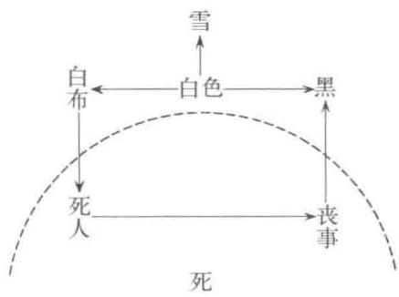

# 第四章 情结

荣格是最初给情结这个词赋予现在所理解的心理学特定意义的人。他在1906年发表的词语联想测验的著作中(1)用到“gefühlsbetonterKomplex”(被感情赋予色彩的复合体)这个词，后简化为“Komplex”，即情结。荣格引入的“情结”这个词，和内向一外向同时得到广泛认知，心理学专业以外的人们也无人不晓。“情结”最初被介绍到日本时，被翻译成“心理复合体”或者“复合体”。现在这一词汇基本上被用外来语的形式直接音译了1，而且成为日常用语。虽然情结、内向一外向已经这么普遍地被用到，但能够深刻地理解其真实含义的人却好像不多。所以，这里重新介绍一下荣格的情结概念，我认为还是有意义的。探究情结的现象，对荣格来说是非常重要的，重要到他曾自称自己的心理学说为情结心理学(Komplexen Psychologie)的程度(2)。

## 1. 词语联想测验

将词语联想的方式用于心理学，这种方法很久之前就有人做过尝试，但应用到临床心理学领域，则是荣格首创的。荣格在简单的词语联想过程中发现，有时候反应时间不知为什么变得很长。究其背后的原因，与其说是被测试者的智力发生了问题，不如说是感情因素在暗中起作用，因而荣格尝试把这种现象应用到临床中，确立了词语联想方法。我们来举一个看上去很简单的词语联想的反应时间长得不合情理的例子。荣格的例子中，对词汇“白色”，患者迟疑犹豫了一段时间，回答“黑色”(3)。随后，让患者对“白色”进一步联想，患者讲到白色让他联想到盖在死人脸上的布。最近患者有一位近亲去世，而“黑色”的意义代表了服丧。也就是说，由“白色”联想到“黑色”，看上去是一个再平常不过的反应，但异常的时间延迟，表现出刺激词与患者

  
图4

的情感变化产生了关系。

不仅是反应时间的延迟，这里还有其他一些需要瞩目的异常现象。就此，荣格建立了情结标志。在具体讲情结标志之前,我们先来列一下荣格用到的刺激词语。测验方法非常容易实施，测验者对被测验者说:“我现在逐个读单词，按顺序读下去。听到每一个单词以后，尽快地回答你联想到的任何一个单词。”测验者拿着秒表，一边读刺激用语的单词，一边记录被测验者的反应词和反应时间。时间一般以四分之一秒为单位，也就是说，时间为1.5秒时，记录“6”。有兴趣的读者可以参考表1的刺激词试一下(能找到别人帮忙最好，自己一个人做也能稍微体会到一点这个测验的感觉，不妨尝试一下)(4)。

表1 荣格词语联想测验的刺激词表1
<table><tr><td rowspan=1 colspan=1>1</td><td rowspan=1 colspan=1>头</td><td rowspan=1 colspan=1>9</td><td rowspan=1 colspan=1>窗户</td><td rowspan=1 colspan=1>17</td><td rowspan=1 colspan=1>海</td></tr><tr><td rowspan=1 colspan=1>2</td><td rowspan=1 colspan=1>绿色</td><td rowspan=1 colspan=1>10</td><td rowspan=1 colspan=1>友好的</td><td rowspan=1 colspan=1>18</td><td rowspan=1 colspan=1>生病</td></tr><tr><td rowspan=1 colspan=1>3</td><td rowspan=1 colspan=1>水</td><td rowspan=1 colspan=1>11</td><td rowspan=1 colspan=1>桌子</td><td rowspan=1 colspan=1>19</td><td rowspan=1 colspan=1>自豪</td></tr><tr><td rowspan=1 colspan=1>4</td><td rowspan=1 colspan=1>唱歌</td><td rowspan=1 colspan=1>12</td><td rowspan=1 colspan=1>询问</td><td rowspan=1 colspan=1>20</td><td rowspan=1 colspan=1>烹饪</td></tr><tr><td rowspan=1 colspan=1>5</td><td rowspan=1 colspan=1>死</td><td rowspan=1 colspan=1>13</td><td rowspan=1 colspan=1>村庄</td><td rowspan=1 colspan=1>21</td><td rowspan=1 colspan=1>墨水</td></tr><tr><td rowspan=1 colspan=1>6</td><td rowspan=1 colspan=1>长的</td><td rowspan=1 colspan=1>14</td><td rowspan=1 colspan=1>寒冷</td><td rowspan=1 colspan=1>22</td><td rowspan=1 colspan=1>生气</td></tr><tr><td rowspan=1 colspan=1>7</td><td rowspan=1 colspan=1>船</td><td rowspan=1 colspan=1>15</td><td rowspan=1 colspan=1>茎</td><td rowspan=1 colspan=1>23</td><td rowspan=1 colspan=1>针</td></tr><tr><td rowspan=1 colspan=1>8</td><td rowspan=1 colspan=1>支付</td><td rowspan=1 colspan=1>16</td><td rowspan=1 colspan=1>跳舞</td><td rowspan=1 colspan=1>24</td><td rowspan=1 colspan=1>游泳</td></tr></table>

1 本表由日语版翻译，与国内通用的词语的表述、词性、顺序略有不同，不一一标注。

续表
<table><tr><td rowspan=1 colspan=1>25</td><td rowspan=1 colspan=1>旅行</td><td rowspan=1 colspan=1>51</td><td rowspan=1 colspan=1>青蛙</td><td rowspan=1 colspan=1>77</td><td rowspan=1 colspan=1>牛</td></tr><tr><td rowspan=1 colspan=1>26</td><td rowspan=1 colspan=1>蓝色的</td><td rowspan=1 colspan=1>52</td><td rowspan=1 colspan=1>分离</td><td rowspan=1 colspan=1>78</td><td rowspan=1 colspan=1>奇妙的</td></tr><tr><td rowspan=1 colspan=1>27</td><td rowspan=1 colspan=1>灯</td><td rowspan=1 colspan=1>53</td><td rowspan=1 colspan=1>饥饿</td><td rowspan=1 colspan=1>79</td><td rowspan=1 colspan=1>幸运</td></tr><tr><td rowspan=1 colspan=1>28</td><td rowspan=1 colspan=1>犯人</td><td rowspan=1 colspan=1>54</td><td rowspan=1 colspan=1>白色</td><td rowspan=1 colspan=1>80</td><td rowspan=1 colspan=1>谎言</td></tr><tr><td rowspan=1 colspan=1>29</td><td rowspan=1 colspan=1>面包</td><td rowspan=1 colspan=1>55</td><td rowspan=1 colspan=1>儿童</td><td rowspan=1 colspan=1>81</td><td rowspan=1 colspan=1>礼仪</td></tr><tr><td rowspan=1 colspan=1>30</td><td rowspan=1 colspan=1>有钱人</td><td rowspan=1 colspan=1>56</td><td rowspan=1 colspan=1>专心</td><td rowspan=1 colspan=1>82</td><td rowspan=1 colspan=1>狭窄的</td></tr><tr><td rowspan=1 colspan=1>31</td><td rowspan=1 colspan=1>树</td><td rowspan=1 colspan=1>57</td><td rowspan=1 colspan=1>铅笔</td><td rowspan=1 colspan=1>83</td><td rowspan=1 colspan=1>兄弟</td></tr><tr><td rowspan=1 colspan=1>32</td><td rowspan=1 colspan=1>刺</td><td rowspan=1 colspan=1>58</td><td rowspan=1 colspan=1>悲哀的</td><td rowspan=1 colspan=1>84</td><td rowspan=1 colspan=1>害怕</td></tr><tr><td rowspan=1 colspan=1>33</td><td rowspan=1 colspan=1>怜悯</td><td rowspan=1 colspan=1>59</td><td rowspan=1 colspan=1>杏子</td><td rowspan=1 colspan=1>85</td><td rowspan=1 colspan=1>鹤</td></tr><tr><td rowspan=1 colspan=1>34</td><td rowspan=1 colspan=1>黄色的</td><td rowspan=1 colspan=1>60</td><td rowspan=1 colspan=1>结婚</td><td rowspan=1 colspan=1>86</td><td rowspan=1 colspan=1>错误</td></tr><tr><td rowspan=1 colspan=1>35</td><td rowspan=1 colspan=1>山</td><td rowspan=1 colspan=1>61</td><td rowspan=1 colspan=1>家</td><td rowspan=1 colspan=1>87</td><td rowspan=1 colspan=1>焦虑</td></tr><tr><td rowspan=1 colspan=1>36</td><td rowspan=1 colspan=1>死去</td><td rowspan=1 colspan=1>62</td><td rowspan=1 colspan=1>可爱的</td><td rowspan=1 colspan=1>88</td><td rowspan=1 colspan=1>亲吻</td></tr><tr><td rowspan=1 colspan=1>37</td><td rowspan=1 colspan=1>盐</td><td rowspan=1 colspan=1>63</td><td rowspan=1 colspan=1>玻璃</td><td rowspan=1 colspan=1>89</td><td rowspan=1 colspan=1>新娘</td></tr><tr><td rowspan=1 colspan=1>38</td><td rowspan=1 colspan=1>新的</td><td rowspan=1 colspan=1>64</td><td rowspan=1 colspan=1>吵架</td><td rowspan=1 colspan=1>90</td><td rowspan=1 colspan=1>纯洁的</td></tr><tr><td rowspan=1 colspan=1>39</td><td rowspan=1 colspan=1>习惯</td><td rowspan=1 colspan=1>65</td><td rowspan=1 colspan=1>毛皮</td><td rowspan=1 colspan=1>91</td><td rowspan=1 colspan=1>门</td></tr><tr><td rowspan=1 colspan=1>40</td><td rowspan=1 colspan=1>祈祷</td><td rowspan=1 colspan=1>66</td><td rowspan=1 colspan=1>大的</td><td rowspan=1 colspan=1>92</td><td rowspan=1 colspan=1>选择</td></tr><tr><td rowspan=1 colspan=1>41</td><td rowspan=1 colspan=1>钱</td><td rowspan=1 colspan=1>67</td><td rowspan=1 colspan=1>萝卜</td><td rowspan=1 colspan=1>93</td><td rowspan=1 colspan=1>干草</td></tr><tr><td rowspan=1 colspan=1>42</td><td rowspan=1 colspan=1>笨蛋</td><td rowspan=1 colspan=1>68</td><td rowspan=1 colspan=1>涂写</td><td rowspan=1 colspan=1>94</td><td rowspan=1 colspan=1>高兴</td></tr><tr><td rowspan=1 colspan=1>43</td><td rowspan=1 colspan=1>笔记本</td><td rowspan=1 colspan=1>69</td><td rowspan=1 colspan=1>部分</td><td rowspan=1 colspan=1>95</td><td rowspan=1 colspan=1>嘲笑</td></tr><tr><td rowspan=1 colspan=1>44</td><td rowspan=1 colspan=1>蔑视</td><td rowspan=1 colspan=1>70</td><td rowspan=1 colspan=1>旧的</td><td rowspan=1 colspan=1>96</td><td rowspan=1 colspan=1>睡觉</td></tr><tr><td rowspan=1 colspan=1>45</td><td rowspan=1 colspan=1>手指</td><td rowspan=1 colspan=1>71</td><td rowspan=1 colspan=1>花</td><td rowspan=1 colspan=1>97</td><td rowspan=1 colspan=1>月</td></tr><tr><td rowspan=1 colspan=1>46</td><td rowspan=1 colspan=1>贵重的</td><td rowspan=1 colspan=1>72</td><td rowspan=1 colspan=1>打</td><td rowspan=1 colspan=1>98</td><td rowspan=1 colspan=1>美好的</td></tr><tr><td rowspan=1 colspan=1>47</td><td rowspan=1 colspan=1>鸟</td><td rowspan=1 colspan=1>73</td><td rowspan=1 colspan=1>盒子</td><td rowspan=1 colspan=1>99</td><td rowspan=1 colspan=1>女性</td></tr><tr><td rowspan=1 colspan=1>48</td><td rowspan=1 colspan=1>落下</td><td rowspan=1 colspan=1>74</td><td rowspan=1 colspan=1>粗暴</td><td rowspan=1 colspan=1>100</td><td rowspan=1 colspan=1>侮辱</td></tr><tr><td rowspan=1 colspan=1>49</td><td rowspan=1 colspan=1>书</td><td rowspan=1 colspan=1>75</td><td rowspan=1 colspan=1>家庭</td><td rowspan=1 colspan=1></td><td rowspan=1 colspan=1></td></tr><tr><td rowspan=1 colspan=1>50</td><td rowspan=1 colspan=1>不正当</td><td rowspan=1 colspan=1>76</td><td rowspan=1 colspan=1>洗涤</td><td rowspan=1 colspan=1></td><td rowspan=1 colspan=1></td></tr></table>

全部词语的联想都做完以后，再对被测验者发出指示，“现在我按顺序重新读一遍，请回答跟刚才反应一样的词”，再次测验。记得第一次反应词语的，记录“+”号;记不得第一次反应的词，记录“一”号；说出和第一次不同的词，则把第二次的反应词记录下来。实际操作一下，就可以发现，忘却的程度相当厉害。

看上去很简单的测验方法，实际上会发生各种各样的障碍。在语言联想测验中，有各种迹象能表达出情结的存在。如(1)反应时间的延迟，(2)无法联想出反应词，(3)重复测验者提示的刺激词，(4)对刺激词明显的误解，(5)再现时的忘却，(6)重复相同的反应词，(7)明显很奇妙的反应，(8)观念的执着(比如，对“头”反应为“身体”，接着对“绿色”反应为“尾巴”，非常执着于前一个词的概念)。荣格总结的还有其他一些类型，但主要的都列在这里了,称为“情结标志”(complexindicator)。荣格特别关注到在看上去很单纯的联想过程中发生的各种各样的异常反应，通过词语联想测验开始进行无意识心理过程的研究。面对这样的现实，我们不得不承认存在着意识的控制力无法企及的心理过程。前边的例子当中，作为“白色”的联想词,正常情况下会浮现出“黑色”“雪”“白布”等词汇。但因为患者近期有亲近的人去世，心底有着强烈的感情存在，联想过程就变成了白色→白布→死人的脸→丧事→黑，走过了长长一段路程，因而表现出显著的时间滞后。根据内心活动的情况不同，有时联想的过程会完全停止，被测试者什么都说不出来；或者联想走的路程是死人→死→生，表现出由“白色”到“生”的奇妙联想；或者“死亡”的观念实在挥之不去，对下一个刺激词“儿童”，依然做出“死亡”的反应，连被测试者自己都吃惊不已。异常反应的形式多种多样，如果我们非常仔细地追究下去，经常会发现引起异常的词语构成了一个集合。比如说，对“分离”反应滞后并回答“死”;对“悲哀的”回答为“别离”，再次回答时又忘了，回答“死亡”等。就这样，单独的感情下边聚集了大量的心理内容，形成了一团不可分离的东西。当受到相关的外界刺激时,这样的一团心理内容开始活跃，超越了意识的控制。荣格把这种存在于无意识领域的某种情感结成的心理内容的集合称为“情结”。

前边已经提到过，情结，最初被称为被感情赋予色彩的集合体(feeling-toned complex)。这样,情结作为一种集合体存在，与此相对应，我们的意识也同样是一种集合体。人从出生开始，意识体系就在不断地趋向复杂，该体系必须保持一贯统合性。正缘于有这样的统合性，我们才能够作为一个独立的人格得到外界的承认，或者说才有了自己的个性。荣格认为意识体系的中心功能在于自我。正因为自我的正常运作，人们才能够认识外部世界，做出适当的判断，进而找到恰当的应对方式。在这个前提下，我们面对形形色色、瞬息万变的场合才能够一贯地表现出合适的行为。情结，正是扰乱了自我的这种正常的整合机能。在刚才的例子中可以看到，一般“白色”到“黑色”的反应比较自然，但心底情结的作用打乱了正常反应过程。自我，一般都有着某种程度的自律性，但情结并不服从自我的统制，所以会在现实生活中制造出很多麻烦：关键时刻想不起某个人的姓名，众目睽睽之下满面通红结结巴巴说不出话，该说“我怎么能接受你这么贵重的礼物”时口误成“我怎么能不接受………”，等等。平常以为的只是偶尔失误的情形背后，往往是无意识领域内的情结在活动。事例之多，可以参照弗洛伊德所著《日常生活中的精神病理学》。情结在自我的统制范围之外，所以引起的混乱时常给人一种“根本没有预想到”的感觉，有时甚至让人疑惑是不是被什么鬼魂附身了。情结就像童话当中经常出现的小矮人那样，在人们什么都没察觉到的时候出来干点坏事，看着我们麻烦缠身、无所适从的窘迫样子捂着嘴偷笑。或许也可以说是过去的人为了记录饱受情结伤害的体验，产生了“捣乱的小矮人”的意象，留下了这些故事。

刚才说到过，情结是一种由共通的情感构成的集合体，具有自己的核心。最典型的就是心灵创伤。比如说受到自已亲生父亲性虐待的女性，会将这种难以忍受的经历极力压抑进无意识领域，非如此就无法活下去。让这样的事实停留在意识领域中是极端艰难的，压抑成为最正常不过的反应。这时候，伴随着经历本身的恐惧、厌恶感统统被压抑住，随着时间的推移，其他类似的感情也会被吸收进去。被老师训斥了一顿，差点被狗咬了，等等，都会和以前被压抑的情感重叠在一起。日复一日，情结集聚的力量越来越大，逐渐成为一种威胁自我的存在。当事人经常会出现一些用意识无法理解的恐惧，比如说毫无理由地惧怕马。也就是说，马，作为一种外界刺激物，激活了压抑着的情结，因而受到伴随情结的恐惧的袭击。在情结内部积蓄的情感能量越大，吸收力也越强，但凡有一点点类似性质的东西，统统都被收入囊中，形成巨大的基团。就像荣格指出的那样，其核心可分为两类，既有因自我无法接受而受到压抑的经历、体验,也有个人无意识中内在的、从未被意识到的内容5。或者，即使不这么明确地区分类别，也应该注意避免总是在情结中探求受压抑的心灵创伤体验，或者因其内容受到压抑就总是强调消极否定性的感觉。我们应该看到，荣格特别想强调的就是这一点。

为什么荣格会有这样的想法呢？在荣格通过联想测验思考情结的存在时，弗洛伊德采用梦的解析、催眠术等方式也在研究相同的课题。得知此事，荣格在1907年非常高兴地去见弗洛伊德，双方开始了合作。但荣格对无意识的认识与弗洛伊德有着明显的差异，这成为双方分手的一个重要原因。概括一下，弗洛伊德认为无意识中的心理内容是受到压抑的且与性的欲望有着深刻的联系。相比较而言，荣格在认可弗洛伊德的观点的基础上，强调无意识的内容不限于此，它还包含了建设性的、积极的内容。情结不仅是受到压抑的体验，我们还需要努力认识到其背后存在的更深层次的原型性事物(有关原型，下一章将做详细讨论)。荣格关于无意识的积极意义的观点在前一章意识和无意识的互补作用中已得到充分的体现，在后续的各个章节我们还能够从其他不同的角度体会到这一点。

荣格的词语联想测验为当前临床心理学领域强有力的武器——投射法构筑了最初的基础。荣格自己后来专注于意象和象征的研究，并没有继续深入实践他的词语联想测验。这个方法看上去简单易行，实则有着深刻的意义，具有充裕的可能在其中挖掘出新的内容，理应受到更多的重视。这里的简单介绍也是为了这个目的，如果读者当中能有人因此产生新的想法，实在荣幸。

## 2. 情结的现象

前一节我们讲到情结扰乱了自我的统合性，因而引起心理或身体机能障碍。我们要熟知情结的构造和现象，特别是情结与自我的关系。从根源上来说，情结是自我难以接受的内容，自我起初意识不到情结的存在是件再自然不过的事情。也就是说自我的抑制机制在起作用。形象地说，就像是和邻国之间筑起高墙，没有交流，仅在自己国家内部保持稳定状态。但是，国界线上时不时地有一些小的冲突，比如，进来抢劫一下平民百姓，总归会有什么事情提醒我们一下边界那边敌国的存在。就像前一节讲到的例子，正常的人也会时不时地因为情结的力量而失误。这可以说是普通人们的常态。但如果防御的墙壁过于厚实、坚固，长年累月根本意识不到邻国存在之后，敌人悄悄地变得越来越强大，超出了我方的力量，事情又会如何演变呢？最戏剧化的表现大概就是双重人格吧，出现了一个与自己到目前为止的人格完全不同的人格，就像是自我的王座被情结夺去，发生了政变。有关双重人格，法国的让内有详细的研究，荣格给予高度评价的同时提出了自己的见解，认为双重人格本质上与情结属于同样的问题，但并不能断言所有的情结都有代替自我的性质。有关双重人格，我们将在下一节做详细说明。这里虽然不继续展开，但应该理解这种现象的存在需要我们熟知情结相对于自我的自律性以及

对自我本身的威胁。

双重人格，是情结的力量非常强大、情结与自我交换主权的一种现象。即使这么极端的情况非常少见，自我依然会采取多种多样的方式处置捣乱的情结。这些方法称为自我的防御机制(defensemechanism)。下边就主要的防御机制做一考察。

首先是同化机制(identification)。自我被某个情结同化，意味着自我被置于情结的影响范围内。同化的程度各有不同，有部分同化，也有近乎整体的同化，因此而产生的意识障碍程度也有差别。比如说，普通正常的人也有某种程度的同化现象，男性会有与父亲相仿的想法，而女性会有着和母亲非常相似的想法或行为模式。现实当中，这样的例子随处可见。人们从幼小的时候开始，对父母亲同性的一方经常抱有批判性或攻击性的态度，但又无法表现出来，以父亲形象或母亲形象为中心，形成了一个情结。成人以后，某一天突然意识到自己竟然在不知不觉中模仿着曾经强烈批判的父亲或者母亲，跟他们做着同样的事情。发现这一点，人们不由得吃惊，哭笑不得。这些在生活中都还属于正常范围。如果女性与父亲有很强的同化现象，或者儿子与母亲同化程度很深，会怎么样呢？极端的情况下应该考虑到陷于同性恋的可能性。更极端的，同化的程度覆盖了自我整体，开始相信“我就是上帝”“我将来是要统治全世界的”，那么不得不说问题已经很严重了。这种状况在妄想性分裂症的人中经常能看到。很多事例都说明了重要的一点，同化程度走向极端，同化的对象就会超越父母亲的个人范畴，延伸到上帝、帝王等形象。这也可以说明，情结不单纯基于个人的体验，即使我们把情结仅仅看成过往体验中压抑的东西，那么背后还是存在着超越个人体验的普遍性内容。从这里出发，荣格发展了集体无意识、原型等重要思想，我们会在下一章详细探讨有关内容。荣格的思想，超越了个人体验中某一个具体母亲的实际人物，或者说超越了个人体验的母亲形象，致力于探究可以称为“具有母亲性质”的普遍性原理。这与非常重视个人幼儿时期体验的弗洛伊德的观点相异，也成为两人分手的一个原因。

我们讲了与父母同化的问题，实际上一个人想要挣脱父母缺点的束缚是非常困难的。人们经常是在不知不觉的情况下，把父母的缺点都纳入自己的行为举止当中。某一天发现这一点时，要么叛逆，要么逃避，反过来走向极端的危险例子随处可见。有人对“父母过于严格”的教育心怀不满，反过来对自己的孩子放任自流，随后搞得一地鸡毛。从本质上来说，这也是一种没有挣脱父母缺陷束缚的现象。可以说，正是因为在同化机制的强力作用下，叛逆过头引起了反向形成(reactionformation)。像这样，相反的东西各自具有强大力量且同时存在，也是情结的一个特征。程度的深浅会有不同，但可以认为，对任何一个情结来说，在什么地方一定存在着一个互相对应的情结。比如说，经常可以在自卑感很强的人身上发现非常强烈的优越感情结。两者之中会有一个离自我的距离更近一些，能更容易地被意识感觉到。因自卑感情结的作用，一贯自我贬低、畏缩不前的人，实际上背后总有一个强大的优越感情结，本人甚至会因为这两者之间的落差之大变得更加自卑。自认为根本没有什么存在的价值，企图自杀的人，与心理治疗师交谈过程中，一本正经地在说：无论如何，我作为一个人能为世间做的贡献就是至少减掉一个人(指自杀行为)，也算是为解决世界的人口问题尽了一份力。他就这么以一脸认真的表情谈论这么荒诞的想法。话再说下去，就变成“像我这样苦恼的人一定不少，希望自己能够解救世界上所有深陷痛苦的人们”。除了死再没有存在价值的自卑，发愿解救全世界深陷痛苦者的优越，两者共存。读者或许为此惊讶，但我们真的能见到不少实例。并不是所有企图自杀的例子都这么单纯，但与高中生年纪相仿的年轻人面谈中，治疗师发现很多自杀未遂的人都是这样。作为心理治疗师，避免让充满高电压、处于两个极端的情结之间直接发生短路、放电，在保证安全的前提下，给两极之间找到适当的联结，就是我们需要时刻牢记在心的准则。

接下来的重要防御机制就是投射(projection)。投射指的是逃避对自己内部情结的认知，把它投射到外部的某个事物上，借助外部事物来认识情结。比如说，总是指责“人都是很滑头”的人，自己却非常滑头;哀叹“世间为什么这么薄情寡义”的人，很多都没什么温情。而且话中的“人”“世间”这样的一般称呼都是不包含自己的，这一点非常有意思。“除了自己，大家都很滑头”，可以说非常形象地说明了投射机制的作用。投射的作用越来越强烈，好像所有的人都在说自己坏话一样。走向极端，哪怕自己一个人待着，也能听到别人在说坏话(幻听)，到这一步，只能说是病态了。没到病态的程度，我们每一个人为了好好活着，也多多少少都会启动一定程度的投射机制，把自己的情结投射到别人身上，以求得到自身的安全。普通人投射的时候，被选择成为投射对象的那个人一定程度上是有着能接受投射的某种缘由，即那人身上也存在着值得投射的情结。因此，被投射的人经常也会反过来发出逆向投射，两人间的关系越来越纠缠不清。像这样，情结很容易诱发周围的情结，内心怀抱着很多情结的人就比较容易感受到别人的情结(对自己的倒一无所知)。这样的人经常自诩“具有敏锐的感受性”，不少人确信自己适合当心理咨询师。像刚才说到的自杀未遂的人想要去拯救全世界痛苦的人们一样，自我受到情结威胁的人不敢面对自己的内心，而是去思考如何拯救其他人，这也算是一种投射机制的作用。话虽这么说，投射机制并不仅仅有负面影响，反过来，可以说正是通过这样的投射，我们才有机会认知自己的情结，才能够与情结面对面地决斗。比如说把自己内心的权威情结向外投射的人，看到比自己地位高的人就觉得非常恐怖，但一个偶然机会，他发现这个处于高位的人实际上有着非常温和的一面。这时候，如果有眼光承认自己看到的事实，他肯定会觉得：“哎呀，自己原来想的好像不对嘛。”看到以往体验的恐怖感觉跟现实不符，他会醒悟到根本上是因为自己的情结在作怪。这种现象被称为投射的撤回(withdrawalofprojection)。我们不要过于害怕自己的投射行为，只要持有开放的态度，观察并吸收周围现象及其含有的意义，一定能够在自己眼中的恶人的行为中发现超乎想象的部分，促成投射的撤回。这样，在认识情结的基础上，通过“投射→投射的撤回”的过程，我们把积蓄在情结中的心理能量引流到建设性的方向。情结的内容流向自我、被自我整合的过程中，总是伴随着情感性的体验，仅仅知识性地理解情结的名词，给这些内容赋予名称(概念化)，可能更多的只能成为妨碍自我整合过程的防御手段。用概念化的手段去压制，一时看上去情结的活动好像平静下来，但就像荣格所说的那样，我们可以无视情结的存在，但情结绝不会无视我们(7)。

上面从情结的投射问题讲到了自我整合情结的过程。如果以情结的消退为目标的话，我们将无法回避与情结的正面对决。对心理治疗，很多人都有着“找到好办法能把长年积累的苦恼一举解决”的期待，而心理治疗首先需要做的就是跟自己的痛苦面对面的决斗。可以说，人们最先遇到的考验就是深化自己的痛苦。下一节，我们来讲一下心理治疗过程中究竟会发生些什么。

## 3. 情结的消退

情结的消退不是揣着两只手就能做到的。前边一节我们也提到过，没有与之对决的姿态，情结是不可能消除的。下边我们举一个游戏疗法的例子，来说明一下这个过程。

这是一个小学三年级的男孩儿。当事人主诉洁癖，是跟妈妈一起来的8。他上厕所后，洗手需要十分钟;吃饭的时候对清洁程度提出很多过分的要求，搞得妈妈头痛不已。心理治疗师接受这个案例以后，每个星期，妈妈的心理咨询和孩子的游戏疗法并行进行。这里我们省去细节，只讲一下在妈妈的咨询过程中渐渐明朗的事情。因为奶奶的溺爱和过度保护，当事人在成长的过程中一直是一个很费事儿的孩子。直到上幼儿园之前他还要求喂饭，希望大人给穿鞋子，而家里也禁止他参与邻居孩子们玩的危险游戏。可以想象，孩子的自我成长过程中，自主行动、略有攻击性的行为都被彻底地禁止了。他有时候肯定也想跟周围的孩子们一起调皮捣蛋一下，吃点儿零食之类的。类似的行为、体验都受到压抑，并没有整合进孩子的自我当中，而是形成了情结。接着，伴随着对被禁止行止的反叛情感，情结渐渐被赋予强烈的感情色彩。单从外表上看，这个孩子非常有礼貌，行为举止得体，谁都会说这是个好孩子吧。在好孩子形象的背后，形成了强力的情结。如果给这个情结命名的话，应该称其为攻击性或者活动性情结吧。把攻击性跟活动性放一起，看上去很不明确。不过，我们后边还会讲到，情结的现象非常复杂，很难简单地命名。这个例子当中,如果强烈的叛逆情感非常冲动地表现出来，显示的应该是一般所认为的攻击性;如果适当地把情结中的力量引导到自我当中，就可以称其为活动性。谈到这个例子中的“情结”，可能英文的“aggression”这个词表达得最为贴切(实际上,我们经常会把这个词直接翻译为“攻击性”)。人的攻击性太强不能说是什么好事情，但过度地压抑攻击性，没准儿又会造就一个缺乏活力的软弱人物。这个例子中，判断孩子的攻击性完全被压抑住了,应该不会错。这是一个智商很高的孩子，学习成绩很好，智力方面活动性很强(来访的直接原因是强迫症式洁癖已经给正常的智力活动造成障碍)。他在家里的行为也能够想象得出来，窝里横吧。

这个例子也能够说明情结现象的复杂性。如果教条地看待攻击性受到压抑这一点，我们就会以为这个孩子完全没有活力。但看到他在教室里很活跃地发言、在家里调皮捣蛋的样子，我们肯定会大吃一惊，搞不懂到底是怎么回事儿。说起攻击性，其意义非常广泛，我们应该更详尽地思考其中哪一些形成了情结。在自我的统制力减弱的时候(比如说在自己家里)，情结的力量增强，行动模式也会变化。这一点也需要熟知。不了解这种复杂的现象，仅仅依赖条条框框，治疗师自己也会迷失方向，最终不过是给别人的情结起些名字，毫无建设性的意义。

例子中，即使有着我们说的攻击性，但因为智力水平很高，这个孩子的学习成绩始终保持良好状态，一直都是个成功的好孩子。终于，情结力渐强大，超出了自我的压制力量。本人对自我难以认同的攻击性渐露头角感到极端的恐怖，顽固地拒绝承认自己内心的东西，投射到外部，形成了不洁恐惧症。上边说的这些，算是对这个孩子症状形成的一种思考，到这一步，其实还不能说对治疗有什么意义。这种对治疗师来说解释得通的认识，说给患者听并不能解决问题。当然，一切都是在跟母亲的咨询过程中渐渐明朗化，这一点还是很有意义的。母亲自己在对话的过程中，可以独立思考、发现、体验。再者，孩子在治疗的过程中也必须勇敢地面对自己的情结，而不是肤浅地了解一下关于情结的知识。

说到与情结的对决，对治疗师来说最重要的是在治疗的现场给孩子创造一个可以自由行动的环境。游戏疗法的根本在于，治疗师都需要保持开放的态度，接受当事人的任何行为表现。搞不明白这一点的人，看到治疗现场的情况，一定看不出和一般的游戏有什么区别。治疗师要用这种容纳一切的态度与孩子接触。开始孩子基本上不跟治疗师说话，只顾自己玩一些智力游戏，随着时间的推移，渐渐地开始显露攻击性。第三次来的时候，孩子狠狠地敲打木制的组合玩具，以实物为对象表达自己的攻击性。再下一次，孩子要求与治疗师比赛保龄球，并在游戏中投入极大的热情。

拼命玩的过程中，孩子拿黑板擦去擦黑板上记录的分数时，嫌费事，就直接用手抹去字迹，然后用手擦汗，把脸也搞得一塌糊涂，表现出和洁癖完全不沾边的行为。在治疗现场，其实经常可以看到这种情形。前边说到过，情结中互补性地存在着比如自卑感和优越感等两个极端的内容。对这个孩子来说，冲破家里的规矩，随心所欲地做一些不干净、危险的事情的冲动，和内心对不洁净事物的极端恐惧，两个极端事物在内心共存，无法整合到一起，仅仅某一方以症状的形式表现出来。这样，在任何表现都能得到包容的治疗场合，一直被压抑着的一方渐渐抬头，显现为表面的行动。这个日常非常懂礼貌的孩子，还会一不当心忘记了来访的日子，让治疗师空等着。这种行为在第六次的治疗中表现得非常明显，跟治疗师玩投球避球游戏时，孩子使劲扔出让治疗师害怕去接的猛球，满身大汗玩得不亦乐乎，干净不干净的，根本顾不上了。但仅把这些表现看作是到目前为止积郁的发散，还是有些太简单了。确实，积淤的情绪发散出来也是有效的，但这种浮出表面的行为仅发生在与治疗师的互动中。在心理治疗现场，治疗师从根本上理解当事人行为的意义，并且采取完全包容的态度，意义非常重大。因为治疗师的存在，当事人才有可能不止步于单纯的情结发散，还体验着情结带来的感受，进而将这些感受整合进自我。这里，孩子要求与治疗师扔球、接球，有着很深的象征意义。面对有着强烈攻击力的投球，治疗师完全接受下来，而且正面对着当事人又扔了回去。这样，在象征性的包容、对决的反复过程中，当事人渐渐地把一直遭到自我排斥的东西纳入自己的体系当中，努力实现自我的再次整合。

这样在治疗的现场看到进步的同时，当事人在家庭内部的表现反倒在恶化—声称“厕所里有怪物”“饭碗里有奇怪的东西”，显示出极端的恐惧感—让家里人非常担心。但是，仔细考察当事人一连串的行为过程，出现这样的状况可以说是必然的吧。随着在治疗场合一直受到压抑的攻击性得到表现，当事人更加强烈地意识到对外界的投射和恐惧。也就是说，当事人的表面行为看上去好像恶化了，但实际上说明了治疗过程的进步。像这样，在治疗过程中经常会出现表面的恶化现象，需要治疗师对事态好转持有坚定的信念，治疗才能继续下去，迎来终结局面。这个例子也是这样，一段时间母亲的担心加剧，但治疗没有中断，孩子的攻击性慢慢有了质的变化。在第十次治疗时，孩子不把球扔向治疗师了，而是跟治疗师比赛，把球朝墙扔，在球弹回来后接住，跟治疗师比赛看谁连续的次数多。孩子中间说想喝水，然后主动地洗了手和脸，接过治疗师递过来的手帕擦手。在家庭内部对清洁的要求是一种扎根于情结的强迫观念，而在治疗现场的这一连串行为则完全是自发的，以一种自我内部具有统合性的行动表现出来。因为没带手帕，孩子偶然性地借用了治疗师的手帕，这一点也很有意思。治疗师一直都只是自己攻击的对象，或者是会反过来攻击自己的人，现在双方却可以建立起亲和的关系。这个变化可能有点太急促了，在下一次的治疗中又表现出一些混乱。孩子坚持要跟自己的母亲一起进治疗室。治疗师不允许这么做，跟他说，想不想做游戏你自己决定。然后孩子说不想做了，当场就回家了。但下次再来，孩子叠了纸飞机，跟治疗师比赛看谁飞得远。治疗师教他一些很有趣的叠飞机的方法，这样，攻击性通过具有建设意义的游戏表达出来，同时孩子又对治疗师表现出和善的行动。最后一次，简直就像是一个结束的仪式，孩子一边说着“我们还做过这个呢”，一边从治疗初期做的游戏开始一样一样地玩过来，做给治疗师看。成人治疗的场合，当事人经常会在治疗的后期回顾治疗经过，明确自己的变化过程。孩子最后把所有的游戏都做一遍，完全对应了成人常有的这种总结性表现。通过这样的过程，即大约半年时间的游戏治疗，孩子的强迫症状消失，能够跟小朋友们一起玩了，治疗结束。

上边，我们为了说明情结的消退过程，简单说明了一下游戏治疗的例子。通过这个过程可以清晰地看到，一个孩子在治疗现场如何面对自己的攻击性，去体验它，并且把它整合进自己的自我体系中。这个例子非常明了，大家或许能体会到，成年人情结消退的过程应该也是走着同样的路程。对还不习惯读出游戏疗法的发展剧情的人，我们再举一个大学生的例子，可以说与孩子的例子完全走了相似的道路。

一位一直压抑着攻击性的学生进入大学读书。但他的攻击性以大学入学为转折点，开始慢慢显露出来。开始阶段还不熟悉新的环境，他尽量不与外人接触，总是一个人行动(类似于游戏疗法，一开始孩子只是一个人做高智商的游戏,不和治疗师接触)。渐渐习惯了大学的生活后，他将攻击性投射到一个同学身上，开始了与“具有攻击性的同学”的战斗。无论是学习还是体育运动，两个人的竞争逐渐激烈，演变成双方的互相攻击。为了不输给同学，他也不断地努力，不断地重复与同学之间的攻击行为(投、接球游戏阶段)。他内心时常觉得这人太可恶了，非常气愤，但心底有时又会感觉到正是这个人的存在激发了自己的潜在活力，对方的行为有时也让自己觉得“能做到这一步，蛮不简单的”。就在这种双方的攻击性达到顶点的时候，某一天，这位学生出乎意料地发现对方其实是一个很温和的好青年，大吃一惊。突然碰到的事情，让他认识到，误以为是敌人的人原来是自己的同伙。这时候，他一边品尝着内心的混乱，一边思考着：看上去攻击性很强的对方，其实不过是自己本身。同时也认识到，适当的攻击性并不是绝对的恶，进而实现了投射的撤回(接受治疗师的手帕擦手，以及后来出现的混乱)。往后，这位大学生会跟自己一直敌视的同学成为好朋友吧。两人在互相竞争的过程中感受到对方的友情，日后会成为力量相当的好对手吧。这样确立了友情以后，估计两人会笑着谈起“刚见到你的时候，真觉得你是个攻击性很强的讨厌家伙”(游戏疗法终结时的仪式行为)。这位学生就这样在心灵内部体验到攻击性情结的消退和自我的整合，在外部世界得到一位好友。我们这里讲述得比较简单，现实中真要实现这样的过程，需要非常艰苦的努力，也有可能需要经过更加复杂的历程。即使这样，再来回头看看事例的大框架，也可以明白它有着与游戏疗法相通的东西。搞不清楚这一点的人觉得不过是跟孩子在一起做做游戏，而我们就能体会到其中的奥妙。游戏的过程中，人格变化的表达真是活灵活现。治疗师时常为此体验到深深的感动。

通过这个例子，读者看到了我们在治疗现场怎么样通过实际的努力实现情结的消退。一说到“与情结的对决”，内向的日本人很容易陷进一个误区，以为要“正视自己的内心”必须苦苦修行。揪住自己的缺点，又是检讨，又是反省，“追求孤寂的内心”，走上独行的旅途。这样的例子真不少见。比起孤独的修行，像例子那样，与讨厌的同学竞争，在与对手争斗的过程中发现友情的萌芽，这样的过程反倒是与情结的消退联系更加密切。独自修行，更多进行的是关于情结的思考，而不是像例子那样，能够在现实当中活出自己的情结，然后，努力整合、提升。当然，不否认有时独自修行也会有很高价值。如果走向另一个极端，完全放弃思考，不自觉地被自己的情结左右也是很让人头疼的(本人还经常会自以为是富有行动能力的人)。但一说到情结就认为是自己内心的事情，只是闷头思考，就容易忽视与外界建立联系，不理解面向外部的努力也会与内心世界相互呼应、共同成长。前边谈论到独自修行，主要是为了强调这一点。内心与外部世界的呼应性，确实是非常重要的事实。当一个人存在着必须面对的情结时，某一个适当的时机经常会有很巧合的外部事象发生，诱发一系列后续的进程。把内部和外部的事象结合起来作为一个整体来看，就好像形成了一个绝妙的布局一样。荣格非常重视这种现象。实际上每个人都有着无数的情结，但其中一定有一个，在某个时间点上具有关键的意义，到了人们不得不正面与之决斗的地步。比如说前边的例子当中，一个孩子从小压抑着攻击性，一直活得也没什么问题，但到小学三年级，终于出现了洁癖的症状。这一症状影响到正常的生活，使他不得不面对内心的问题。后边一个例子也显示进大学成为一个转机。从大学生的外部行动来看，出现强迫性神经症的症状，对一个同学感到强烈的敌意，都不是我们期待的行为，但对自己的内心世界来说，却又可以被看成是努力解除情结的艰苦路程的开端。

对情结不应采取完全否定的态度，当事人付出艰苦的努力，把情结整合进自我的时候，就显示出其建设性意义。情结，对它的自我来说是一个被否性的存在，人们总是先看到它破坏性和攻击性的一面。但是，当被整合进自我后，情节表现出来的多是值得期待的人的活力。我们应不仅仅紧盯着情结的负面，还要认可其中存在的正面作用，或者说在看上去负面的外部症状中，发现具有建设性的自我再次整合的努力，这种态度显示出荣格心理学的特征。我们每个人都有着无数的情结，比起成天做些没必要的自我反省，不回避某一时机布局好的情结现象，从最初的负面现象中找到一线光明，不断付出实际的努力，一步步地积累下去，这才是有意义的。

我们讲了情结消退的过程以及和情结决斗的必要性，按这个思路来看，回避情结绝不具有建设意义。而且，情结是自我拒绝体验的那部分内容被赋予了感情色彩，日积月累又被强化产生的。这么看来，打着“不要让孩子有自卑感”旗号的教育，起到的作用往往是强化了自卑感情结。老师不是发自内心的称赞、恭维，即使学生本人分辨不出来，但内心的情结绝不会轻易地被糊弄了。自卑感情结的解除,需要对自卑感有真正的认识,这无疑是一件非常痛苦的事情。说这些，绝没有鼓励教育者去随便指出孩子们自卑感的意思。自卑感被人触动，无论谁都是无比痛苦的。没有与人共同面对、共同承担这项艰巨任务的决心，只是随意去触碰别人的情结，跟一副好心肠的样子去引爆人家床底下静静躺着的炸弹没什么不同。把嘴上说着的“不要有自卑感”当作信条，不敢面对情结的老师，根本上可以说是软弱的吧。反过来相信“教育者的使命就是指出缺点”的老师，也是让人痛苦不堪的存在。在这两种老师的身上可以找到共同点：谁都对自己内心存在的巨大情结毫无知觉。这些话是针对站在教育者立场的人说的，实际上，从前边讲到的内容也能够明白，对情结下手是一件非常艰难的事情。一般来说，尽量不要去触碰别人的情结，算是作为一个成熟的人与他人交往时最起码的礼仪吧。

以上举例解释了让荣格负盛名的“情结”概念，相信可以使读者认识到存在于无意识领域内的情结的重要性，以及其与有意识的行为发生关系的机理。荣格在深入研究情结的基础上，逼近无意识的深层，这些我们将在后边的章节继续讨论。

## 参考文献：

(1) Jung, C. G. , Diagnostische Assoziationsstudien. Barth, Bd. I, 1906, Bd. II, 1910; 英文版 Studies in Word Association, New York. Dodd, Mead & Co. , 1918。

(2)现在均统一称为分析心理学(analytische Psychologie,analyticalpsychology)，但在德语圈，依然有人沿用情结心理学的名称。

(3) Jung, C. G. , The psychology of Dementia Praecox. C. W. 3, p. 46.

(4)想要掌握测验的方法，最好自己先接受一下测验。比起自己做,让别人给做意义更深刻。这个词语联想测验看上去很简单，实践一下就能体会到其深意，尽量请别人帮助尝试一下。

(5) Jung, C. G. , On Psychic Energy. C. W. 8, p. 11.

(6)荣格给予让内很高的评价，承认自己受到了他的影响。让内关于双重人格的研究，可以参考 L'Evolution Psychologique de la

Personnalité, 1929。

(7) Jung, C. G. , A Review of the Complex Theory, C. W. 8, p. 103.

(8)这个事例中,母亲的心理咨询由天理大学副教授高桥史郎担任，笔者负责孩子的游戏疗法。该事例的罗夏测验分析已经公开发表过，有兴趣的读者可以参考。河合隼雄/高橋史郎遊戲療法の前後に施行したロールシヤッハ法に言語連想法を併用した例」『ロールシヤッ八研究』V、一九六二年、一六八一七九頁。
