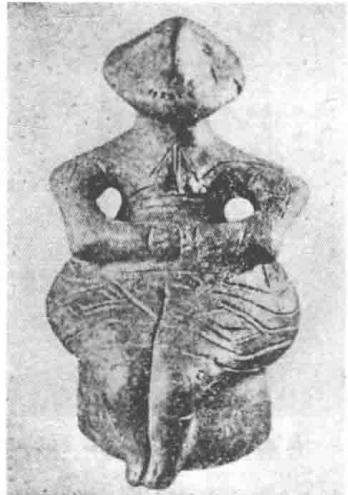
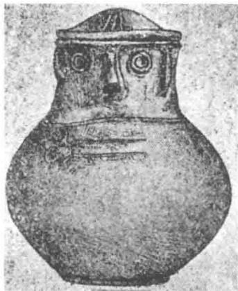
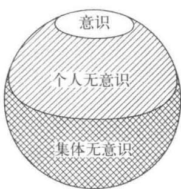
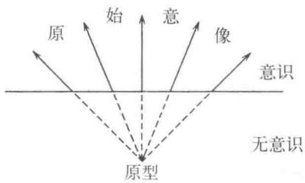

# 第五章 个人无意识和集体无意识

前一章我们讲述了存在于无意识内的情结的重要性。荣格在研究无意识的过程中渐渐认识到在情结的背后还有着更深的层次，萌生了这一章中将要说明的集体无意识(collective unconscious)、原型(archetype)等概念。将无意识分层思考，形成了荣格心理学的特征。他建立的集体无意识概念在广受艺术家、宗教家和史学家赞赏(1的同时也招致了不少误解。后边还会说到，在初期，实际上荣格也时常把原型和具有原型意义的意象当作同义词在用，导致逻辑上有些混乱，更加深了理解的难度。即使后来经过理论上的整理，还是很难说清楚的。这里，我只能尽最大的努力解释得容易懂一些吧。

## 1. 集体无意识

荣格将无意识看作分层构造，区分出个人无意识(personalunconscious)和集体无意识。这些内容用概念上的规定来解释可能很不容易理解，我们就先来看一个例子吧。这是笔者的一个来访者的例子。

一位中学二年级的男生得了学校恐惧症，两个月没去上学。当然自己也搞不清楚为什么没办法去学校，满心不情愿地被妈妈强行领到我这里来。第三次面谈，他讲到下边这个梦。

梦境：比自己的个子还要高的茂密的三叶草丛中，自己在行走。然后看到很大很大的肉的漩涡，马上就要被卷进去时，自己感觉实在太恐怖，被吓醒了。

关于这个梦，少年几乎联想不起任何事情。在进行梦的分析时，让当事人对梦境里的事物进行联想是不可或缺的重要事项。不知读者是否还记得在第二章里讲到梦中看到“野兽的眼睛”，当事人由此联想到意大利人，继而联想到父亲，这成为心理治疗中分析的重要线索。可这次，当事人什么也联想不出来。而且，对肉的漩涡这种超乎常人想象的东西，以及附带的强烈恐怖感，当事人同样毫无思想准备，自己也惊讶不已。这说明梦中的内容离当事人意识的距离还非常遥远，是从心灵很深的层面浮现出来的。从这个梦里我们唯一能够推断的是，他好像要被什么力量很强大的东西卷进去一样，难以走出自己的家，对外表现出惧怕上学的症状。

少年自己联想不出什么事情，但就梦境中漩涡状的恐怖程度，我们还是能够感觉到此漩涡并不是单纯的线条状漩涡，而是能够吞没一切的深渊。类似的深渊，在很多国家的神话中都扮演着相当重要的角色，也就是说象征着大地母亲的子宫2)。大地母亲,既象征着产生世间丰饶的万物，也是吞没一切生灵的死亡国度的入口，一般总是作为全人类共同的永恒意象出现。对原始时代的人来说，植物从土地中生发，又枯萎回到土壤中(他们应该是这样想的吧)，然后又有新的植物发芽、新的生命出生，实在是令人惊叹、不可思议。特别是，依赖这些生发的谷物，人类自己的生命得以维持、延续，“土地的奇妙”一定引起过他们胸口的悸动。作为“产出的原点”，母亲、大地、隐藏着什么的深渊合成一个整体被人们感知到，“地母神”的意象，在世界各地都能找到。

在象征着谷物生发、传达着母亲意象的神话里，希腊的珀耳塞福涅1和其母亲德墨忒尔的故事应该算作一个典型吧。而且，在众多神话中能看到作为生产万物的地母神的形象,经常同时兼具着死神的特征。就像生于土地的植物又再度回归土地一样，产生万物的深渊同时又有着吞没一切的含义。因此，我们能看到很多例子中，地母神一身兼具着生和死完全矛盾的双方。比如说日本神话中生出整个日本国土的母亲神伊耶那美，后来也降到黄泉之国成为死神。具有这种

  
图5 新石器时代的太母神像1(色雷斯出土)

深层含义的母亲意象是全人类共通的。为区别于个人层面的母亲的意义,荣格称其为太母(great mother)。大地母亲，太母，具有生命之神的意义的同时还是死亡之神，漩涡状的形象正象征着母亲神的双重性格。漩涡，同时还象征着太母的乳房，远古时期的太母画像中经常有这种表现方式(3)(可参照图5所示具有漩涡标记的太母神像)。

上边我们就漩涡稍做了些讨论，现在再回头看看少年的例子，是不是可以说少年陷入具有母亲象征意义的肉的漩涡中不可自拔?而且少年在不能去上学的期间，最热衷的就是去看石器时代的各种各样的壶形文物，甚至自己也动手烧制一些粗劣的模仿品。这些行为都能给我们重要的启发。太母，能生出万物，同样也能吞噬一切。壶，成为太母最普遍的象征。实际上在古代，壶本身或者给壶加上眼睛鼻子，就成为信仰的对象，这样的例子

  
图6壶1  
(公元前8—公元前4世纪普鲁士出土)

很多(参见图6)。

这个少年一开始对自己的梦并没有什么特别的联想，但在接下来的一次面谈中讲到肉的漩涡多么可怕时，他突然冒出一句：“真讨厌家里人这么溺爱着我。”考虑到这句话有着治疗过程开始发展的意义，我们也就能够理解前边所述的内容并不是空穴来风，而是有着事实作依据的。治疗进行下去，少年开始表露出内心的想法：自己的父亲患有精神疾病，不想让同学知道，所以特别不愿去学校。在这个例子中，我们能说父亲的精神疾病是导致少年无法去上学的直接原因吗?确实，这是明摆着的事实。但是，仅仅为这个就不去上学,不觉得反应有点过度了吗？荣格针对类似的情况有过表述:“任何心灵反应如果与其诱因的强度不相匹配的话，我们就应该探求这种反应是否还同时受到了某种原型的影响。”(4)按照荣格的理论，这种场合,不仅要看到父亲得精神疾病这个原因，同时还要关注到背后存在的原型(参见下一节)。实际上这个例子中非常软弱的父亲像的背后存在着具有强大力量的肉的漩涡，也就是具有吞噬一切的巨大力量的太母原型，它成为所有现象存在的前提条件。治疗过程就这样把我们的思路带到这一步。少年吐露出这些以后，在父亲的病情并没有好转的情况下，自己却能下决心去上学了。父亲的病情，更多的只是派生出来的而已(父亲的问题在少年重新回到学校以后，由母亲出面处理，这是后话(5))。

在第二章我们也谈到一例神经症,其无意识中的原因是与其父亲和意大利人有关的过往事件。那个例子可以解释为患者过去的经历受到了压抑，但这个少年梦中的情形与自身的经历无关，反倒与神话性的主题有着强关联性，可以认为属于全人类普遍性的层面。

  
图7

考虑到以上各方面，荣格认为人类心理不仅应划分为意识和无意识层面,无意识还应该进一步划分出个人无意识及集体无意识。我们用荣格的说法来解释一下这几个层面的意义(6)。

(1) 意识。

(2)个人无意识 首先指意识内容中因失去强度被忘却的部分,或者是被意识主动地回避(压抑)的内容;其次，虽然不具有能够达到意识的强度，但以某种方式在心灵中留下的感觉性痕迹形成的内容。

(3)集体无意识 表象代表的所有可能性，作为人类共同的遗产不存在于某一个特定的人，而是存在于整个人类甚至动物中的普遍性内容，因而成为个人心灵真正的基础。

照顾到在人类无意识深处存在的具有人类普遍性的心理层面,是荣格心理学的特征。这一点也成为他与弗洛伊德的学说产生异见从而诀别的原因。就像刚才的例子中说明的那样，这种具有普遍意义的集体无意识的内容有着神话般的主题和形象，在神话、传说故事、梦、精神病患者的妄想以及原始部落人的心性中都能找到共通点。举一个例子,荣格在一位精神分裂症患者的梦中发现了与古老的密特拉神1祈祷书中相通的内容(7。

我们简单地说一下这个例子。荣格在医院遇到一个分裂症患者眯着眼睛看着窗外的太阳,左右摇晃着脑袋。患者对荣格说：“眯着眼睛盯着太阳，就能看到太阳的阴茎。左右摇晃脑袋，阴茎也会晃动。这就是刮风的原因。”荣格曾在读希腊语写成的祈祷书时，发现里边写道：太阳中有一个下垂着的圆筒状的东西，往西边倾斜就会刮东风，往东边倾斜就会刮西风。而这个患者不懂希腊文，这本书也是在患者有了妄想症状以后才出版的。所以可以排除患者读了这本书以后才有了眯眼睛看太阳之说的可能性。像这种患者的妄想与神话的内容一致的情况，我们可以当作纯粹的偶然置之不顾。但就像一贯所做的那样，荣格并没有把这奇异现象看成是单纯的偶发事件，而是把发生的事实当作严谨的研究对象。随后荣格在很多地方都涉及类似的情况，指出：如果在心理治疗的现场持续观察，出乎意料地我们经常会遇到同样的情形。

就这样，在持续研究的过程中，荣格提出了集体无意识的概念。如果说，我们上一节中讨论的情结是存在于个人无意识层面的东西,那么作为集体无意识的内容，荣格导入了下一节中要讲述的原型的思想(8)。

## 2. 原型

在前一节讲到的例子中，一位中学生得了学校恐惧症，与此同时还表现出对古代壶状文物的留恋，而且漩涡状的意象等一系列在神话的主题中表现为太母的象征也出现在他的梦中。荣格认为在这种人类普遍的集体无意识内容的表现当中，可以找到共同的基本类型。荣格称之为原型。他最初使用这个词是在1919年9),这之前一直借用雅各布·布克哈特的术语—“原始意象”(primordial image,urtümlichesBild)。后来这两个术语被区分开来，原型为假设的概念，是隐藏在内心深处的基本要素；而原始意象则表示原型对意识产生的效果，即浮现到意识范围内的意象。换句话说，“原型本身”绝不会被意识化，就像是一个不可视的节点，其表象则为原始意象(也称为原型性意象)。这一点，我们要清晰地区分开来。

做一个比喻吧。假设原始人开拓了森林用作生活的地盘，他们对自己开发出来的这一块土地可能了如指掌，但周围的原始森林无疑还是阴森森的令人恐怖的存在。假设某一天,集团中的某个人被不知来头的什么东西杀掉了，他们怎么来解释这件事呢？最后应该是归结到森林中的某个未知的X头上。这个X,不知道后来他们会称其为神还是恶魔，总之会对其加强观察。他们仔细观察下来发现，只要有人被杀，周围都会出现一些相同的脚印。有的时候没看到脚印，但是受害者的背后都有很大的抓伤。这样，他们对以前单纯认定的森林中的X就会开始区分出甲或者乙。在这个例子中，我们把开拓地当作意识，森林作为无意识(在梦中时常会有这样的表现方法)，再来思考一下。可以看到，在意识中表现出的原始意象就像是伴随杀人事件的足迹。人们一次都没有直接看到杀人的怪物，但从每次都会出现的共同类型可以推测出有怪物X存在。并且根据类型的不同，还能找到Y、Z型的怪物。人们通过研究不同类型怪物的行为模式，有可能找出防御手段。虽说并没有直接看到因而也无法了解到怪物本身，但人们从现象的类别还是能够找到防止灾难的有效措施。从这一点我们可以看到，作为无法意识化的节点，导入原型这个假设的概念是有实际意义的。也就是说，在思考这样的基本类型时，通过把握意识现象(这时指原始意象),意识体系在极力地避免发自无意识的原始力量随心所欲地给我们带来的危险。如例子所示的场合，如果最终发现怪物X是开拓生活地盘时逃到森林深处的熊，用意识、无意识的图式来解释，可以等同于过去被意识压抑的个人无意识的内容再次出现引起意识障碍，或者显性地意识化以后迎来问题的解决等现象。

  
图8

从以上的比喻例子可以引申出神话的成立以及研究神话的意义。刚才我们假设灾难是因怪物引起的，实际上对原始人来说，自然现象的一切都是令人惊异、让人疑惑不已的对象。昼夜交替及其间太阳月亮的运行、洪水、暴风雨等等一定时常对他们的心灵产生某种影响。我们无从得知这些对他们的心灵究竟产生了哪些具体的影响，但一定程度的推测还是可以尝试的。从神话中，我们可以读出许多栩栩如生地模拟各种各样自然现象的内容(如太阳神等)，甚至有些学者主张神话就是原始人为解释自然现象而做出的说明。事实上，从最初宗教意义浓厚的神话的母胎中，也曾衍生出一些现代科学的内容，但单纯把它们解释为一切都基于原始人的说明欲望，从低层次的物理学角度上看待神话,却过于片面了。不限于自然现象的物理说明，自然现象、自然现象引起的心理动态，惊叹、悲哀、欢喜等情感在自己的内心扎根并且稳定持续下去，我们更应该尝试从这方面来看待神话。神话学家柯列尼1说过(10):“真正的神话不是说明事物，而是给事物打基础。”这个论点非常有启示性。

就此，我们再深入讨论一下。

首先，我们不得不正视的问题是：古代的人记述自然现象时，为什么不是完全按照自然现象发生的样子记录下来，而是创造一个空想的故事？单纯作为物理学、天文学的观察来说，描述从东方升起的太阳就应该如实地把太阳的样子记录下来，为什么一定要写成驾着四轮黄金马车的神？关于这一点，荣格认为古代的人不仅在看事象的外部表现，而且同时想要表述自己由外部事象引起的心灵活动。甚至可以说，古代的人认为外部事象与内部的心灵活动是不可分割的。神话则力图生动地表述这种主客分离之前的内容，这是我们读神话时不可忽视的一点。作为实例，荣格举出了和东非埃尔贡山的住民一起生活时的体验(11)。荣格知道这里的人们在日出时对太阳礼拜，就问道：“太阳是你们的神吗?”被问的人用像看傻瓜一样的表情看着荣格。后来，荣格指着升到天空正中的太阳继续追问下去：“太阳在这儿的时候不是神，但早上在东方的时候是你们的神？”大家更是一副迷惑不解的样子，无话回答。过了一阵子，老酋长出来解围了：“确实，在那上边的太阳不是神，但是早上升起来的太阳是神。”也就是说，对他们来讲，太阳升起的现象和这个现象引起的内心感动是不可分离的。他们并不区分人的感动和早上初升的太阳，而把这些作为整体来体验，体验神。现实中，一个因合理主义思考方式而僵化的人想要把握这样的体验，相当困难。太阳是神，太阳又不是神；到底是神还是不是神？崇拜太阳，太阳就应该恒为神;陷入把一切都分割清楚去看待事物的态度中，就很难把握到原型性的体验。这种体验中不存在合理的知识性所表现出的绝对区别，主体与客体产生了不可思议的一体化，荣格称其为神秘参与(participation mystique)。

按照以上的思考，神话所对应的外部事象无疑是现实的存在，是毫无疑问的事实。但事情绝不仅于此。神话绝不仅仅以相关的外部事象来决定，伴随着这些外部事象的内在体验也是极端重要的内容。我们面对外部事象提出“为什么？”的疑问，并且力图将它组织进合理化的知识体系中去，同时也是在为外部事象底层流淌着的心理体验打基础，并且努力使其趋于稳定。这正是构筑一个神话的过程。这个过程，神话学家柯列尼认为是在回答“为什么”的背后存在的“从哪里来”(Whence?Woher?)的问题(12)。比起用高气压、低气压、空气的移动等概念来解释暴风雨现象，气势磅礴的欧坦军队1把挡在自己前边的东西,无论是房屋还是树木，一律横扫碾压过去的故事更加有直达我们心灵的魔力。再有，美貌而神秘的莱茵河女儿罗蕾莱用自己婉转的歌声迷惑着来往于莱茵河上的船员，引诱他们走向深渊的故事，更是形象地传达出深不可测的美丽以及隐藏在背后难以抗拒的危险性。也正因为这样，按理智的判断明显很荒唐的故事，其生命力强大到可以世代相传、延续至今。故事中描绘了猛烈可怕的暴风雨之神的男性像，以及兼具了美丽和恐怖的深不可测的女性像。只要去读世界上林林总总的神话，到处都能找到类似的形象。荣格将这种在全世界普遍存在的主题定义为原型。不同于人类理智的层面，在更加深层的地方有可能存在着与人类原始的心性相通的表象，因而，我们可以在某种程度上以类型的方式把握其特征，或者说，用类型的方式来研究心性更加方便。

以上通过与神话的关联性我们讨论了荣格的原型思想，还想追加说明一些内容。荣格的原型思想经常被误解为“人类在古代得到的意象会被遗传下来”。毫无疑问，很难想象人们在出生以后得到的东西可以简单地遗传给下一代，荣格也不是这么想的。原型，我们或许可以说是人生来具有的“行动模式”(pattern of behavior)，换句话说，如果把原型看作是自古留下来的遗产，不能认为是遗传下来的理念和意象，而应是其表象的可能性。借用前边的例子，不单纯地将从东方升起的太阳仅仅看作是太阳，而是作为“神”来把握其存在，这种样式存在于人类的心灵内部。为了表达以这种方式把握事物的可能性的存在，荣格导入了原型的概念。但无论如何我们不能在自己的意识层面掌握原型的面貌，只能通过原型施加于意识的影响效果来感知到它的性质。这种效果正是刚才神话例子当中的原始意象。实际上，原型仅仅以隐喻(metaphor)的方式展示它的姿态。对于接受不了这种隐喻信息的人来说，原型不过是一个超出合理范围的不可解的谜。原型难以理解的另一个原因在于主体的参与。前边说到的埃尔贡山区住民，是以主体与客体分离之前的一种体验来把握升起的太阳的。以这种形式来把握原型的意象，没有主体的参与，没有通过主体和客体对类型的认识，是不可能实现的。有关这一点，希望大家回忆一下在第一章中讲到的现象学的逼近法。如果我们没有掌握现象学的逼近法，即使反复经历原型式的体验，也不可能体会、认知并习得原型的意义。这也反映出传达原型思想的困难之处。

从以上的讨论可以看出，抽象地谈论原型没有什么意义，基于实例给出说明可能更加易于理解。接下来，我们会更多地采用给出实例并加以解释的方式来说明荣格的思想。荣格提倡的原型中比较重要的有人格面具(persona)阴影(shadow)、阿尼玛(anima)、阿尼姆斯(animus)、自性、太母(greatmother)、智慧老人(wise oldman)等等。其中有关太母，我们已经有所涉及，其他的也会在后续内容中讲到。下一节我们讲一下最容易理解的阴影。

## 3. 阴影

在众多的原型当中，与某个特定人的心灵内容关联性很强，因而比较容易理解的是阴影。简单说，阴影就是这个人的意识没能活出来的那一部分反面内容。对个人来说是意识难以认可的心理内容，如字面意思，就是构成其阴暗面的影子部分。人的意识都具有一种价值体系，一般倾向于极力把跟这个价值体系水火不相容的内容压抑到无意识之下。比如说，孩子从小被教育得温文尔雅，不可以有任何攻击性行为。对这样的孩子来说，任何具有攻击性的东西都威胁着自己的意识体系，因而意识会极力排斥所有“坏事情”。这种背景下，影子就会集聚很强的攻击性。在现实当中要正常地生活下去，一般人们都不会去故意伤害别人，或者非常恶劣地到处行骗，或者在公众面前说些很下流的话。这些一般公众社会的常识认为属于“恶”的内容，也经常构成了阴影的大部分内容。阴影的内容基本上整个社会都是共通的，但具体到每一个人身上，因为价值体系的个体差异，生活方式的不尽相同，阴影会表现出非常浓厚的个人色彩。正因为这些阴影的存在，我们才能感觉到某一个具体人物鲜活的个性，人，才有人的味道。荣格曾说道：“活着的形态要表现出雕像般的视觉效果，需要深深的阴影。没有阴影,人生不过是平板上的幻影。”(13)没有阴影的人,看上去无论多么光鲜，总是给人一种没有人味儿的不真实感。

沙米索1在有名的《出卖影子的人》(Peter SchlemihlswundersameGeschichte)中，就非常生动地描绘出失去影子的男性的悲哀。在这篇优秀的故事终结处，沙米索讲到写这本书的目的就是想告诉大家，最重要的东西，第一是影子，第二是钱。看到沙米索写的这段话，笔者联想到一位精神分裂症患者的梦。这位患者在梦中看到自己的影子在窗外渐行渐远。影子脱离自我的控制，开始独自行走，真是危险之极。

在接受心理分析之后，几乎所有的人都会遭遇到影子的问题。自己没有活出来的那一半，即自己的黑色分身在梦中多以同性的人物出现。比如说下边这个例子中一位30岁男性的梦。这位男性平时非常胆小，动不动就脸红，因此很是苦恼。

梦境：我在教室里学习。数学课老师向我提问。我想回答问题，但无论如何什么都想不起来。老师一脸嘲笑：“连这么简单的问题都不知道吗？”最后还加上一句：“你成天就这副样子，然后还脸红，还说不出话……”接着班上的同学也跟着老师起哄，喊着：“脸红！”“啥都不会！”我浑身冒着冷汗醒来。

做这个梦的人，从小就像个乖巧的女孩子一样，特别讨厌别人使坏，也不喜欢人们显示出权威的态度，当然，自己也绝对做不出这种事。被自己的意识体系完全排斥在外的东西，在这个梦中涌现出来，威胁到自我的意识。从他对梦联想的内容来看，梦中老师的形象跟现实生活中的父亲形象关联性很强。在心理分析初期，阴影的形象多呈现出对父母的否定意义(随着分析的进行，初始的阴影会分化，意思变得更加明确)。那么，通过这个梦，当事人终于知道，自己一直竭尽全力回避反抗的恶意和攻击性已经充满了自己无意识的世界，从现在起不得不面对这一切。这个例子中被压抑的内容确实也是社会通常不认可的，但阴影就是这样，显示出的并不是单纯的恶。下边我们再来看一个分析过程已经有一些进展的25岁男性的例子。

梦境：我的哥哥因为做了什么反社会的事情被逮捕了。梦中好像回到了武士时代，哥哥不愿意被抓走，情愿选择切腹。我也觉得当然应该这样。但真的到了要实施的时候，我突然明白了“死”的意义，拼命地拦着哥哥，大叫：“不要去死，不管发生了什么事，只要还活着，我们就还能见面，还能商量办法。死了，就什么都完了。不要去死！”

做这个梦的男性，平常做什么事都条理清晰、进退得体，从不做过分的事情。这些就像是他的生活信条，他遵循人世间的规定，在普遍认可的行为准则范围内合理地生活。而梦中出现的哥哥则完全相反，总是希望冲破规则，即使有可能触及法律的边缘，也希望能做点儿什么以行动改善现状。因此,在当事人看来，哥哥的行为经常受情感左右，徒劳无功。例子中，跟自己完全对立的哥哥无疑代表着自己的阴影，哥哥做出反社会的事情要被逮捕这一点就是很好的隐喻。但非常有意义的是这之后的剧情走向，当事人与阴影之间的关系产生了微妙的角色变化。面对不想被逮捕宁可切腹自杀的哥哥，当事人先是觉得理所当然。这一段，非常形象地表现出当事人遵循社会规范、按规矩办事的态度。哥哥原本是反社会的影子,现在也愿意遵循规范自己结束生命，这一点非常引人注目。直到最后的瞬间，当事人的态度突然一百八十度逆转，完全放弃了按社会共同理念的要求以谢罪责的想法，极力要求哥哥活下去，不要去死。他平日在心底嘲笑哥哥,看不上哥哥被人情世故牵着鼻子走，成天做些无用功。到了节骨眼上，他却顺从了自己心底感情的流动，要冲破理念的束缚。在这一瞬间，他喊出了“只要还活着，我们就还能见面，还能商量办法”，这句话，意义深刻。或许预示着今后他会与免去一死的阴影持续沟通，或许他的生活态度、生活方式都会发生改变。

从这个例子我们可以看到,阴影并不总代表着“恶”。确实，在这个当事人看来，一个人做事没有头脑，或者情绪上来想怎么做就怎么做，实在是太愚蠢了，招人讨厌。但这方面正是自己今后要吸取的部分，是能够充实人生的另一方面。也就是说，当事人至今一直持否定态度的生活方式，其中也有值得肯定的部分，应该付出努力把这部分整合进自己的意识体系中。在分析治疗中发生的这种变化过程，荣格认为是将阴影整合进自我的过程，对此非常重视。说起心理分析，人们可能有这样的概念，以为让分析家分析一下自己的心理状态，然后指出你是什么类型，有这种特征，没有那种倾向等等，就结束了。事情绝没有这么简单。了解到目前为止从未意识到的缺陷、否定的部分，每个人都需要直接面对这类挑战，从中找出可以肯定的内容。走出这一步的生活超乎想象的艰难、痛苦，把阴影整合进自己的意识体系，说说容易，做起来举步维艰。

尽管前边我们举的梦的例子可能还是比较难以理解，但在日常实际存在的人当中找到自己的影子倒是件比较容易的事情。看看周围,有的人不知怎么挺招自己讨厌；有的人平常相处得还可以但总归有一点让人无法接受、想起来就生气。如果有这样的例子，我们可以仔细想想：会不会这正是自己无意识当中的缺点呢?思考的过程中没准儿会发现些什么。我们每个人都有自己相对固定的意识体系，体系一旦形成，通常难以改变。因此，意识总是倾向于把有可能威胁到自身的东西当作“恶”，极力予以排斥。自己不知道的事情、自己做不到的事情、自己不喜欢的事情、自己会吃亏的事情，统统等于“恶”。这个等式很容易成立。比如说，前边讲到的脸红恐惧症的人(这个人是外国人)，非常憎恶军人。对他来说，承认军人中也有很好、很伟大的人，是非常困难的。想想看，虽不能说全部的军人都很伟大，但军人中有伟大的人不是一件很正常的事情吗?当事人的智商很高，但却无法认同这么明白的一件事，让人觉得不可思议。事实上，问题不出在智商方面。这不是知识性的判断问题，这个人长期以来的人生观，用简单的式子来表达，就是“军人=攻击性=令人讨厌=恶”。要打破这个等式，绝非易事。不同于意识范围内的等式，无意识中的等式存在着其不合理性，并且用强力的情感武装起来，具有难以轻易改动的顽固和不承认任何例外的偏执。承认了等式的例外，则意味着改变了人生观。这也就是我们定义的“阴影的整合”。

实际上，读者应该也能联想到智商很高但在某一点上令人吃惊地偏执、绝对不能有任何通融的人。这样的例子不少吧。一些明白无误的命题一旦被承认，对当事人来讲可能就马上变成了与自己的阴影面对面决战。无论如何，面对自己的阴影非常令人恐惧，不管是谁，都不自觉地力图压制自己的阴影，回避、否认这一点。只是，压抑的力量过于强大，阴影和自我之间的交流奇缺，阴影会变得越来越阴暗，越来越强大，待在暗处，伺机反扑。这就有点像因为害怕邻国而关闭国境、终止贸易，自己对邻国一无所知的过程中，邻国越来越强大，某一天突然杀了进来。阴影的自律性增强，超越了自我的控制，以突发性的行动显现。最极端的现象就是双重人格。在强力压制下与自我断绝了交流的阴影，渐渐积蓄了力量，作为一个完整的人格出现，与自我作对。接下来我们用西格彭和克莱克里报告的著名的多重人格事例(14)来做说明。

这是位25岁的美国家庭主妇，她在自己一无所知的情况下买了好多跟自己平常的喜好完全不同的华丽衣服，收到服装商人的账单时大吃一惊。自己毫无印象，但是商人的账单送来了，打开衣橱，来路不明的衣服也出来了，毫无推卸的理由。这样，她找到心理治疗师寻求帮助，最初怎么也解不开衣服之谜。后来，治疗师在治疗中对她实施了催眠术。催眠状态下交谈时，她以与平日的她完全不同的人格出现，让治疗师大吃一惊。为了区别这两个女性(当然肉体是同一个人)，治疗师给她们分别取名为白色夏娃和黑色夏娃。这样，突然出现的黑色夏娃说自己在白色夏娃无意识的情况下，到服装店去买了适合她自己穿的衣服。黑色夏娃非常愉快地谈到，趁白色夏娃意识不到的时候还干过其他很多坏事，然后看着白色夏娃挨骂，特别高兴。黑色夏娃正是这位朴素低调，甚至有些阴沉的家庭主妇的阴影。这两位女性的性格正像她们的名字所表现出的那样，黑白分明，形成绝妙的对照。白色夏娃朴素谨慎，简直像个圣女，脸上总是浮现着慈悲的表情，从来没有展现出活泼的一面，声音温和稳重。而黑色夏娃，喜欢奢华，生性阳光活泼，像个小魔女一样，甚至连说话的腔调都很粗野。而且黑色夏娃知道白色夏娃的存在，有时作为白色夏娃的替身穿着闪亮的衣服到夜晚的俱乐部现身，释放自己的魅力跟周围的男性尽情玩乐以后，不动声色地回到家里。第二天早上，黑色夏娃不见了，白色夏娃在不明原因的头痛、疲劳中醒了过来。

接着，治疗师在对白色夏娃实施催眠时，叫出黑色夏娃，让她们两人不屈不挠地对话，努力地将她们统合成一个人格。过程我们省略了，在这里需要关注的是就像治疗师非常贴切地取的名字那样，白色夏娃只活出人生“白”的一面，她的无意识当中“黑”的一面长期没有机会表露，人格化以后变成黑色夏娃，超越了白色夏娃的控制开始活动，到处制造麻烦。这个例子可以说非常形象地描述了阴影的现象及其恐怖之处。

黑、白两个夏娃的实例非常富有戏剧性，文学领域也同样有很优秀的作品。斯蒂文森的《化身博士》、奥斯卡·王尔德的《道连·格雷的画像》都是具有代表性的例子。《化身博士》中的杰基尔和海德的故事来自作者斯蒂文森的梦(15),这一点非常有意思。一眼看上去缺乏合理性的非现实故事打动了无数人的心，把人们内心世界的现实放大描绘出来，让我们能够明确看到生动的形象，确实颇有意义。想想我们平常即使没有像杰基尔和海德那么明显的黑白交替，喝醉酒啦、下班回到家里等等，也有自我控制力减退的时候。跟平常表现出的性格完全相反的一面往往在这时候显露。现实中，我们的阴影部分最容易在亲近的人面前暴露出来。有些很伟大的人，无论在外边得到多么高的评价，却得不到妻子或家里佣人的尊敬，甚至还会受到轻蔑，就是这个道理。

一个人如果过分地压抑自己的阴影，结果就经常成为阴影的牺牲品。有的时候，牺牲是由别人付出代价的。比如说，父母的阴影成为孩子逃脱不掉的人生。时常能看到这类例子，父亲像是一个道德典范，找不出一点可以指责的地方，俨然一位完美的教育家，儿子却完全是相反的，成了一个谁都不愿意招惹的浪子。单纯地相信孩子会跟自己父母相似的人，见到这种事肯定很吃惊。其实，从像父母这一点来说，例子中的儿子也是像自己的父亲的，不过是像自己父亲没有活出来的那一部分阴影罢了。或者还有圣人的阴影由自己的妻子承担的例子。这样让人感觉到像是家庭成员各自担当不同的角色，家族整体共同构成一个人格的例子非常多。表面看上去是德高望重的教育家被放荡儿子的坏名声所累，心灵高尚的圣人为道德败坏的妻子烦恼。但实际上，也可以认为放荡儿子和不道德的妻子不过是德高望重者阴影的牺牲品。现实中，正视自己的阴影、努力和阴影较量的宗教家、教育家大有人在。阴影，在我们的人生中确实是棘手的问题。正因为棘手，更不应该推卸到别人身上。负责任地承担起自身的问题，才是真正的人生。

认知并且整合阴影的困难程度促使我们回避困难，学会充分地利用投射的机制。当一个人实在无法认同存在于自己内部的阴影时，时常会把它投射到周围人的身上。不管怎么说，总归是别人不好，自己一贯都是好人。这种倾向普遍化以后，范围扩大到整个世界，我们可以看到把一个国家、一个民族整体的阴影投射到别处的现象。比如说，某一个国家的人总是瞧不起另一个国家的人，或者觉得另一个国家的人都很坏。这种现象很多。我们日本人在战争中也是教育孩子们“美英鬼畜”之类的,对“美国人都像鬼一样可怕”信以为真;反过来美国人应该也确信日本人都很残虐。实际上，“一个国家的人全像鬼一样可怕”这种单一的事情是不可能发生的，但就是可以做到让另一个国家几乎所有人深信不疑。我们不能忽视，这种现象听上去很荒谬，但其实很普遍。把存在于自己内部的“恶”转嫁到别人头上，相信是别人不好，多么方便、省心。深知其中奥妙的狡猾的为政者，找到适当的投射方法，就可以提高群体的团结力量。最显著、典型的例子就是希特勒迫害犹太人。在希特勒极权主义体制之下发生的难以解决的问题，都被成功地转化成犹太人的罪过，即非常巧妙地把人们的注意力、不满、仇恨转移到犹太人身上，从而逃避责任。在“都是犹太人不好”的集体标语下边，大家因为可以免除个人责任、无须承担心灵负担而紧密地团结起来。人们一旦形成组合，哪怕仅仅是一个村庄、一个班级、一个家族，甚至朋友的小圈子之间，都会发生这种状况。靠着丑化别人而结成的团结力量，看上去总是声势宏大，但其根基是脆弱的，终归会土崩瓦解。真正的团结，需要集团成员都能认识到内部的阴影并且承担起整合阴影的责任，团结只有在人人承担责任的条件下才能得以维持。

阴影中个人色彩比较强烈的部分总是带着对本人的否定意义。但其实在我们毫不退缩地面对自己的负面，并努力对其加以整合时，事态往往会朝正面的方向转换。比如说刚才梦中试图阻止哥哥切腹自杀的例子，就可以说在阴影中显露出了一丝光线。能够领会到这种微妙的感觉，对理解阴影有着很重要的帮助。但是，不能忘记阴影中具有强烈的普遍性的部分，即成为集体阴影(collective shadow)的部分，可以说这一部分是绝大多数人长期共同感受到的“恶”，在内部认知这些，非常困难。这种具有普遍性的阴影意象，自古以来由恶魔、鬼、妖怪等等担当，出现在各个国家的民间传说故事中。用心读这些故事，可以加深理解我们人类一直以来都是如何看待自己的阴影，如何感受到它，如何处理这些问题的。关于这个问题的详细分析，日后我们有机会另起篇幅，这里仅简单地强调一下其重要性。可能有人会觉得在人造卫星飞上天空的时代，再谈传说故事、恶魔等等，简直像是穿越了时空，不识时务。但笔者不是讨论恶魔是否真实存在，而是关注产生这种心像的心理现象。这一点请务必不要混淆。比如说，现在很少有人害怕非科学的恶魔和幽灵(不能说完全没有)，但这绝不意味着我们内心不合理的阴影就完全消失了。作为替代，现在的人们开始患癌症恐惧症。科学合理地生活着的人，一点肚子痛就怀疑自己得了胃癌，害怕去看医生，或者对医生的判断疑神疑鬼，成日坐立不安。这样的例子随处可见。很明显，关于癌症本身，科学已经能够证明很多，但人对癌症产生的恐惧中极大的比重是非科学的。现在的人们把不合理的恐惧落实到科学的对象上，让人感觉自己的恐惧很现代，但其实跟古往今来害怕恶魔的人类心性没有什么差别。我们没有资格嘲笑传统故事中的主人公。当然，癌症实际存在，而且是很令人恐惧的存在，我们需要竭尽全力予以应对。但这与非合理性的癌症恐惧症还是不一样的。

接着，我们再来比较一下日本和西方的不同。感觉上，好像日本人比起西方人要更加能够领会阴影的魅力。笔者在为时不长的经历中，讲到在“阴影”中发现“光明”、在整合“恶”的努力中产生“善”的经验时，西洋人多表现出迷惑不解的态度，或者极力反对。有些还会因为知道这样的事例，像是有了重大发现一样，欢喜无比。而我当面对日本人讲述同样的事情，得到的反馈经常会是理所当然的认可。西方基督教引导的鲜明的善恶判断、合理主义导致的明确的思考方式，都会造成意识极力地排斥阴影部分，因而西方人在整合阴影的课题面前裹足不前。东方人，对阴阳调和、否极泰来等心理现象的复杂性有着丰富的知识，自古以来就经历着具有各种各样阴影的人生。

## 参考文献：

(1)我们可以举出在日本已广为人知的Herbert Read、PaulTillich、ArnoldToynbee以及神学家柯列尼等的例子，他们均接受了荣格的思想并将其应用于各自的学术领域。还有一些著作，在简单介绍荣格思想的基础上,分析了它与其他学科的关联性和社会意义。可参考:Progoff, I. , Jung's Psychology and its Social Meaning.Grove Press, 1953.

(2) Neumann, E. , The Great Mother. Routledge & Kegan Paul, 1955, p. 170.

(3)同上，p.124和p.106。照片引自同著作。可以认为是日本的地母神像的土偶也多有漩涡状纹样。

(4) Jung, C. G. , Mind and Earth. C. W. 10, p. 32.

（5)本例发表于第三次日本精神病理·精神疗法学会“精神疗法的技法与理论”研讨会，是说明荣格派特征的示例。登载于《精神医学》杂志第九卷七号，1967年。对事例感兴趣的读者可参考。

事例中的少年通过六次面谈治疗，开始回学校上学，并且一直坚持了下去。事例家庭中少年的父亲罹患精神病，形象比较软弱，这成为很多学校恐惧症儿童比较明显的特征，与家庭中力量强大的原型性母亲形象形成对应。

(6) Jung, C. G., The Structure of the Psyche. C. W. 8,

pp. 151 – 152.

(7) 同上，pp.150-151。

(8) Jung, C. G. , Archetypes of the Collective Unconscious. C. W. 9, I, p. 4.

(9) Jung, C. G., Instinct and the Unconscious. C. W. 8, p.133.

(10)关于神话的思想，柯列尼在一本书序言中有过论述，详 见: Jung, C. G. & Kerényi, C. , Essays on a Science of Mythology. Harper & Row, 1949.

(11) Jung, C. G., The Structure of the Psyche. C. W. 8, p. 154.

(12) Jung & Kerényi,同(10) ,p. 7。

(13) Jung, C. G. , Two Essays on Analytical Psychology. C. W. 7, pp. 236- 237.

(14) Thigpen, C. & Cleckley, H. , The Three Faces of Eve, MacGraw-Hill, 1957.

(15) 斯蒂文森，《化身博士》(Dr. Jekyll & Mr.Hyde)。
