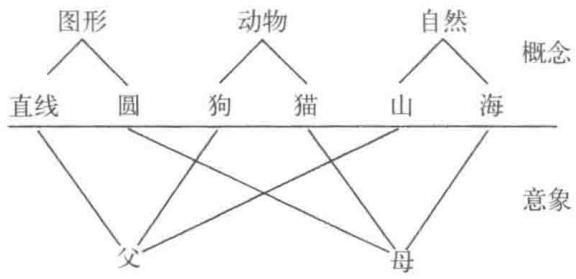
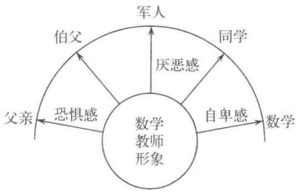
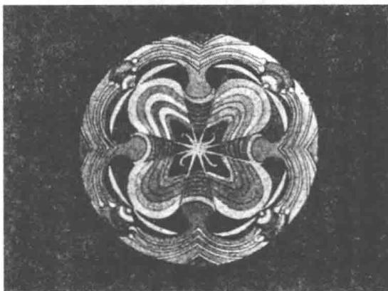

# 第六章 意象与象征

前一章讲到，我们无法直接知道原型本身究竟是什么，但可以通过把握原型对意识作用的效果来探知原始意象。从这个观点出发，荣格非常重视研究心灵内部的意象(image，Bild)及其活动的意义。意象，存在于意识与无意识的相互关系中，成为每一瞬间无意识以及意识领域心理状况的集约表现，因而读懂意象是非常有意义的事情。荣格一贯很注重意识和无意识的互补作用以及外界与内部的微妙呼应关系，理所当然，他肯定非常重视意象的研究。研究意象，必然要延伸到“象征”(symbol)的研究。荣格把象征与简单的符号(sign)区分开来，强调象征具有创造性意义，从这一点我们能够感受到荣格心理学的不同之处。也可以说，着眼并致力于意象和象征领域的研究，是荣格心理学显著的特征。这一章，我们重点说明意象及象征，在解释具有荣格心理学特征的内容的同时，也为至今未曾接触这种思想的读者搭建一个通向该研究领域的桥梁。

## 1. 意象

荣格所说的意象，基本上不具有一般意义上外部客体样式的意义。反倒可以说意象是基于心灵内部的活动，是与外部现实世界之间只有间接联系的无意识层面的产物。无论如何，意象只能是心灵内部的像，是有别于外部事实，且仅被特定的个人所接受的内容，因而也不同于幻觉、幻影等。幻觉是把内部的意象误当作外部事实而产生混乱的一种病态，意象并不具有类似混乱和病态的性质。通常，意象看上去不具有被“外部和现实”认可的价值，但对具体的个人来说往往有非常重要的内部价值，是一种和外部现实有着微妙关联的存在。下边我们从具象性、集约性和直接性几个方面来讨论意象的意义。

内部意象处于形成明确理念之前的阶段，或者可以认为意象是生发理念的母胎。我们在有意识地思考时，各种各样的概念会成为思考的要素，思考的过程也就是组合这些要素的过程。同时概念本身将某种意象作为自己的母胎，通过该意象母胎间接地与无意识层面建立关系。概念层面的规则和无意识层面的秩序犬牙交错，并不具有统一性，因而生出许多问题。

如图9所示，在意识领域属于完全不同范畴的概念，对应到意象的世界里，分类完全被打乱，重新集约成为父亲像或者母亲像。在意识的世界，概念作为思考对象的分类，属性明确，秩序井然。进入到意象的世界，属性变为情感/感觉机能的对象，用意识世界的分类观点来看，完全一片混沌。意象世界的分类破坏了意识世界的时间、空间秩序，以某种意象的形式得以具象化，与现实世界的概念相互交错。在这个世界里有时甚至排中律1都可以被忽略，也就是说在这个世界里，类似于“部分相等，那么全体就相等”这样不合理的规则是行得通的。因此，不相等的事物时常被认为是等同的，比如说，母亲、漩涡、壶作为相同的事物存在。而且，作为这种不合理的意象更加高层理念的母胎确实存在，某一种思想有可能以这样具象化的形象出现，被活生生地表达出来。比如说第三章第四节的扑克牌的梦中，当事人手上的牌里边一张红桃(心)都没有。这种非常具体的形象对做梦的人来说，形成了思考人生时所需的素材，并且生动地传达出了当事人的现状。

  
图9

意象世界的表现过于具象化，反倒增加了一般大众的理解难度。因为形象太具体，注意力都被吸引过去，而忽略了事态真实的意义。意象有点像站在数学的另一个极端。数学过于抽象的表达方式使很多人无法理解深处的含义与具体事物的联系，因而产生畏惧之感。意象的世界同样让人难以接受，但跟数学不同的地方在于，大家不是感觉到难懂，而是经常觉得不可置信。但正是这样看上去没个正经样子的意象，如果在其形成过程中集聚了足够的心理能量，就可能成为破坏意识世界概念组织的强大力量。比如说，人的内心一直有着威严恐怖的父亲像，那么在社会上遇到的地位比自己高的人总是会和内心的父亲像重叠，这样很难建立起和谐的人际关系。我们如果有机会实际遇到神经症的当事人就会明白，仅仅对事物做出合理的解释是多么苍白无力。面对着有社交恐惧症的人，再怎么极力说明“人没什么可怕的”，也毫无作用。这时候，与其在当事人合理的判断能力、概念的统合性上找问题，我们或许更应该聚焦在现象背后的意象世界。现实中，这样的感触很多。这里我们能够明确地感受到第一章中讲到的“扩展视野”的意义。可以说，相对于概念的世界，心理治疗师的特殊任务就是在充满了非合理性的意象世界里寻求答案。这意味着心理治疗师通过自己主体的参与，与患者共同体验意象的世界，认识意象世界的意义，为了意象世界内部的分化和统一而努力。

除了上述的具象化，意象的集约性也增加了意象世界的理解难度。心灵内部的意象是具象的，但并不单纯，是各种各样素材的复合体，且有着自身独立的意义。用荣格的话来讲，意象“是心灵整体的集约表现”2)。并不是说意象代表了无意识的全部内容，而是在适当的时机形成的一种布局(momentarily constellatted)，表现为意象。这种布局，一方面是无意识的产物，另一方面也依存于当时的意识状态。作为例子，我们来看一下第五章第三节中脸红恐惧症的梦。当事人觉得梦中给人难堪的老师和自己家里当军人的伯父很像。自己的爸爸也是军人气质，但妈妈喜爱文学和音乐。当事人的性格很像妈妈，经常受到爸爸的严厉斥责，所以从小特别怕爸爸。到了服兵役的时候，理所当然成绩很差，在军队中遭受不少凄惨的待遇。母亲的家族中多出艺术家，爸爸家族里有伯父这样的军人，实在让当事人难以释怀。梦中的数学课也是一个关键点。当事人虽说在学校里很多科目成绩都不错，但数学却是自己的短板，解不出题很丢人。梦中同学们都在嘲笑自己，与自己的名字比较奇怪，平常总是被同学讥讽有着关联。回想起来，也就是这时候自己开始动不动就脸红。本人实在讨厌自己的名字，可爸爸还觉得挺值得骄傲，真让人难堪。咨询过程中，当事人慢慢讲出了自己过往生活中的秘密，话题就这么朝着深处发展下去。

细节我们就省略了，借这个例子能够看到，很多事象是怎么样被浓缩后以意象的形式表现出来的。梦中数学老师的刁难、不擅长数学的自卑、同学的讥讽，都和过去的生活有着密切的联系，形象地传达出现时点的心态。像图10中所示那样，一位数学老师的形象不仅仅表达了数学老师这一个人，同时凝聚了恐惧、厌恶、自卑等情感，和自己内心的父亲、伯父、军人、同学以及数学等密切相关。我们这里简单地罗列了一下本人通过梦联想到的事情，读者应该也能意识到一个梦是可以这样引出很多重要的事情的。说是梦引出来的，其实是当事人从梦境联想到的众多事象在本人内心形成了一个布局，通过梦把它活灵活现地表现出来。

  
图10

我们已经解释了意象的具象性和集约性，下边来谈一谈意象的直接性。前边讲到过一个打扑克牌的梦，当时只是简单地指出了当事人作为劣势机能的情感机能问题。这种场合，如果我们忽视梦的分析，仅仅指出问题、提出忠告，“你的思维机能很出色，但太不在意情感机能了，以后要注意多发展自己的情感机能”，事情会怎么样发展呢？前边已经多次重复强调了，心理治疗不是指出患者的缺点，给出建议。现实中，指出别人的缺点往往非常容易，但作为一个志向于心理治疗的人，不能局限于对缺点的知识层面的认识，而是要有能力把握场面中触及心灵的体验。现实中，对当事人来说，玩弄“情感”“思维”等文字游戏，远不如梦中“手上的一副牌中一张红桃(心)都没有”所表现的意象来得印象深刻，这是我们能够直接获得重大信息的来源。意象的表达形式之丰富，触及心灵的力量之强大，都是令人惊叹的。意象具有这样直接的意义，也是它的一个强大优势。从知识方面入手讲道理，可能很难触及人的心灵深处，而直接的体验常常成为促人心动的根本力量。

意象有这种强大的力量，但缺乏明确的规律，且具有多义性，难以理解，往往令人无所适从。因此我们需要努力从意象直接得到的内容中剥离其具象性，赋予意象明确的意义，使之提炼升华到更高级的理念层面。如果我们只关心明确的概念，忘记背后与意象的密切关联，概念就成为没有水浇灌的植物，总有一天会枯死掉的。反过来，被意象强烈的直接性吓倒，疏忽了提炼升华概念的努力，终究会成为意象的俘虏。就像用刚砍伐下来的湿木材盖房子一样，慢慢到处变形，房子也不成为房子。关于这两者的关系，荣格曾说道，“理念的特征在于其明确性(clarity),原始意象的特征在于其生命力(vitality)”(3),真是名言。这里荣格指的是原始意象，可以说这种倾向比我们目前讨论的意象更加强烈。

原始意象力量更加强大，具有普遍的意义。个人意象当然也是存在的，并且和本人的无意识有着密切的联系。意象难以理解的另一个原因在于个性。首先我们能够说的是，意象对当事人本人来说，意义非常直接，感觉非常强烈，但又非常难以向外人传达。我们在做梦的分析时，时常感叹梦中的情形真是非常贴切地表达了当事人的状况。对有些很微妙的情形，治疗师和患者会有心灵相通的感觉，有时会不由自主地一起大笑不止，但想把这感觉传达给其他人，却经常让人困惑，不知该从哪儿说起。自己感动得不得了的事情，说给别人听，人家一脸迷茫：这人在说什么傻话呢？比如说刚才我们讲到的扑克牌的梦、数学老师的梦，都具有很强烈的个人性质，我自己心里也很不安：没准儿读者中也会有人觉得傻乎乎的。但反过来说到意象的直接性，对体验过其强烈冲击力的人来说，会感觉到试图“解释”这些的努力，都不过是剥夺意象生命力的小聪明。例如，笔者在前述的梦中谈到情感机能、父亲像等等，都可以说是画蛇添足吧。实际上，梦试图传达的意义，既包含了我说的这些，又远远不止这些，均以强烈的方式一股脑地传达给做梦的人。在了解到意象的各种意义、性质的情况下，即使我们只能捕捉出其中一部分概念的形式，用不完全的方式讲述意象，笔者还是认可这样做的意义，因而在前边做了很多解释。无论如何，意象归属于个人的色彩如此强烈，使得它成为一个

这样，我们讲明白了理解意象的困难之处的同时，也强调了意象的重要性。最后还想重述一下，意象与产生新生事物的创造性有着千丝万缕的联系。有关这一点，结合下一节的象征，一并讨论可能比较合适。

难以理解的事象。能了解到这一点，也是有意义的。

## 2. 象征及其创造性

前一节，我们主要讲述了意象具有的生命力，并指出意象是产生新事物的母胎。最能够显著地体现其创造性一面的是象征。荣格严格地把象征与符号、标识等区分开来。按照荣格的思想，一种表现方式如果用来代替已知的事物，或者是已知事物的简称，那么就不能称其为象征，只能是符号。相对而言，象征不单纯是已知事物的代用品，而应该成为在意欲表述某种程度的未知事物时产生的最优方式，意味着再不能够找到更合适的表现形式。比如荣格举的例子讲到(4),把十字架当作上帝之爱的象征,可以说是一种符号性的说明。如果十字架的意义能用“上帝的爱”这个词完整地表达的话，那么，就没必要用十字架这种还有其他含义的物体来表现。所以，只能说十字架是一种符号性的表达。

但是如果认为十字架是到目前为止并没有得到过任何认知的超越性的事物，除此之外再也找不到更合适的表达方式，那么，十字架就成为一种象征性的事物。从这个意义来看，弗洛伊德提倡的梦中的性象征，如果仅仅因为形状比较长而把它看作是男性性器的表现，比起“象征”的意义，“符号”似乎是更贴切的表达。作为翔实地表现了“象征”和“符号”的差异的例子，我们可以考察一下哑剧和手势哑谜游戏等。哑剧的名人马歇·马叟1能够在舞台上活灵活现地演绎出人的一生——两三分钟的时间，表现出人从出生一刻到成长、死亡的过程—给观众带来深刻的冲击和感动。但仅仅用姿势、手势来模仿的话，大多数常人也很容易做到。手脚并用在地上爬、走、拄个拐杖，然后躺地上死去，给谁看，都能明白在说人的一生。但细想想，这不过是人的一生的“符号”性的表达，谈不上人生的象征。马叟的演绎，充满了人一生的悲欢、内心流淌的形形色色的思绪和情感，这些集约在短短的两三分钟内，直诉胸臆，给场内所有的观众带来了深深的感动。我们不得不承认只有马叟能够表达到这样的层次，这早已无法用符号替代，是马叟通过自己的人格才能做到的象征性表现。

这里，我们讨论了十字架和马歇·马叟的演技，但不可忽略一个重要的事实：对某一个人可能具有象征意义的内容，对另一个人来说没准儿就毫无价值。换句话说，一个事物究竟有没有象征意义，很大程度上取决于接受方的态度。比如说，在初期基督教时代，十字架作为活生生的象征，具有的难以表达的神秘含义被众多信徒内在化。随着时代的流逝，十字架慢慢被看作是标示基督教信徒的一个符号，甚至对毫无关系的人来说，可能不过是两根组合起来的毫无意义的直线。这有些像艺术，一个艺术品对某一个特定的人来说具有不可替代的意义，另一个人可能就看不出任何意思。像这样，象征与接受方的态度息息相关，因而，试图汲取事物象征意义的人，总是需要对每一件事物背后未知的可能性持开放态度，这是必要条件。

下边，想给大家看几张幼儿园孩子的画，这些画可以说是意象和象征的绝妙例子。借用这些画，我们来做进一步的说明。彩色印刷的五幅画(卷首，图I—V)是六岁的女孩子平常在幼儿园画的画，跟心理治疗没有关系，完全是在日常场景中不受任何限制完成的，小女孩儿想画什么就自由地画什么。笔者到这个幼儿园去，偶然看到了其中第Ⅱ幅画，内心深受感动：左边的家和右边的一群蜗牛之间耸立着严格区分两者的高山。大家都知道，幼儿在发育过程中，经历第一次反抗期，获得一定程度的身体自由。随后到了六岁左右，又再次倾向更高层次的自立。之前在家庭内找到自己安居场所的孩子，到了这个年龄，开始向往进入社会。这时候，无论男孩女孩，都会把父亲当作一个模范，渐渐完成自立的行程。再来看看这张画，蜗牛和家是分离的，简直就像是为了把这两种东西分开，中间拔地而起一座高山。在山上画的两棵树，也是意味深长。两棵树能让我们感受到强烈的成长力和向外延伸的生命力。笔者看到这幅画想到，之前或许还会有表现出自己安住的家庭内部温暖感觉的画。于是笔者请幼儿园的老师帮助，找出来在这幅画前不久女孩画的第Ⅰ幅画。与图Ⅱ相比，这幅画给人的第一印象是画面整体非常温暖，画中央红色的蜗牛安心地住在家里。但左边很多蜗牛均用冷色调来表达，或许预示了后边将要发生的蜗牛与家庭的分离。和第Ⅰ幅画基本在同一时期画的还有粉色蜗牛住在家里，旁边有一些奶油色的小蜗牛，基调都很暖。但画面里还是有一部分被绿色框住，甚至有些地方什么都没画，留着空白部分，是否可以说同样一定程度暗示着将来会发生的分离呢？

无论如何,第Ⅱ幅画冲破第Ⅰ幅画中表现出的安稳状态，出现了力量，实在让人惊叹。这种强烈的分离之后，毫无疑问还需要再次整合的努力。这个过程反映在Ⅲ、Ⅳ、V三幅画中。这三幅画中能够看到的共同点在于图的左右分割的主题。这些基本上原样继承了图Ⅱ的分离力量，我们可以在图中感受到认可分离力量前提下的整合努力。在纵向分割的基础上，试图构成一个具有整合性画面的努力，可以从图Ⅳ采用的鸟瞰式构图中看出，这可以说是最适合的形式吧。图Ⅲ看上去也有着鸟瞰图的特点，中央一条大道，路边有街树，右边是家，左边有人。女孩儿画着画着，中间出现一棵大树，使得这幅画又像是普通视点的画，混乱中，这幅画画不下去了，右侧被涂掉了不少，内容渐渐消失。尽力在整合，却难以简单地成就其过程，图Ⅲ形象地表现出再次整合的困难。而图Ⅳ则用花田的鸟瞰图展现了一种绝妙的表现方式。当然，这里说的“绝妙”是从心理学意义的观点出发，与画的艺术性没有任何关系。说到一幅画的美术意义，我完全是门外汉，没资格发表什么意见。但与前边的蜗牛的画相比，我还是能感觉到后边的画变得更接近几何图形，作为画来说，失去了趣味性。或许只能这样吧，既要容许纵向分割，又要构造出一幅具有整体性的画，对幼儿来说具有相当的难度。所以，女孩儿一定程度上牺牲了绘画的表现力，用形式化的手段完成了高难度的任务。

就像最后这幅画的画面分成的四部分那样，在表达整合性的时候,经常会产生“四”的主题的现象(7)。图11引用了荣格著作中一位成人患者的画(8)。

  
图111

这幅画中也能看到非常清晰的“四”的主题的表达。虽然幼儿与成人的绘画在精密程度上无法相比，即使这样，依然可以在孩子的画中感受到整合的努力结出的果实。好像为了让过于几何图形化因而缺乏感情动线的第Ⅳ幅图透一口气似的，第V幅画呈现出了生动活泼的发展过程。这幅画中，左边是女孩儿，右边是家，中央是棵大树，家用红色包围，女孩儿则在绿色丛中。这幅画跟以前的画一样，同样在表现分离，但让笔者感到非常欣慰的是画在大树上的孩子。前边提到过，树经常用来表达生长的意义，世界各地流传的从树里边出生的孩子、被遗弃到树下的婴儿等传说故事，最直白地讲述着从生长的象征——树—中诞生出新生命的主题。孩子，具有某种新的意义，是可以带来很高价值的不可思议的东西。

孩子出现在树上，借用荣格的表达方式，恰恰象征着英雄的诞生、儿童原型(childarchetype)的出现。这种原型性的儿童，正是为了促使处于分离状态的家和人(前边表现为蜗牛)再次整合而出现的英雄。除此之外，找不到别的解释。或者可以说，以几何性较强的图Ⅳ为基础，原型性的孩子带来了强烈的生命力。像这样，新事物的产生经常以原型性的孩子形象表达出来，荣格和柯列尼在合著9中明确地表达了这一重要事实。柯列尼在著作中极力强调神话里儿童神的重要性：儿童神比起成人神，并不缺少重要性，也不欠缺含义，甚至需要特别强调在代表“新的可能性的出现”方面具有更深刻的意义。荣格明确了这种原型性儿童的意义，但指出对于内心产生的“未知的新的可能性”，其神秘性以及超越了一般理解的体验，使得新生儿诞生的话题往往以荒诞的形式表现出来。比如桃子里生出来的英雄，从竹子里诞生的绝世美女，在日本可以说家喻户晓吧。还有，被鸟儿扔在树上，在树里边出生的孩子等等，都具有这样的意义。

基于这种观点，笔者对画面中出现在树上的孩子感到非常欣喜，可以说这表达了新的整合的可能性。但幼儿园的老师解释说这是描绘格林童话《杰克和豌豆》的画，听老师讲杰克和豌豆的故事以后，孩子画了这幅画。画中左边看上去像女孩儿一样的人是杰克的妈妈，树上的孩子是豌豆树上的杰克。看到这里，读者中或许会有人觉得“什么呀，说了半天原来不过是这么回事”。就像《徒然草》中，吉田上人看到反方向放着的石狮子,不知道是孩子们调皮故意放错，心想一定有着深奥的由来，鸣咽不止。读者看我在这里滔滔不绝地讲原型性儿童的诞生，肯定把我也当作吉田上人的同类吧。但我还是真心认为，杰克和豌豆树的故事恰巧在适当的时候出现，给这位女孩儿的内心状态提供了富有生命力的表达方式。

在刚才说到寓言故事时提到的桃太郎的诞生，也同样具有丰富的适合表达内心状态的意象。时常给孩子们讲童话故事、寓言等，意义正在这里。这样，孩子听了杰克和豌豆树的故事以后，完全不受任何约束地在自由活动的时间里画出这样的画。从这个事实可以推测到，故事中的意象准确地捕捉到孩子当时的内心活动。更加令人深思的是，看了同一时间其他孩子们的画，也都是在当中画着朝天上伸展的豌豆树以及爬豌豆树的杰克，几乎没有人画“杰克与巨人作战”的话题(有的甚至在大树边上画着小小的巨人，和冲天的豌豆巨树形成鲜明的对照)。刚才我们在画的说明中也提到，向着天空不停地长呀长的豌豆树以及不停地向上攀登的杰克，这类意象对这个年龄段的孩子们来说无疑具有特别的吸引力。再看这个女孩儿之后的一些画，中间画着一棵大树，旁边有四只动物等等。这些画基本上仍旧持续着中央一棵大树的主题，但已经不是把一幅画生生地切成两半，因而画的整体中生硬的对称性也消失了。能看得出来“四”这个数字依然延续下来，但动物的位置等等变化更多，不是以前那种僵硬的构图，画的整体性也呈现出来。我们这里省略了后边的这些画，但经过上边的说明，从这五幅画中应该也能看到女孩儿内心发展的过程。

特别是，笔者从第Ⅱ幅画中感受到孩子为了走向自立所表现出来的力量，以及伴随而来的分离不安(蜗牛被从家里赶出来了)，因此向幼儿园老师询问了一下当时女孩儿的情况。幼儿园老师想起来，正好是在画这幅画的前后一段时间，女孩儿看上去非常乖，整天文文静静的，却不知为什么反倒总是被班里调皮的男孩子欺负。老师站出来阻止男孩子们的时候，男孩子们却说她最近很嚣张，要教训教训她。在大人们的眼里很文静的乖孩子，孩子们看上去却是“嚣张的”，这一点很发人深省。可以推测，同年龄的孩子们或许在某一点觉察到女孩子内心发生的如此强烈的自立意向，因而产生了抵制行为。

我们以一个幼儿园孩子的画为例做了说明。如果不仅用反映孩子内心发展过程的意象来看待这些画，还能感受到画中包含的某种未知的可能性在向我们的心灵诉说。而且如果对这个孩子来说，找不到其他更合适的方式来表达内心的变化历程，那么可以认为这些画是具有象征意义的创造性表现。这一系列的画，把家和孩子当作对立的事物展现出来，并且向着再次整合的目标而努力。像画的特征所表现的那样，象征总是具有对立事物的统合性。而且，随着对立事物数量的增加，各种事物之间的关系越来越微妙，统合性上升到更高一层，象征的构造就会愈加复杂，其创造性也愈加高涨。因为象征具有具象性，我们把最原始的层面当作母胎的同时，并不能满足于平庸的、传统的事物，需要更加高度分化的精神机能。通过这样的象征，我们内心存在的合理的事物及不合理的事物、内向的东西和外向的东西以及思维机能和情感机能等获得了更高层次的统合。而这些象征性的表达会出现在我们创造性的工作当中。比如说在浮世绘中，画家直观把握对象的本质，但又绝不超出对事物外部的表现(甚至可以说是写实的)，从中，我们能够感受到画家绝妙的感觉机能与直觉能力的统合。再来看一下卡拉扬的指挥，你无法不感觉到他那紧闭的双眼对着自己内心世界开放，有着深厚的内倾志向；反过来，又简直像是特意做给听众看一样，华丽的动作不断地向外扩展。外向性和内向性两个完全相反的特性，就这么完美地统合在卡拉扬这个人物当中，形成象征性的表现。实际上，如果世界上存在着只依赖思考且完全无视情感的哲学家，或者感觉机能非常发达却缺乏直觉机能的音乐家，我们可以承认其正确性，但无法感受到他们的创造力。

有关象征形成的过程，我们再来看看荣格是怎么说的。前边已经做过说明，象征的特点包含着对立物。因而在象征出现之前，一定有着如下的体验：意识到有两个相反的倾向，对于这两个完全相反的对立物，我们无法简单地选择站在哪一边。面对这样的窘境，单纯彻底地压抑某一方，看上去易行，但自我却从来不会这样简单地解决问题，总是跟命题和反命题的双方都有着不解之缘。这时候，因为双方的对立，自我无法向着某一个方向行动，不得不品尝着停滞状态的滋味。从而导致以前持续地维持着自我机能工作的心理能量从自我领域退行到无意识范围内，也就是说心理能量回归其源泉，开始诱发无意识的活动。

这里说的过于抽象，可能不容易理解。下面试着具体、简单地描述一下。比如说一位以思维机能为优势机能的思想家，日常总是依靠自己的思维能力归纳自己的思想并且表达出来。但某一天他突然觉得自己的思考非常乏味，缺乏关键的重要因素，这就意味着以往被忽视的情感机能开始活动，在秩序井然的思维形式中追加情感之火成为不可回避的人生课题。一般来说，思想家如果还能够压抑住自己内心无意识的情感活动，继续往常的思考，可能不会出大问题，但思考或许就欠缺了创造性。反过来，如果他忠实于自己内心的情感活动，并且不抛弃自己以往就具有的优势思维机能，思维和情感的对立、纠缠将会阻挠他继续思考，使他陷入困境。这时候心理能量退行回流到无意识世界，表现出来的行为就像是放弃了有意义的思考、耽于无谓的空想之中不能自拔，时不时地有一种幼儿式的行动或者冲动。也有可能，当事人根本就静不下心来工作，自己也搞不清楚到底想干什么，每日为自己的迷茫而焦虑、烦躁。这种退行现象比较强烈，自我实在难以忍受时，会出现一种引人注目的向对立面转化的现象，所谓“物极必反，相反相成”(enantiodromia)，态度出现一百八十度转向。但这种过程仅仅是态度的逆转，不伴随任何创造性的变化。比如说思维型的人突然变得非常感情用事，内向的人突然做出具有强烈外向型特征的行为，这只能说从一个极端到另一个极端变化得比较激烈，却难以找出其创造性意义。

与这种现象形成对比的是，在发生了强烈的心理能量退行的情况下，自我弱化了原有机能后，还能忍耐变化持续运行。这样,无意识内的倾向和自我的作用超越了单纯的命题和反命题而出现了具有统合意义的意象。这样形成的高度统合性超越以往的立场因而具有创造性的内容，这就是象征。通过这个象征退行到无意识领域的心理能量再次开始前行，注入自我，使得自我获得新的能量开始活动。荣格非常重视人所具有的形成象征的能力，称其为“超越功能”(transcendentfunction)(10)。这时候,纠结于这个功能究竟属于思维，还是直觉等等，已经没什么意义了。超越功能具有合成多种机能带来的复杂性，不仅超越了某一种特定的机能，还意味着它甚至包含了完全对立的机能在内。我们论述的象征形成的过程等同于创造过程，在这里能找到荣格所说的无意识层面的肯定性和创造性的源泉，因而，也需要非常重视退行性行为具有的积极一面。相对而言，弗洛伊德认为无意识是所有被自我所压抑、排斥的内容之集合，退行现象永恒地代表着病态。在这方面，两人观点不同。荣格针对退行现象，首先区分是已经到达病态的标准还是属于正常行为范围，认为创造性的人生必然需要正常范围内的退行行为。当然，荣格是在承认无意识的破坏性和丑恶一面的基础上，寻求其成为建设性源泉的可能。荣格的这种基本态度成为他与弗洛伊德诀别的一个重要原因(11)。

伴随着象征的形成，一直处于退行状态的心理能量开始往建设性的方向流淌，这一点前边已经讲过。荣格指出这种心理能量的变容来自象征及宗教仪式，找出了象征及宗教仪式的高度心理学意义。我们的意识体系由明确的概念构成，本身就具有整体性，但为了充满活力地持续发展，意识还必须与心灵深处建立联系，构成坚实的基础。这么看来，意象是来自心灵深层部分向着自我诉说的语言，可以认为基于此我们才能保持与心灵深层的联系。因此，意象的内容具有高度的统合性和创造性。任何其他事物难以替代，因而作为唯一的表现出现的事物，均可以称其为象征。神经症患者当中，能发现有不少人断绝了自我与无意识之间的创造性互动关系，还有一些人就是不能够理解我们刚才讲到的这些意象的意义，以至于引起了概念世界里的混乱，威胁到实际生活中自我的统合性。从事心理治疗的人日常面对着这种症状，研究意象、象征就成为非常重要的工作内容。不能简单地把象征看作是某一种东西的替代物，要发现其中蕴含的未知的可能性，时常注视着当事人发展的动向，这是治疗师在治疗现场至关重要的态度，不可懈怠。一个象征经常既包含着对过去的洞察，也表现出面对未来的志向，现实当中经常能遇到这样的例子。

觉察到意象和象征对心理治疗的重要性后，荣格开始致力研究远古时产生的、后来又失传的宗教仪式及象征的意义。他在给这些古老的事物赋予新意的同时，更看到了每个人内心产生的象征的意义。

## 3.心理治疗中意象的意义

前一节我们讲到了心理治疗过程中意象和象征的重要性，这里我们用实际例子来做具体的说明。例如第五章中讲到的患学校恐惧症的孩子，以梦中出现的“肉的漩涡”意象为中心，我们可以辨别出分布在其周围的壶、软弱的父亲及作为替代的母亲、强势的太母等原型。治疗师在深入理解了这些原型意义的前提下，与少年就此深入交谈，慢慢地找到了通向解决问题的道路。但是，意象并不一定总是与梦相关，为了能理清楚在通常的心理治疗现场意象的重要性，我们下边举一个其他治疗师介绍的实例。

第一个是智力障碍儿童的游戏治疗的实例(12)。七岁十一个月的男童，发育年龄只有一岁九个月，成长过程非常迟缓。当然他无法与其他同龄孩子一起玩耍，只能一直闷在家里过着孤独的生活。在给这个孩子进行游戏治疗的过程中，到第七次，发生了一件令治疗师心动的事情。这个孩子在游戏治疗的现场，一直重复着如下行为：用绳子缠在玩具熊的脖子上，拖着玩具熊走一阵子，再把绳子解开。治疗师当时并没有明确理解这重复行为的意义，但内心还是受到震动，留下了很深的印象。治疗师事后把这个情况告诉了一直跟孩子妈妈对话的心理咨询师,才知道，妈妈也说到最近家里不知道从哪里来了一条走迷路的小狗，孩子非常高兴地在喂养这条小狗。有一天，妈妈外出回来，狗不见了。

妈妈说：“小狗不见了，得赶紧出去找。”但留在家里的智力障碍的孩子说不用找了。妈妈觉得很奇怪，后来才了解到这是附近邻居的狗，迷路了走到自己家里来。终于狗主人找来了，让把狗还回去。当时一个人守在家里的孩子理解了狗主人的话，自己把心爱的小狗狗牵来，一边哭一边把链子解开，还给了原来的主人。这件事情让妈妈非常吃惊，也非常高兴。至今为止，基本上不怎么会说话的孩子，能够理解邻居的意思，而且能把自己那么喜欢的小狗还给原来的主人。孩子完成这么一项伟大的任务，妈妈的喜悦可想而知。当然，这样的喜悦也传达给了治疗师。

可以说终于做成一件“大事”的孩子在治疗现场一遍又一遍地还原、再现当时的场景，就是为了向治疗师表达事情的经过。但事情仅仅如此吗?这个游戏只有这么一个意义吗?笔者在孩子的一再重复的行为中，看到的不仅是要向治疗师讲述事情过程的意图，还看到了生动地表现出来的一个主题—解除束缚。向治疗师询问了一下，当时这个孩子身上有没有发生什么跟“解除束缚”有关的事情，治疗师说起，因为智能障碍，孩子的母亲一直尽量把他放在家里，不带他出门，孩子就像是活在某种囚禁状态下。后来，孩子经常要到这里来做治疗，不得不出门。妈妈的想法有所转变，同时孩子也在成长，慢慢地妈妈开始不怎么限制孩子外出，他也就有机会很高兴地跟外人接触。正好在这个时候，发生了前边所说的游戏治疗现场的行为。这样，我们就理清楚了孩子给熊玩具解开绳索的游戏(几乎可以称其为仪式)的意义。把这个游戏当作孩子内心产生的意象，能够感受到从关起门的家里挣脱了束缚被解放出来的强烈印象。从意象的多义性来看，游戏不仅表达了这一个意思，其中还包含了把心爱的小狗还回去的悲伤，以及能跟邻居对等地交流、能控制住自己的悲伤还回小狗的成就感，各种各样复杂的情感都凝聚在一个游戏里，集中表达了出来。所以，它一定有着与之前的游戏不同的感染力，治疗师才能在这个游戏中感觉到心动，留下深刻的印象。这样，在现场一对一的治疗过程中，全力以赴地较量时产生的联系两者之间的深层感情交流，实在是不可思议，而且总是令人感动不已。进一步来看，作为两者间心灵交流的中介，意象形式的表达也是具有深刻意义的。想想例子中的孩子发育年龄只有一岁九个月，表达出来的内容实在令人惊讶。确实，现实中，笔者经常能感觉到，意象形式的表达深度常常无关乎智能、年龄。

像这样在游戏的场面中，游戏生动地表现出孩子内心的世界。不把孩子的行为当作单纯的游戏，敏锐地观察到意象表达出的内容，治疗师才能够感触到背后蕴含的可能性，进一步将潜在的可能性引导出来。治疗师对意象的世界敞开心怀，用这种眼光看待孩子，在与孩子接触的过程中，游戏内容渐渐变得意义深刻后，从中可以发现贯穿始终的主题。主题当然会随着孩子遇到的问题类型、所处的境遇而有所不同，但经常可以读出离家出走、在家庭内部寻求自己可以安住的位置、一直压抑着的攻击性的整合(参考第四章洁癖的例子)等各种类型的主题。如果治疗师能够理解到这一层面，对把握治疗过程的走向、增加治疗过程的稳定性都会起到很重要的作用13)。

能感受到意象意义的场面并不局限于游戏治疗法，在一般的心理咨询现场，意象同样具有重要的意义。举一个年轻女性的例子(14)。这位女性在心理咨询时讲到表妹生孩子，自己去帮忙时的事情。她不怎么说自己的烦恼，一直在说表妹在以为已经无法生育快要绝望的时候有了这个孩子,高兴得不得了，自己去帮忙，看到婴儿觉得真是可爱。接着还是表妹的话题,她就表妹的性格谈论了很多，接着说自己一直认为节约、俭朴是一种美德，可是这个表妹花起钱来一点不在乎。但看到表妹遇到喜欢的东西，在想要的时候毫不犹豫地买下来以后高兴的样子，想想有时候浪费一下也挺好的。她一直就这么说表妹的事情。如果只在表层听她讲话，或许会觉得她怎么一点儿不说自己的问题，话题怎么总是不离表妹，甚至可能觉得她只是为了回避自己的问题才这么滔滔不绝地讲别人的事情。但是，如果把这些当作意象的表现来看，或许能察觉到表妹可能正是这位女性的阴影(参见前一章阴影的说明，当然，仅仅看这里简单的叙述可能比较难以想象，听到这位女性具体讲的话，会非常清楚地感受到这一点)。看着这位女性这么长时间热心地谈论表妹的性格，能感觉到表妹的形象在她心中占据的位置有多么重要。以前她一直觉得“浪费”是绝对的恶习，但通过观察表妹的生活细节，从表妹的行为中也发现了有益的一面。前边我们讨论过意象的具象性，这里，通过表妹这个具体的形象，女性讲述着对自己的阴影的洞察结果。比起当事人单纯地思考“过于节约也不太好”，这样的洞察伴随着更深层次的体验和理解。实际上，头脑中理性地理解一件事情经常出乎意料地简单，但这种层面的理解往往也不具备促进行为改变的力量。大家都知道，对着神经症的患者，苦口婆心地教育、讲道理、说服，基本上是没什么效果的。但通过活生生的意象体验到的东西却能触动自己的内心。比如说从意象的立场来听例子中的女性述说，就会发现一个有趣的事实。她自己非常动情地说到表妹在几乎对生育绝望的情况下却喜出望外地迎来了孩子的诞生。希望大家能回忆一下我们在上一节中说到孩子诞生的原型性意义，一般来说孩子的诞生总是意味着出现了新的可能性。遵循这个思路，再去听当事人的叙述，我们可以感受到她在讲述“以浪费恶习为代表的自己的阴影，她从未意料到阴影中也可以诞生新的可能性(没想到表妹还能生出孩子)，阴影中诞生了新的可能性的现实(表妹的孩子诞生了，发现了表妹性格中好的一面)”等内容。在心理治疗的现场，我们作为治疗师经常可以体验到例子中讲到的实际发生的事情和意象世界之间不可思议的呼应现象。如果治疗师能经常抱着这样的态度倾听当事人的叙述，从很多看上去跟当事人没有什么关系的故事当中，就能感受到当事人在努力地表达自己内心深处的问题。

我们说到的治疗师以意象表现来听取当事人的叙述，或者外部事象和内心世界的呼应性，都是在指立足于这种观点时的有效性，并没有“这些观点绝对是必要的”“这就是绝对的事实”等含义。比如例子中，说“表妹生孩子的事实，表现出了当事人整合阴影部分的新的发展可能性”，或者说“因为表妹生了孩子，所以当事人具有了新的可能性”，都是荒诞无稽的。我们并不是在说因果关系的推理可以成立，而是在说在倾听当事人叙述外部事象时，感受到叙述的内容与其内心世界有着呼应关系。只是表达了“这种观察方法可以成立”的想法，仅此而已。基于上述观点，治疗师在现场要非常慎重地选择自己的词语。可以说“在认为已经没有可能生孩子，不可能有新的事物出现时，出现了新的事物”，也可以说“有着浪费习惯的人，也可以产生新的事物”。最重要的是，治疗师不能把听到外部事象时内心浮现的内容不做任何提炼以原始状态全盘托出，需要找到一种既可以成为内心世界的表现也能够成为外部事象描写的、居于两者之间的表达方式。在当事人对此能做出呼应的范围内，治疗师引导话题向深处发展。说到底，无论治疗师怎样把表妹生孩子的叙述看作意象的表现，当事人本身对此毫无共鸣的情形也经常会遇到。不考虑到这一点，治疗师自

己兴致勃勃，无视对方的反应，自说自话，终究也只是把理论解释强加到别人头上，不具有任何治疗的意义。在实际的治疗现场，治疗师对当事人的深入了解(比如说例子中的表妹意味着当事人的阴影)，感受到当事人在叙述过程中呈现出的感情波动等等，都会提高治疗师对状况判断的准确性。前边讲到的游戏疗法中，孩子给熊玩具解开绳索的动作一定有什么能够打动治疗师的东西，才使得治疗师在现场没有放过这个信号。心理治疗师，要永远保持着对当事人和自己的情感变动的敏锐性。治疗师以这样的态度面对当事人，在当事人的叙述中感觉到其内心世界的表现内容时，通过兼顾内部与外部的表达方式来探索前边的路径。当事人对治疗师的表述没有反应时，暂时放下不谈，当事人但凡有一些呼应时，顺着其呼应渐渐深化表达。这样，治疗过程方可渐渐深入。

像这两个例子所显示的那样，治疗过程中，当事人把实际发生的事情通过游戏再现或者用语言叙述，通过与治疗师的内心交流，促进自己用意象世界里具有意义的体验在自己的心灵深处构筑更加坚实的基础。柯列尼认为神话的作用不是单纯的说明，而是为了构筑事物的基础。这个观点正好适用于这里讲到的内容(参见第五章第二节)。实际上，“用个人的体验在心灵深处构建基础”是心理治疗过程中非常重要的事项，心理治疗师自然会感受到具有这样功效的意象和象征的重要意义。刚才举的两个例子发生在游戏疗法和心理咨询的现场，但现实中，梦的世界才真正是意识和无意识交错的地方，可以称为意象和象征的宝库。笔者非常能够理解荣格为什么倾注了大量心血在梦的研究中。有关梦的分析，我们在下一章做一些详细讨论。

## 参考文献：

(1)这一章以及后续章节讲到的意象和象征均遵循荣格的思想，与一般的说法相当不同。多数场合讲到的“image”指对外界事物的感觉在没有外界事物刺激的情况下的再现，或者称为二次感觉。关于象征，也因学者所持观点不同而不同。一般来说多指某种更高维度的思考、事象以其他形象或事物的表达或者代理，有时包含了荣格定义的符号。有关荣格的思想，本章中都有详细论述。

(2) Jung, C. G. , Psychological Types. Routledge & Kegan Paul, 1921, p. 555.

(3) 同上，p.560。

(4) 同上，p.601。

(5)天理市、丹波市幼儿园儿童的画。这个幼儿园不限制幼儿的行动，给孩子们自由活动空间，孩子们想画画的时候可以按自己的意愿尽情地画。我想可能正因为这样，这里展示出的几幅画才能够表达出如此丰富的内心世界。

(6)正像类似“生命之树”(Lebensbaum)这些词所表达的那样，树经常被当作成长的象征。这里的“两棵树”的数字“二”，通常既表达了“纠葛”，也说明“距离意识比较近”(neartoconsciousness)。非常契合这个例子。

(7)荣格不止一次讲到“四”具有“完整数”的意义。关于这一 点,荣格有非常详细的论述,详见：Jung,C. G.，The phenomenology of the spirit in Fairytales. C. W. 9. I, pp. 207 − 254.

(8) Jung, C. G. , A Study in the Process of Individuation. C. W. 9. I.

(9) Jung, C. G. & Kerényi, C. , Essays on a Science of Mythology. Harper & Row, 1949, pp. 67 – 91.

(10 ) Jung, C. G., Transcendent Function. C. W. 9, pp.67-91.

(11)关于这一点，近期自我心理学者中有人强调的“为了自我的退行”(regression in the service of the ego)的思想,与荣格所述创造性所需要的退行现象表现出同样的过程。仅从这一点来看，现在的荣格派和弗洛伊德派比以前的更加接近了。

(12)这是京都大学教育学部研究生院的东山纮久的治疗实例。

(13)因为孩子们容易将自己的心像以更加整体的形式表现出来，治疗师也更容易看出其中的意义，笔者近来在游戏疗法中并用“箱庭疗法”(Sand PlayTechnique,也称为沙盘疗法)。最新的研究成果，与京都市心理咨询中心的职员共同发表在该中心1967年的“研究纪要2”，有兴趣的读者可以参考。其中，在大谷的实例报告中讲到孩子玩超人和怪兽斗争的游戏，途中超人失败死去被埋进地下，然后又活过来打败了怪兽。这也是在游戏中戏剧性地完成了“死和重生”的过程，随后，孩子的症状也渐渐好转。“死和重生”的主题在第七章的最后还会讲到,确实非常重要。

(14)这是京都市心理咨询中心中村良之助的治疗实例，和前边的东山的例子一样，都非常珍贵。对他们允许我在此使用这些治疗事例，深表感谢。
