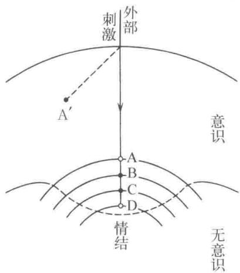
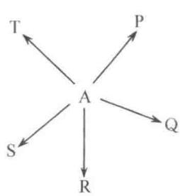
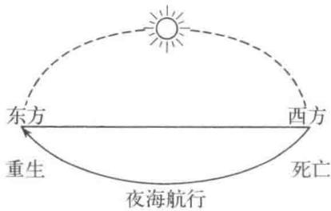

# 第七章 梦的分析

梦，以及梦的分析，是形成荣格派心理分析学说核心的重要事项。可现实中比较尴尬的是，一说起“梦的重要性”，可能会立刻引起很多人的反感：非科学，像近现代未开化之前糊弄人的东西一样，听上去就傻乎乎的。人们经常把一些稀奇古怪、不可实现的愿望贬称为“白日梦”，这就是一例吧。在我们身处的心理治疗现场，正是要把这样非现实的梦作为一种“现实”，应用到治疗过程中。但说实话，稍不谨慎就会游走于现实和非现实的边缘地带，面临跌入万丈深渊的险境。不过，回忆一下我们从第一章到第六章，洋洋洒洒地说了那么多，应该可以说已经为踏进危险的“梦的分析”领域做了一些准备工作吧。我想，能坚持读到这里的读者，应该可以把前边的内容当作进一步阅读的线索，不再会感觉到研究梦是一件荒诞无稽的事情，一定能够理解本章的内容。在类似“大白天说梦话”的表达当中，我们能感受到对梦的否定态度，但也有“年轻人一定要有梦想”这样对梦持肯定态度的说法。这两种态度恰好表达出了梦的两面性。

无论东西，自古以来就有梦的故事。在日本，以《古事记》中很多有关梦的故事为代表，古老的叙事故事中到处都能看到梦的记录1)。这些故事以外，自古以来人们如何解释梦、如何研究梦，也同样是令人感兴趣的领域。实际上，在这些梦的故事中，我们同样可以挖掘出有益的智慧，限于篇幅，这方面的内容就略去不谈了。另外，梦的生理学研究，近年也渐渐盛行，人们发现了不少有意思的现象，这些也只能省略2)。在这里，我们主要以荣格的立场来探讨一下梦的心理学方面的意义。

在讨论梦的分析之前，我们先引用一段尼采说的话3)，通常认为这段话体现了对梦的重要性的认识。

人，无论是谁，在创造梦的世界方面都是完美无缺的艺术家。梦的世界中的美丽形象是一切造型艺术的前提。……梦的世界中我们享受着对物体形状的直接理解，一切形态都向我们诉说着，不存在任何无意义、不必要的事物。

## 1. 梦的意义

最早是弗洛伊德明确地指出梦的重要性。在1900年出版的《梦的解析》中，弗洛伊德在总结了大量的梦及其解析例子的基础上指出：梦实际上是“某种受到压抑的愿望的伪满足状态”。其后，比起梦的解析，弗洛伊德更加重视心理治疗现场的自由联想方式。荣格则重视梦的意义，认为梦是治疗现场的重要手段，发展了梦的研究成果。现在，我们不纠结于梦的讨论，先来看一个具体例子吧。这是一位28岁独身女性的梦。

梦境：一个很大的家，像是宾馆一样。有很多人在里边住着。一个男的被杀了，杀人的人又被不晓得什么人杀了，同样的模式接连重复发生了几次。我从自己的房间往窗外看去，河流的水溢出来，在房子周围流淌，一直漫到远处的大路上。我知道谁会是最终的杀人者，把这个答案告诉了在我房间里的陌生男人。我一边告诉他这个答案，一边感受到深深的疲劳和悲伤，忍不住喊了出来：“你就当我什么都不知道好了！”然后陌生男人说“你既然并不想惩罚杀人者，为什么把他的名字说出来呢？现在再说就当自己什么都不知道，已经晚了”等等。我辩解说自己很怕杀人者，在跟陌生人争论的过程中，最终的杀人者用自己的刀自杀了。

读者即使不了解任何背景也能够感受到这个梦境的疹人气氛吧。做这个梦的女性可以说是典型的思维型。一次笔者问她：“那么你有什么感觉呢？”她回答说：“我也不知道。我可以思考，但没法感觉。”她的思维型特点就强烈到这种程度。与这位女性现实生活中极端稀缺的情感表现相比，梦中出现的场景构成了鲜明的对照。从这个梦开始联想，并结合到目前为止对梦的分析结果，女性认识到梦中拿着日本刀的杀人者代表了潜藏在自己思维机能背后的意象，并感受到意象力量之强大及其危险性。这里，我们可以回忆一下在第三章中讲到的思维和情感机能的对立性，以及前一章中讲到的意象表现的直接性、具象性。这里特别希望大家能够注意到，自己心灵内部的某种机能或情结以具象化，特别是人格化(personify)的意象形式出现的现象。梦中会有例子中这样强烈的意象出现，但并不总是这样，有时候梦的表现会非常幽默。下边的例子是这位女性十天前的梦，虽说跟上边讲的梦一样，也表现出与她平时占绝对优势的思维型生活方式形成的鲜明对照，但可以留意到梦传达出的意蕴又别具一格。

梦境：电话响了。我接听电话，但对方声音很小，听不懂在说什么。我又问了一遍，听到轻微的声音在嘟囔着：“这里是幽灵协会。”我告诉他，自己根本不相信幽灵什么的，对方说：“你有没有读过最新一期的幽灵新闻？啊，不过你嘛，只要有一枝削得尖尖的铅笔就行了。”气得我回答他：“不管怎么说，我既不相信幽灵也讨厌尖尖的铅笔！”他还想说下去，我把电话挂断了。

这个梦与前边的有着同样的主题，但表达方式不是那么惨烈，一种幽灵协会打来电话的幽默气氛弥漫其中。梦的开始是电话铃响了，非常有启示意义。我们在做游戏治疗时，当事人不想直接跟治疗师接触，但又产生了接触的意愿时,经常会尝试通过电话建立联系。梦中的情形有着完全相同的意义。这显示出想与当事人建立联系的某种东西(例子中可以说是被强力压抑着的情感机能)还没有达到能直接与自我接触的地步，但已经在试图不管通过什么方式先联系起来再说。电话对方的声音很小难以辨别，则明确表达了建立联系的困难程度。发现对方是“幽灵协会”时，当事人毫不客气地攻击：“根本不相信幽灵。”思维机能占绝对优势、一直合理地度过自己人生的当事人对幽灵满心不屑，很可以理解。可是敌方也不是好对付的，马上还击：“你读过最新一期的幽灵新闻吗?”好像只要有幽灵新闻，就可以证明幽灵的存在一样。这说法确实抓住了问题的要点。也就是说，幽灵发现了思维型女性的逻辑体系主干多数基于报纸上登载的报道(或者说人世间普遍认可的主流观点)，削得尖尖的铅笔则形象地表达出女性日常使用的“武器”。她用尖尖的铅笔写出来的观点，往往带着一种对异性的威胁。但是，女性面对幽灵的嘲弄非常生气，“既不相信幽灵”“也讨厌尖尖的铅笔”等等，发泄一通，挂了电话。梦的最后阶段，这个平常主要依赖思维机能的女性表现出情感型的发作，意义深刻。幽灵一伙可能对女性说出“讨厌削尖的铅笔”感到比较满意，暂时不再重新打电话进来纠缠。梦中，对话的对手是幽灵，说明了建立联系的困难程度。包括最后的场面，当事人生气地切断电话，都让人感觉到我们的工作——帮助当事人发展她的情感机能——还是相当艰巨的。放下这些不谈，至少可以说这个梦相当生动地给我们传达出女性当时的心理状态。

从这些例子中可以看到，梦对人们的生活有着不可估量的意义。简单地归纳一下，可以说相对于意识，梦是以某种意象的形式表达出的无意识状态的自画像。通过研究这种显性表现出来的意象，我们能够了解到自己的无意识状态，并深入探讨它对意识的意义。在执行这项任务时，第三章中讲到的意识和无意识的互补性就非常重要了，下一节会详细讨论这一点。作为意识和无意识的相互作用，出现在梦中的内容具有非常深刻的意义，与前一章讲到的意象的意义有着密切关系。我们来解释一下概念与意象的差异。意象的意义在于赋予概念以生命力，并为概念构筑了基础。这一点，梦也有着完全相同的功效，它让我们的意识体系/自我与内心建立起更深刻的密切联系，并形成坚实的基础。这些认识，基于我们每一天的经验积累。在日常工作中找到梦的意义，认识到梦中伴随的情感，以及当事人在现实生活中因缺乏体验而中断的事物时常会出现在梦境中的事实，都说明了这一点。比如说前边的幽灵协会的梦，在做这个梦那天睡之前，当事人接到表妹的电话，表妹津津乐道地讲自己丈夫的琐事，听得她心烦意乱，无言以对。当事人愤愤然：“没完没了地炫耀自己的丈夫，多傻。我真做不出这种事。”说得确实不错，她的观点可以说是正确的。但很多女性就是这样，有的时候就是想唠叨下自家丈夫的事情，电话拿起来说个没完。对这种行为感到极度气愤，未免有些过头了。她自己在日常生活中很少能像表妹这样开放地表达自己的情感,总是压抑着情感的涌动,理性地生活着。因此，她的自我对表妹的啰唆电话特别不耐烦，但内心深处又何尝没对表妹那样直率的情感表达产生共鸣呢?因此，那一晚迫不及待入梦的正是来自幽灵协会的电话。

弗洛伊德引用的阿纳托尔·法朗士1的名言可以说是一种非常直接的表达。“入夜，我们在梦中见到的是白昼被我们忽略掉的东西的可怜残渣。梦，时常是遭我们轻蔑的事实的复仇，是被我们抛弃的人们的谴责。”(见《红百合花》)(4)当然,不像这里说得这么绝对,梦不能简单地说成是“遭轻蔑的事实的复仇”。应该说，梦将崭新的体验整合进自我、组织进意识体系当中去，进一步，还要在更加深入的层面打好基础。为此，梦不可或缺。像刚才的例子显示的那样，有自我的外部体验引出的梦境，也有内在力量非常强大的梦。说明一直处于发展状态的自我，不仅从外部世界，同时还从自己的内部不断地发现新的可能性。这时候，比起个人的实际体验，更多的是当事人内心的状况、原型性的意象以梦的形式出现。自我把通过梦得到的内心状况整合进来，得到不断的发展。当然，现实当中我们并不刻意去区分梦的来源，而是把梦视为内在心灵与外界联系的接点，也就是说，认为梦具有消化外部事物的功效，并且能将内部事物向外展开，梦就是这样相互作用的结果。这么想应该比较妥当吧。

我们可以举出不少在梦中找到了创作的灵感，或者在梦中有了重大发现的例子，能够直截了当地说明梦作为意识和无意识相互作用的结果所起到的积极作用。比如说，塔蒂尼1作曲的《魔鬼的颤音》，据称是他在梦中听到魔鬼拉的小提琴曲，醒来后记录下来的;斯蒂文森的《化身博士》也来自梦境的启示。众所周知的凯库勒²发现苯环的过程(5),也说明梦中的意象对科学研究的发现起到了积极作用。凯库勒在思考中入睡，梦中看到一条蛇吞咬着自己的尾巴形成一个圆环，由此受到启发完成了苯环结构。蛇咬着自己的尾巴的意象称为衔尾蛇,自古就被用作一种象征6)。结合这一点来看，非常令人深思。这种具有普遍性的意象出现在凯库勒的梦中，启发了他的研究，他因而发现了苯环结构。

意象所具有的创造性我们在上一节里已有所表述，同时意象的具象性在这个例子里也得到了生动的表现。梦中，抽象的事物获得了具象化的表达方式。从刚才的例子中可以看到，一直起着压抑自己情感作用的思维机能被表现为杀人犯，建立直接关系的困难性被表达为通过电话难以听清楚的对话，梦中这些抽象概念都得到了具象化。还有，新的想法出现时经常会在梦中表现为新生儿诞生，两人间的关系表现为两个人在梦中做传球游戏。意象的特征在很多梦中都得到体现：相似的东西合为一体,部分代表了整体,两个相关事物错位出现等。这些，很多都与原始部落人类和幼儿的心性有着共同点，研究原始部落人群的心性能够丰富梦的分析的知识,反过来掌握了关于梦的丰富知识，在孩子们的游戏治疗过程中也会得到很多帮助。比如说由梦中电话的情形，我们可以联想到游戏治疗过程中电话的意义，在听当事人讲述投球的梦时，应该有人可以回忆起第四章第三节中游戏治疗时投球的重要意义。为游戏疗法准备的道具中，球类和电话是必备物品。现实中，人们的梦中经常会有投球的场景出现。“我把球传出去了，可是对方实在太没水平了，怎么都接不好”，听着这样的梦境叙述，心理分析师或许该反省一下，上次咨询的时候自己的“接球”水平是不是太差了。患者的梦境经常详实地反映出了现实中的尴尬。要理解出现在梦境中的意象的意义，经常是很困难的。但是一旦体会到其含义，则不由得为其生动的表现力和准确性叹服不已。正像尼采所说的：“在创造梦的世界时，无论是谁，都是完美的艺术家。”

有关梦的素材，或者说源泉，弗洛伊德在《梦的解析》中做了相当详细的论述,荣格也有过系统的考察(7。这些素材包含了外界的刺激、身体感觉、心理体验、被意识忘却但又遗留在潜在记忆中的事物等等内容。现在做梦的分析时通常聚焦在心理方面，这里就省略不谈了。但是，前边讲到的神话之所以成立的缘由，也可以适用于梦。第五章中讲到神话成立的源泉时，我们说到背后存在着关联的自然现象，但仅仅有这一方面是不够的，神话之所以成为神话，人的内心世界是另一方面的重要原因。当然还有一些外界刺激，比如说闹钟的铃声在梦中变成了陌生男性来访时的门铃声，但闹钟并不是梦的全部原因。仔细想想就能明白，闹钟的铃声为什么在梦中没有成为电话的铃声,或者干脆就是闹钟的铃声,而偏偏就是陌生来访者的门铃声呢?这时候的外界刺激并不能够回答这个问题。确实，作为外界刺激的闹钟铃声成为一个契机，但我们真正要思考下去的是被唤醒的意象本身的意义。不过现实中能理解到这地步还需要一段路程。刚开始进行梦的分析的当事人，经常会以为自己明白了什么。梦见游泳，就想起来，“对了，肯定是因为我从卧室里冲出来了”;梦见失火了，就说，“明白了，昨天在电视上看到的”。我们不否认外部刺激有时会成为一个诱发因素，甚至可以说，这样的外部刺激经常会作用到分布在比较接近意识范围的情结，因而产生了相应的意象。但归根结底，应该重视的是意象本身，而不是外部刺激因素。现实中，经常会有一个长长的梦，在梦正要终结时，一个恰到好处的外部刺激叠加上来。这种情形正好形象地说明了这一点。弗洛伊德列举过很多类似的例子，刚才说到闹钟，那我们就举一个闹钟的例子吧。这是弗洛伊德讲的实例8)。

梦境：春天的早上，我在散步，穿过萌绿的原野走到了邻村。邻村的人都打扮得很漂亮，抱着赞美诗集。大家三三两两地朝着教会走去。对了，今天是星期天。马上就要开始早上的礼拜了吧。我也想去参加礼拜，但是走得浑身发热，去礼拜之前先到教堂边上的墓地凉快一下。我看到好多好多墓碑，读着这些碑文时，听到教堂敲钟人登上钟楼的脚步声。钟楼的顶部能看到村里教堂为礼拜开始而敲的小钟。等了一会儿，钟静止着，没有一点声响。然后钟开始晃了起来，突然，一阵清冽的钟声传来。钟声非常响亮，我醒了过来。梦中听成是教堂钟声的，原来是闹钟的铃声。

我想，肯定没有人傻乎乎地认为这个人就是为了让钟声跟自己设的闹钟铃声碰巧能合到一起，才做了这么长一个梦。那么，很长的一个梦的终结之处正好与外界的刺激合上拍，又该怎么解释呢？我们来试试用图12做一个说明。

  
图12

人处于觉醒状态时，情结被压抑在意识的下边。睡眠中，意识和无意识之间的界限变弱，情结的活动开始活跃。这时候的外界刺激，比如说闹钟的铃声响了，处于活动状态的情结中能够对应闹钟铃声的意象D—梦中教会的钟声——受到激发。与此几乎同时,形成该情结的表象群(春天的散步、邻村人漂亮的服装、教会墓地的墓志铭等)得以意识化，然后醒来。在觉醒的过程中以及醒来以后，这些意象群由自我按时间顺序、合理性等原则重新串起来，形成了当事人讲述的具有完整故事性的梦境。如果处于觉醒状态，情结被压抑在无意识领域内，外部刺激立刻就被感知为意识领域的A′点，也就是闹钟的铃声，不会发生任何问题。按照这样的思路想下来，就可以领会到情结的构造非常复杂，在其核心之外包裹着层层的表象群。很多实验也验证了梦中的时间和实际时间之间存在着很大的差异，比如说在很短的时间里做了一个延绵不断的长梦。无意识世界的不受时间约束的性质(timeless)，比如一年的时间一瞬间就过去了、过去和现在混为一谈等等都是梦中的常见现象，说明了情结内相邻的意象A和B,并不意味着时间上也是相邻的。这里，我们把意象A、B、C和D都归为同一情结，但实际上梦中经常会有更复杂的情况出现，各种不同的情结盘根错节，纠缠在一起难以理顺。刚才例子中谈到的是外部刺激，还有白天经历的事情当中，也会有跟情结内的意象关联性比较强的或者能够刺激到情结中的情感的，这时候，它们与外部刺激一样，沿着同样的路径出现在梦中。简单说来，外部刺激等被称为梦的源泉的东西，是形成梦的某一种条件，但绝不是梦的全部。我们关注的重点更应该集中在形成梦的其他条件—做梦的人的心理状态。

## 2. 梦的功能

像前一节中已经指出的那样，梦的最大意义在于对意识的补偿功能。但，梦也并不永远只限于补偿，很多情况下我们甚至能感受到它的破坏性。梦，是当时的意识状态与对应的无意识状态的相互作用产生的结果，当无意识的心理过程过于强大，力量失去平衡时，补偿的意义就越来越淡薄了。在这些前提下，荣格尝试着对梦的功能做一定的分类9)。现实当中的梦，很少有像下边的分类那么单纯、明了的，多数情况下意义并不明确，各种类型缠绕在一起。但为了能有一个方向性的指针，分类还是有意义的。

### (1) 单纯补偿型

这类梦的主要功能在于补偿意识的态度，或者补偿现实生活中意识的实际体验不足，以及意识未完成的部分，因而比较容易理解。一直过度贬低自己智力的人，梦中“在检测智商时得到很高的结果，大吃一惊”，就是典型例子。可以引用一个荣格举的例子来说明一下(10)。荣格在为一位女患者做分析，一直难以进展，这时荣格做了一个梦，梦中患者待在一个高高山丘上的城堡上边，荣格需要极力地仰起头来才能看清患者的样子。荣格做了这样一个“仰视患者”的梦以后，觉察到自己是不是无意中太低看了患者。荣格把这个想法告诉患者，两人就此交谈、沟通后，心理分析的场面境况大大好转。尼采讲到苏格拉底的梦应该也属于这一类(11)。苏格拉底在牢狱中跟朋友谈到,在他的梦中,枕边时不时地会出现一个幻影，跟他说：“苏格拉底啊，投身音乐吧。”苏格拉底一直认为自己的哲学思考是至高无上的，音乐这种低俗、大众性的东西从来不入他的法眼。可以说梦的出现就是为了补偿他现实中意识层面的片面性。尼采介绍道：苏格拉底按照梦的指引，改变了以往的态度，为献给阿波罗的颂歌作词。

### (2) 展望型（prospective dream）

梦超出了单纯的补偿领域，带着对遥远将来的一种计划的意义而出现。也就是通常说的展望吧。刚才提到的苏格拉底的梦，与其说是单纯的补偿，不如说更接近于这一类型。苏格拉底一直根本没有将音乐放在眼中，可以认为梦为他提示了从事音乐这样一个有效的规划。当我们一些片面的意识态度过于僵化、根本找不到解决问题的头绪时，这时候做这样的梦，真让人觉得梦给我们提示了一种解决问题的方案。比如说，有一位学者在自己的研究陷入困境，总是看不到出路时，梦中很流利地说着自己本来说不了几句的德语，跟德国人交谈甚欢。这位学者以前从来没想到要去德国，受到梦的启发，终于下决心到德国去留学。虽说例子中的学者受梦的启示,现实中选择了去德国，但展望型的梦还是要与下边要讲的预知梦区别开来。我们后边会详细讲到，预知梦指的是梦中相当多的细节会和现实一致，而展望型的梦，却不拘泥于细节，其意义往往在于提示了一个大

致的规划。

做了展望性的梦，以为就可以按照梦来决定自己的未来行动，则是一种非常危险的想法。看前边的例子中，“因为”做了用德语交谈的梦，“所以”决定去德国留学，这样的做法也太欠考虑了。梦给我们提供了一种规划，规划尚未转化为行动时那就只是停留在规划的阶段。到目前为止，我们已经多次强调了意识和无意识之间相互作用的重要性，在这种情况下，仅仅有梦还是不够的，更重要的是需要意识参与进来，按照梦提出来的方向持续不断地努力。就算是梦中用流利的德语在跟别人沟通，真正走到去德国留学这一步，学习德语等意识层面的不懈努力是必不可少的。以梦中的见解、规划为出发点，在意识领域坚持努力、点滴积累，努力着的意识态度也会对无意识的动向产生反向的补偿作用。这样，意识与无意识之间持续地互相作用，才有可能成就荣格所说的“自性实现”。站在意识的立场上，一眼看上去，梦中提示的规划经常显得荒诞、鲁莽，或者出乎意料。正因为这样，通过意识领域的努力，当规划渐渐变得成熟、具有现实感的时候，我们会有一种“梦的告知得以实现”的感觉。但是，如果在这个延长线上，当事人从此开始对“梦的告知”抱有不切实际的信仰，忽略了意识层面的努力，那么“梦的告知”魔力就会失效。对于展望型梦，我们举了梦中说德语的例子，但通常并不能把梦中的情况直接应用到现实世界。梦到了孩子出生，不能直接联系到现实生活中马上就会怀孕，否则，简直就成为荒唐无稽的“梦的信徒”。这也是我们一再强调梦的解析伴随着危险的原因。如果在最初进行梦的分析时就遇到印象非常深刻的展望型的梦(或者后续会讲到的预知梦)，被强烈的印象打动，这时不加以小心，极有可能失去自己合理的判断力，成为一个“梦的信徒”。在梦中看到的事情，充其量不过是内部现实和外部现实微妙地纠缠在一起共同产生的意象，只能以这个观点来看待梦。类似“孩子要出生了”的意象，无论是新的感情诞生，还是会构筑起新的人际关系，都要仔细地对照当事人的意识状态，缜密地研究之后，才有可能对这种意象究竟表达了什么做出结论，绝不能简单地引申为“你要生孩子了”。

梦具有展望型的含义，在心理治疗的现场某种程度会对治疗的走向给出预测，具有重要的意义。所以，即使不能通过梦来做诊断，但倾听梦的内容，也会在诊断或制定治疗方针的过程中得到有力的帮助。特别是，治疗初期最早显示出的梦被称为初始梦，初始梦经常会呈现出一种对治疗的全过程有着先见之明的展望意义，值得特别重视。初始梦的重要性同样得到了弗洛伊德的认可(12)。但在现实中，即使不是严格意义上的第一次的梦，治疗初期，也经常会得到具有浓厚展望意义的梦。心理咨询的现场，患者找不到解决苦恼的线索，完全失去希望，甚至治疗师也渐渐要放弃努力的时候，预示着光明未来的展望梦时常成为双方的精神支柱，使得治疗能够坚持下去直至走向成功。在黑暗的现实中做着光明未来的梦，连患者自己都经常会惊讶不已，但这梦确实给漆黑的世界带来了一线光明。

### (3) 逆向补偿（reductive or negative compensation）

我们也可以称这类梦为否定性补偿，拖意识态度的后腿。当意识态度过度感觉良好、过度高昂时，起到泼冷水的效果。下边我们用荣格举的例子来解释一下(13)。这是某个青年做的梦。

梦境：父亲开着新车离开家。他开车的水平真差劲。我实在难以理解父亲这么愚蠢的行为。父亲开着车一会儿晃到左边，一会儿晃到右边，往前开开又退回来，净是些危险动作。最后到底还是撞到墙上，车也撞坏了。我实在气愤，对着父亲大喊大叫：你不好好开车，多危险！但父亲只是傻傻地笑着，烂醉如泥。

询问做这个梦的青年,我们了解到现实中他的父亲绝对不是能干得出这种傻事的人，甚至可以说跟梦中的形象是两个极端。而且他的父亲是一个极为成功的人士，青年非常尊敬自己的父亲，父子间的关系也很圆满。这样我们就能够明白，青年对父亲有着相当正面的情感，而梦中表现出的场景完全与现实背离，是非常典型的逆向补偿。

关于逆向补偿梦的功能，弗洛伊德给出了具有卓见的研究成果(14)。如果套用一下弗洛伊德的方法，可以解释为，表面看上去很圆满的父子关系的背后，青年的心中具有梦中所描述的鄙视愚蠢父亲的愿望，这个愿望长期受到压抑，梦恰巧可以让隐藏的愿望得到满足。然后，或许事情就会发展为对青年宣告的一个严厉的解释：“你和父亲的关系表面上看着很美满，但实际上梦中显示出来的才是父子关系的真实面目。”这样，青年没准儿会沉溺于回顾历史，把精力都花在努力去翻找曾经引起自己憎恨父亲的琐事上；或者，因为自己从心底敬爱的父亲被治疗师这么贬低一通，实在气不过，以后再也不来了。同样的情形，荣格的主张则是，无论如何我们要尊重青年跟父亲的关系非常融洽的现实，不能去伤害或者肆意破坏青年尊敬父亲的态度。分析家应该抱着尊重现实的态度去看待这个梦。这时候需要思考的是，现实既然是这样,那么为什么青年做了这样一个有损父亲形象的梦呢?我们不能为了解释清楚为什么(why?)就极力在青年过去的生活史中翻检能够对应得上的事实，而是要尽力思考这个梦的出现究竟有着什么意图(forwhat?)。实际上，在没有伤害青年对自己父亲的感情的情况下，做梦的当事人从梦中发现自己对父亲的感情过于圆满的事实掩盖了自己独立性不足的缺陷，事事过于依赖父亲。也就是从梦里试图贬低父亲的意图中，找到了不诋毁父亲，通过自己的努力向上改善对父亲的过度依赖关系、增加自己主体性的解决方案。通过这个梦的例子可以看出，逆向补偿的梦，表面上看起来具有否定的一面，但恰当地理解梦的意义，我们同样能够找到建设性的指导意义。弗洛伊德的“愿望满足”和荣格提倡的“补偿作用”，应该说没有本质性的区别，但感觉的微妙差异还是存在的。当然，我们在后边还会讲到，荣格并没有把梦的功能都归结为补偿作用。说到补偿，弗洛伊德也关注到了我们这个例子中说明的逆向补偿。这一点非常重要。

看上去像是在贬低意识态度的逆向补偿的梦，却带来了具有建设性意义的结局。在意识的片面性过于强烈时，比起建设性的补偿意义，梦时常更倾向于预测到意识僵硬的一面可能会诱发的整体崩溃。这就是所谓的警告梦(warning dream)。荣格曾经举过一个同事登山遇难的例子(15)。荣格有一位非常爱登山的同事，某天做了一个梦，他去登山，越过峰顶以后，一直登上天。荣格警告他千万不要一个人进山，并且还特意叮嘱他的向导。但这个同事完全无视他的忠告，独自进山，从岩壁摔下，遇难。这时候的梦，只能说早已超越了补偿梦的框架。对于在从事登山运动的过程中开始自我膨胀的人，梦并没有直接拉低他对登山的态度，而是用翻过山顶一直登上天这样非现实的场景向他警示狂妄的危险性。反过来，如果在现实生活中已经吓破胆的人，是不是就会做一个非常愉快的梦呢？现实好像不一定是这样，有时甚至会反过来做更加痛苦的梦，正像是屋漏偏逢连阴雨一样。通过这样的梦，清醒地认识到自己目前的艰难状态、继而奋发,梦或许能够成为我们找到突破口的契机。还要再提一句，登山的梦，似乎也可以看成预见到做梦的人后来遇难的展望梦，但荣格比较强调展望梦应具有某种建设意义的展望，因而登山的梦不能归入此类。逆补偿的梦往往也有预见性的一面，但总是好像在预测一个很负面的结果。无论如何，(1)至(3)都有着某种补偿的功能，下边说的就很缺乏补偿性了。

### (4) 无意识心理过程描写

我们说过梦是意识和无意识相互作用而产生的。在无意识心理过程活动比较剧烈时，有时梦就像是无意识的自主发现一样，很难在其中找到对意识的补偿意义。这些内容可以在精神病患者和原始部落人群的所谓“大梦”(bigdream)中找到。普通人群，特别是在意识的力量比较薄弱时(疾病、极度疲劳等等)，也会做这样的梦。这时候，人们经常因未曾预料的奇妙梦境惊讶不已，觉得很是不可思议。但对梦有认知的人，往往可以从中看出神话的主题。可以说第五章中“肉的漩涡”的梦等等，就比较接近现在要讨论的内容。举例的梦中，男孩儿自己被卷进漩涡，但这一类的梦，本人并不出现在梦境中的例子比较多。比如说，梦见“洞窟中有一条守护着金钵的大蛇16)”,梦境当中，做梦的主人并没有出现。一般，梦中出现的本人，时常代表的就是“自我”。所以可以认为，梦中没有本人出现的梦起源于与自我距离很远的层面。在这些梦当中，既有刚才说到的“肉的漩涡”那样具有非常深刻意义的，也有一时半会儿(至少在意识的层面)感觉不到有什么重要意义的梦—也就是说让人感觉到梦只是展现了集体无意识内容的一些断片。

有别于这些普通的“小梦”，原始部落的人们会有一种被称为“大梦”的梦(17)。荣格曾讲过非洲中部埃尔贡族人的情况，他们的梦有两种，一种是普通人做的普通的梦，这种是小梦;另一种是酋长和巫师这些伟大的人会做的大梦。每当做了大梦，做梦的人就必须把全体部族的人们召集起来，讲述这个梦。怎么判断这个梦是个大梦呢?据说，他们天生就对这种梦的重要性有本能的知觉，梦的印象过于强烈，难以想象自己可以不为所动地独自抱持着它。

这类梦缺乏对意识的补偿性，自主地描绘着自己的心理过程。我们可以回忆一下第五章第三节梦见“自己的影子在窗外独自行走”的精神病患者的例子，这个例子应该可以归于这一类。还有一个例子，得了不治之症的病人，在知道自己疾病名称的前一天，梦见“在无边的荒野，独自一人坐在矿车里。矿车突然启动，越跑越快，自己也没办法让它停下来。矿车就这么往前冲啊冲，直到冲进荒野的尽头，眼看将要消失在虚空，病人在极端恐惧中惨叫着醒来”。某种意义上，这种梦正像是预见了后话。我们接触到这样的梦，能体会到深深的无力感，发现一种自己的力量无论如何也无法干预的涌流，甚至能够感受到冥冥之中一个过程(process)的存在。

### (5) 预告型（telepathic dream）

我们前边举的例子已经有一些涉及梦的预告性质，但还存在一种连细节都表达得很清楚的预告梦。举一个典型的例子,这个例子源自哈德菲尔德的著作(18),我们简单描述一下。

S夫人在梦中看到儿子F和陌生人站在不知什么地方的悬崖上。F突然从悬崖上滑落下去。她对着陌生人问道：“你是谁？”陌生人回答：“亨利·亚文。”接着又问道：“亨利·亚文，是演员亨利·亚文吗？”陌生人答道：“不，不是演员，不过也是差不多的职业吧。”从这个梦中醒来以后，她突然非常担心儿子F。F的哥哥觉得她的担心根本没必要，安慰她：没事儿的。八天以后，F在某一个悬崖上被人杀了。S夫人去了F被害的现场，碰到了F遇害时在现场的人。突然想起这就是自己梦到的那个陌生人，于是问他叫什么名字。对方回答说叫亨利·德伯莱尔，是个举办音乐会的歌手，对外自称为亨利·亚文。

这个梦，不仅预见到儿子的死，而且连当时在场的人及其名字都预见到，真是非常不可思议的梦。这种类型的梦在其他地方也有报告，与现实的一致性如此之契合，使得我们无法用“偶然的巧合”简单地弃之如敝屣。

预告梦，确实是一种非常不可思议的现象。我们在做分析的时候偶尔遭遇到这样的梦时，真是目瞪口呆。不过要特别注意，有些梦看上去像是预告梦，但准确地说应该不归于这一类，也就是说梦来自潜在的意识或者潜在的知觉。比如说，一个人有生第一次去一个城市，出发的前一天晚上梦到这个城市。第二天实际到这个城市走出车站一看，跟昨晚的梦境一模一样的景色展现在眼前。这个人为什么会准确地梦见自己应该没见过的城市的景色，实在让人吃惊。但往往当事人后来会发现自以为没去过的地方，其实很小的时候曾一度去过，只是后来完全忘记了。本人已经根本没有记忆的景象出现在梦中，这种情形很常见(19)。我们不特别注意的话，会把其他类型的梦与预告梦混同起来。经常会有人白天忽视了自己身体的不适，在睡眠时感受到不舒服做了相应的梦。过了一阵子真的发现得病了，这时候也会误解梦的预告性20)。这种情况实际上确实“预见”了疾病的存在，但我们要说的预告梦特别指找不到合理解释的那一类，所以这种也不能归类为预告梦。像S夫人的例子完全预告了事件的发生，预告梦还会有同时发生的情形，比如说梦到亲人去世，而正好同一时刻亲人确实离去了。这种类型的例子在刚才引用的哈德菲尔德的著作中有记述，荣格也曾经有过论述。这种心灵感应式的梦，有人用精神电流等加以解释。但就像荣格所说的那样，企图单纯地去解释这种现象是很危险的，在试图对现象做出说明之前，更重要的是谨慎、准确地记述。特别是，心灵感应发生在亲人去世这种重大事件时还比较容易解释,对那些怎么看都不过是些鸡毛蒜皮的小事情的状况，解释、说明都是无力的(21)。比如说前边的例子,儿子的死亡无疑是重大事件，但当时在场的陌生人的名字，而且是艺名，为什么会出现在梦中呢？只能说不可思议。

比起研究、调查预告梦现象的存在，彻底无视预告梦的存在似乎更加安全一些。但面对现实中存在的现象，我们的态度首先是承认其存在，但不草率地急于解释它。这一点很重要。承认预告梦的存在，对仅依赖于合理思考的人来说，是一件非常痛苦的事情。因而，很多情况下，即使梦到了预告梦，也马上就会忘记。但不管怎么说，这种态度，比起那些一受到预告梦的强烈印象影响就立刻引导出伪科学、伪宗教的人，还是健康得多。

### (6) 反复型（repetition dream）

把现实中的场景原样在梦中重复，就是反复梦。不过，仔细看看就会发现梦跟现实的场景还是会有些不同的地方。如果把关注点放在与现实不同的这些内容上，就会发现异于现实的部分时常起着补偿的作用。也就是说梦中出现的与现实不同的部分，正好补偿或修正了在现实中自己看到、感觉到的东西。因而，在心理咨询现场，如果听到当事人说起做了重复现实内容的梦，一定要问一问：“有没有什么地方跟实际发生的事实不太一样啊？哪怕只有一点点不同，也说说看。”有一位母亲训斥了自己的女儿，晚上做了同样的梦。但仔细回想一下，梦中自己的父亲站在边上，跟现实的场景是不一样的。而且这个父亲的形象是他非常年轻的时候的样子，自己也觉得很不可思议，不由地说出来：“父亲的样子很年轻，我感觉自己就像是他的妻子。”于是醒悟到：自己现在训斥女儿的样子，就像小时候妈妈训斥自己一样，只是在重复着过去。

与这个例子不同,有些现实的场面会在梦中反复出现。比如说在战争中受到极大的冲击，其深刻影响在梦中反复重现。可以说自我还没有能力将这种激烈冲击完全整合好，只好在梦中一遍遍地重新体验，试图把过往的体验整合进来。这时候，“解释”梦是没有任何意义的，最重要的是尽可能给患者合适的气氛去讲述梦中体验，并且倾心听取。与分析家的态度相辅相成，患者在自己难以接受的经历逐渐明朗化的过程中，才有可能把它整合到自我当中吧。就这样，一遍遍登场的梦在重复的过程中(或者说，伴随着一定程度的变形的重复过程中)会渐渐消失。在我做分析的经验中，经历了残酷激烈的街巷战的人做过这种梦。患者的经历是那么的残酷，倾听这样的讲述，也是分析家的使命之一吧。这种经历往往惨不忍睹，没有办法对其他任何人开口，但又萦绕于心头挥之不去，久而久之形成一团难以解开的芥蒂。埋在心中一直不甘于沉静的芥蒂，在可以完全信任的一对一的场景下才能够表达出来，慢慢趋于稳定，在自我的领域里找到自己的位置。通过这些例子，我们能够切身地感受到，表达，在心理治疗现场具有多么深刻的意义。

综上，我们算是讲完了梦的功能。最后想附加说明一下梦中出现象征性很强的意象时的情况。这种情况甚至可以当作梦的一个功能，单独拿出来做关于“象征的产生”的讨论。单纯的几何形状的十字、圆、正方形等等，或者两者以上的组合，在梦中出现，时常带有很强烈的象征意义。或者，在梦中还会以“与半径为r的球内接的四面体的高是多少?”的提问形式出现。所有这些类型的象征，都不单纯是几何图形的问题。对做梦的本人来说，可能象征着整合精神与肉体、合理与不合理、无意识和意识等处于两个极端的事物的努力。但这里谈论到的这些内容，已经分别被包含在我们讨论过的功能当中，象征也不单纯指几何图形。最后还要再强调一下，梦的功能不是单一的，总是互相穿插、缠绕在一起，极其复杂。

## 3. 梦的构造

尼采认为梦是神秘剧，叔本华好像曾说过“在梦中，每一个人都是自己的莎士比亚”，荣格也尤其重视梦时常具有的戏剧般的构成22)。也就是说,梦和戏剧一样具有(1)场面的提示、(2)剧情的发展、(3)高潮、(4)结局等四个阶段。在日本，大家是认可梦的起承转结的构成的。当然，这只是比较典型的情况，戏剧有时也只有一场，提出问题就结束了。或者像剧作家一样，在作品完成之前，也有可能画画草图、试排一下，梦也不一定总是四个阶段齐备。还有前一节讲到的，有些梦只能看到象征性的意象。但作为一般规律，我们还是应该重视梦的这种戏剧型构成。

比如说这一章开始时举的例子，正是戏剧型构成的标本。

### (1) 场面的提示

“一个很大的家，像是宾馆一样。有很多人在里边住着。”

在这个阶段，先把场所和出场人物交代清楚。要注意到，戏剧中很重要的要素“时间”，在这里却并没有明确的表达。和无意识的无时间性关联，梦中时间不明了的情况非常多。也有特例，“去年3月15日…”什么的，不过非常少见。

### (2) 剧情的发展

杀人事件连续发生，当事人看到了“河流的水溢出来，

在房子周围流淌”。用水来表达无意识的情况非常多，这时候表达出的可能是意识与无意识的水平面发生变化，梦向着深处发展。

### (3) 高潮

“把谁是最终杀人者告诉了陌生男人，然后说：你当我什么都不知道好了!’陌生男人说：现在再说就当自己什么都不知道，已经晚了。””

这里，因为说出了谁是最终杀人者，发生了问题，剧情推向高潮。如何解决问题成为有待解决的课题。

### (4) 结局（问题的解决）

“最终的杀人者用自己的刀自杀了。”

这个结局有点出乎意料(其实，梦中的结局大多数都比较意外)。梦的结局非常重要，我们一定要特别地予以重视。一般来说，比较希望是大团圆式的结尾，你好我好大家好。如果这个梦的结局是“杀人者知道我把他的秘密告诉别人了，然后来袭击我，把一把刀插在我的胸膛”，我们会是什么样的感觉呢？听当事人讲述这样的梦，会不会有一种危在旦夕的紧迫感？这个梦的结局，尽管有些意外，而且不能说是大团圆,提示着“自我整合情感机能”的路还比较遥远，但是比起我们随后举的电话的例子还是有一些进步的。

我们说了梦的结局非常重要，但时常有以缺乏最终结局为特征的梦。比如说这个梦中,如果被陌生男性指责“现在再说就当自己什么都不知道，已经晚了”之后，当事人无所适从地醒过来，这个梦就成为一种没有结局的梦。对这种梦，我们可以认为是无意识把解决问题的主导权交给了意识，或者说在试图唤醒意识的努力。下边的例子大概可以很明白地说明这个问题。

梦境：我开着车。车开始走在下坡路上，速度越来越快。我突然发现这个车没有刹车，吓出一身冷汗。车的速度越来越快。到这地步，我知道只有唯一的解决办法：醒来。于是努力睁开眼睛醒来。

这个梦，很显然是一个警告梦，是对当事人盲目地沉溺于某一件事情的警告。毫无疑问，这个人最需要的正是：醒来！我们前边说到把解决问题的主动权交给意识，这一点，也得到生动的说明。

戏剧总是具有一种样式，先有一个设定问题的场面，然后解决问题。另外，戏剧的观众把自己带入主人公，由此而引起的情绪反应使得观众的心灵在戏剧推演的过程中得到净化。这一点，同样适用于梦中。但是，需要注意的是，梦中，“自己是自己的莎士比亚”，不仅编剧，而且导演，还要自己上台演戏，同时还有可能是一个观众。也就是说，在梦中，从演出、观看的双方得到净化，净化的效果则会成倍增长。从这个意义上来说，做梦，这件事本身就已然带有治愈的功能。就像神秘剧有着同样的效果一样，甚至可以说，“梦,才是具有治疗意义的神话”(therapeuticmyth)(23)。梦中体验到的深度感动，有时其本身就形成了一个伟大的体验，支持着当事人的心理进程。再看一个例子。

梦境：妻子怀孕了。妻子以经济状况为理由想做人工流产。我反对她这么做。非常奇妙的是我能看到将要出生的非常可爱的婴儿(女孩儿)。我因为看到婴儿，所以更加坚定地主张把孩子生出来。妻子解释经济上的窘迫，坚决反对。我心里想着“女人都是这么现实，真让人头疼！”跟妻子商量，说是自己再努力去寻找增加收入的方法，妻子总算同意了。(以下，自己到底是观察者，还是梦的当事人，一片混乱。)一个陌生男子出现，说现在开始吹笛子，要在电台广播。男子站在麦克风前边准备吹笛子了，但是想着现在吹笛子，还不如谈一谈跟妻子之间发生的事情，在很多人都轻易地去流产的时代，这个话题更有意义。(这时候，不知不觉，自己好像又变成了吹笛子的男人。)我详细讲了跟妻子之间的争执，想讨论一下生命的尊严。这时候，背后传来了充满悲哀的柔弱笛声，我在压抑不住要喊出声的深深感动中继续说着……

这个梦的意义不言自明。在很久以前，实际上做这个梦的男性在妻子怀孕时，以经济拮据等等理由说服想把孩子生下来的妻子,去做了人工流产。梦中，两个人的立场完全反转，耐人寻味。对于本人来说,以前非常合理地处理掉的事情，像梦中最后的场面出现的悲哀的笛声一样，不动声色然而强力且经久不断地在心灵的深处活动着。为了赎罪，他要向着日本全国发出“生命尊严”的呼唤。他最后体验到的压抑不住的感动，具有不可估量的意义，起到了改变当事人的人生观的作用。

这是一个非常好的例子,充分说明了梦中演绎的戏剧所具有的治疗意义。再从剧的构成观点来看，可以看作剧由前半部和后半部两部分组成，也可以看作以剧中剧的方式在前半部分的剧中看到后半部分剧情。这些跟现实中戏剧、电影的手法如出一辙。在这么典型的戏剧化构成中，现实主义的当事人在梦里彻底转变了立场，站在妻子的对立面，为妻子的“现实主义”而“头疼不已”，真不愧为杰作！生动地体现了尼采所说的梦中“不存在任何无意义、不必要的事物”。从前述梦的功能的观点来看，这个梦的补偿机能同样是非常明确的。将会诞生一个女孩儿，也具有展望性的意义。

下边我们再来看一下梦中产生的典型主题。比如说，出发去旅行、岔路的选择、埋藏的宝物、危险的动物(怪物)、在空中飞翔等等，主题有着数不清的样式。不可忽视的是，这些主题总是存在于神话、民间传说、童话当中。从事梦的分析的人，在这一方面也是要尽可能充实、扩展自己的知识范围。实际上，有些梦几乎复制了童话。我们来看下边这个荣格讲到的富有深意的例子(24)。

梦境：一个气质高雅的人，像是僧人。我站在他面前。这个人的称号是“白色祭司”，但却穿着黑色长袍。正好是白色祭司在一段长长的演说快要结束之时，说道：“因此，我们需要黑色祭司的帮助。”这时候，门突然打开，一位老人，也就是穿着白色衣服的“黑色祭司”走了进来。这个人同样看上去非常高贵。很明显黑色祭司想要跟白色祭司说什么，但看见我在场就犹豫着。然后白色祭司指着我，对黑色祭司说：“你说吧，他是一个无罪的人。”然后，黑色祭司说了些很不可思议的话，讲他找到了天国丢失了的钥匙，但不明白该怎么用。他为了搞清楚钥匙的使用方法，来找白色祭司。然后黑色祭司还说到，他们国家的国王在寻找适合自己的石棺，随从偶然挖到一个旧的石棺，但里边有少女的遗骸。国王打开石棺把少女的遗骸扔出去，为了以后自己用，让手下把石棺又重新埋回地里。但是少女的遗骨见到太阳后突然变成了一匹黑马，向着远处的荒野逃去。黑色祭司穿过荒野一路追赶，路上遇到重重困难，终于找到了通向天国的钥匙。黑色祭司的话到此为止，很遗憾，梦也结束了。

这是某一位神学院学生的梦，里边包含着很多童话中会出现的主题。这位学生一定怀抱着宗教性的难题，在苦恼的过程中。梦中印象最深的是在这学生面前出现了一位拿着解决问题的钥匙的老人。童话中有很多这样的样式，处于困境、走投无路的主人公面前，突然出现了一位伸出解救之手的智慧老人。我们这些凡人面对困难重重的前景无所适从的时候，一位经过长年磨炼的高雅老人，有着旁人无法获得的超凡睿智，给我们无价的忠告，指点着我们的行动。梦中这样的老人形象有着不可思议的双面性，黑、白双重主题交错表现，可以说暗示着善与恶之间微妙的纠缠。

从刚才的例子中我们看到，梦有着各种各样的主题。同一天做的好几个梦，看上去各式各样，但经常不管哪个梦都包含着相同的中心思想，这一点要特别引起注意。还有，即使是同样的主题，随着时间的推移，内容会渐渐深入下去。能够发现、指出这种变化，对分析家来说是很重要的任务。因此，从事梦的分析时，进入到每一个梦的具体交谈之前，先把当事人带来的所有的梦都听一遍会更好一些。这样，便于把握事物整体的流动、发展方向。在有了整体概念的基础上，针对每一个具体的梦的细节进行详细的对话，或许事情会进展得更顺利。我们在下一节还会再探讨这一点，了解做梦的人的意识状态也很重要，而且，不局限于梦境，经常在当事人讲述的现实生活中也可以发现共通的主题，这方面也需要给予足够的关注。有的时候，患者描述梦和描述现实用了同样的表达方式，患者自身可能都没有意识到，但作为分析师，发现这一点也能够加深对问题的理解。下边我们来举例子说明。这是瑞士的一个高中男孩儿，因为同性恋和梦游，听从校长的建议来做分析治疗。这是治疗刚开始没多久的时候他做的梦。

梦境：我在一个宾馆的食堂，已经吃完了什么食物，正在等餐后甜点。可是上来的不是甜点，而是像药片一样的东西。我生气了，站起来去理论。……后来，到底是点了甜点还是药片，自己也搞不清楚了。我可能需要药片……嗯，我可能就是点了药片，所以，就对店里的人道歉了。

这个梦也具有戏剧的构成。开场交代场景—在宾馆食堂的自己;然后是发展阶段—在等甜点，但是得到的却是药片;接着迎来了高潮—生气了去找人家抱怨;剧的结局是自己越来越没有自信，最终承认可能自己要的就是药片，向对方道歉。补充说明一下，做这个梦时，这位高中男生自己已经下决心要结束分析治疗。理由如下：他觉得同性恋，对于高中阶段的人来说应该是一件非常普通的事情，谁都会体验一下的，根本不需要治疗；校长说让他来，他才来的，其实自己根本没有想来的意思；校长也真够多事儿的等等。我对他自己并没有想来的意思也觉得没有必要来，但被校长说了不得不来的心情表示理解，然后把谈话的重点放在了来治疗这件事本身、同性恋以及对校长的抵触情绪。对话的过程中，他的心情渐渐起了变化，自己意识到好像愿意把分析治疗继续下去。甚至说出，这不是因为校长让来，而是按照自己的意愿想要继续下去。他像是自言自语一样地说：“我需要做分析治疗。”我接了一句：“我需要药片。”他听到了,露出笑脸，加上一句：“点了药片的那个人，肯定就是我自己吧。”然后两人相视而笑。我又重复了一遍：“分析不像甜点那么好吃，需要的时候不得不吞下去。况且，那些药片可是你自己点的。”这个梦，描述了最初对心理分析的抵触以及决心终止分析的过程中当事人的想法。随着后来心情的变化、对话的进行，表达方式渐渐与梦境重叠一致，借助分析家指出的要点，梦的意义就逐步显现出来。通过指明主题，梦的分析的对话一步一步向现实生活靠拢。关于在分析现场需要注意的一些问题，我们将在下一节讨论。

## 4. 梦的分析实务

我们已经重复多遍，梦是在意识和无意识的相互作用下形成的。从这个意义来说，在做梦的分析时，了解当事人处于什么样的意识状态也是非常重要的。不知道意识是一种什么状态，也就难以了解梦相对于意识的意义。因此，进行梦的分析时，做梦的当天都发生过什么事情，本人对发生的事情是怎么想的、有什么感觉，这些都是需要倾心去听的。前边的例子已经看到，听的过程中，现实和梦可能会重

  
图13

叠起来。这种例子有很多(25)。除了做梦人的意识状态，还需要了解当事人对自己的梦的联想。比如说，这一章中举的第二个幽灵协会的例子，询问一下：“说起电话，你有什么能想到的事情吗?”这时候,不是像自由联想那样，从A想到B、从B想到C,找出A→

B→C→D这样的联想系列,而是像图13那样，找出以A为中心的联想模式。

比如关于电话的联想，听到“电话费很贵，比较头痛”，不是接着询问：“其他还有什么费用很贵的东西，给你造成困难呢？”而是要问：“关于电话，还有没有其他能想到的事情呢？”重复问下去。这样，才能够渐渐明白在当事人心中电话的意象究竟代表什么意思。如果当事人对电话说不出什么可以联想到的事情，也可以询问一下：“你觉得电话是一种什么东西？如果要向不知道的人解释的话，你会怎么描述它?”这时候，注意排除自由联想式的发散，要以一件事情为中心开展联想。也就是说，我们如果让患者进行自由联想，沿着自由联想的锁链会到达患者的某一个情结。关注点在情结时，自由联想的方法非常有效，这一点在荣格自由联想测验的研究中也得到了明确的证明。如果我们的目的是要搞清楚情结的状况，有自由联想等这么有效的方法，完全用不着大动干戈地分析梦，从一个随处可得的新闻报道或者其他什么的都可以得到有用的材料。也就是说，自由联想式的方法，分析的是情结(这一点没有错)，但不能够成为梦的分析。

根据弗洛伊德的学说，无论如何，梦总归只给出显示在正面的东西，梦的解析就是要找出其背后隐藏的愿望。采用前边说的自由联想方式的同时，就等于认可了梦中的位移(Verschiebung),梦的解析就与梦本身渐行渐远。换句话说，就是在位移的过程中，梦里边原本比较“强壮”的东西可能位移成“软弱”，原本表达“接受”的东西位移成“赠予”。极端地说，我们甚至可以从所有的梦当中引导出俄狄浦斯情结。实际上，弗洛伊德的弟子们当时用这样的手法解析神话和传说的时候，从每一个故事中都能发现俄狄浦斯情结的存在。刚开始还很兴奋的弗洛伊德，慢慢也将其评价为一成不变的收获(monotonousharvest)，觉得它没有什么

建设性的意义。

相对于弗洛伊德的观点，荣格并不认为梦是一种背后隐藏着什么东西的正面，而是把梦作为一个现实，主张要重视梦本身，因此基本上不考虑梦的位移操作。这样看待梦的时候，才能够从梦本身的表现当中发现怎么去应对现时不得不面对的情结、当下的情结和意识处于什么样的关联状态。关于这一点，在第四章讲述情结的消退时，曾说到与其费力气去翻找自己都有些什么情结，还不如对眼下那些与自我的关联比较强，因而相对有希望能够被自我整合为一体的情结多加关注，做好与这种情结正面决战的思想准备。情结总是应该在与自我的关系中得到认识，情结在被自我整合的过程中所体现的建设性作用是非常重要的。基于这种思想，荣格流派的梦的分析将关注点放在了与自我的关联方面，也就是把梦看作是意识和无意识的相互作用。弗洛伊德的方法，在阐明情结的状况时并没有错误，只是对眼下的自我来说，缺乏建设性的意义。

在梦的分析过程中，应该重视做梦人的联想。这时候，切忌把梦中发生的事项立刻解释为某种东西的象征(荣格所说的符号)。比如说，梦中出现了狮子，并不能简单地断定为代表着父亲，或者是权威的象征。分析家首先要花工夫理解狮子对做梦的人来说究竟有什么意义，这可以通过让当事人联想来实现。比如说当事人可能特别喜爱小时候收到的一个狮子玩具，也可能是睡之前看到电视中狮子的漫画故事。通过这些联想，我们渐渐找到狮子代表了当事人意象中的什么意义。当然，除了对当事人个人的意义以外，社会一般大众对狮子的印象也是重要的，比如说是一种很强大的动物、百兽之王之类的，对这些也不能视而不见。很多情况下，当事人对自己梦中出现的主题一无所知，分析家就需要讲述它的意义。从上一节的观点来看，可以想象得到，作为无意识过程的描写，意识干预的程度越低，做梦的人能联想到的内容就越贫乏。当事人一脸茫然“什么也想不出来”的时候，分析家或许需要根据自己的见解讲述一些共通主题的童话、神话，以丰富梦的意义。这样，通过联想和阐明主题的方式丰富梦的素材所具有的意义，荣格称之为扩充分析法(amplification)。荣格非常重视这个方法。扩充法在梦的分析中不可或缺，分析家就梦中的一个主题讲述其意义时，不可用确定无疑的方式限定其扩充的可能性，而应提供一个能够使梦的意义更加丰富的材料。这样，分析家和被分析者才能够形成联手与人生课题较量的协同关系。

接下来要说的重要事象，就是在对全部的梦的系列有整体认识的前提下研究每一个具体的梦。比起孤例，从一系列的梦的变化中更容易看到心理变化的过程，意义重大。前边说到过，梦的分析，先要把一系列的梦都听一遍，然后再进入个别梦的分析，是同样的意思。把梦的记录保存好，一旦遇到困难，实在找不出意义的时候，拿出来从头重新看起，或许能发现以前没看到的动向，帮助自己理解。听到一个梦，尽量地把它放到系列当中去看，跟当时的意识状态对照着分析，针对每一个细节，精心地把相应的联想叠加积累上去。这样，我们就能从中看到以某种集合的形式表现出的布局。这是依赖分析者和被分析者之间的互动形成的，没有一定之规的公式可循，也没有触类旁通的方法能够简单地解释梦的意义。就此，荣格有一个警句：“分析家做什么都行，但千万不要试图去理解梦。”(26)

分析梦时，还有一个概念非常重要，即所谓“主体水准”(subjective level)和“客体水准”(objectivelevel)的两种解释意义。比如说，我的梦中出现了朋友A,如果是一个谈论A的事情的梦，那么我们称这个梦是客体水准的，如果朋友A具有自己内心内容的具象化表现的特征，则称梦是主体水准的。比如说前边讲到荣格仰视患者的梦，就是直接使用在当事人身上，属于客体水准的解释。在考虑去德国留学的例子中，本人实际上并不会说德语,却在梦中与德国人流利地交谈，这种也属于客体水准的解释，但有着展望性的意义。相对于这些例子，这一章开始讲到的杀人的梦，把它当作客体水准的解释去寻找哪里发生了杀人事件的做法意义不大,更妥当的是考虑做梦者内心有什么需要面对的“杀人”的主题。换言之，需要思考这个人的内心属性中是不是存在着用“拿着一把刀的杀人者”表达出来的东西?例子中，当事人要面对的可能是“一直挥刀割舍情感机能，仅依赖思维机能活到现在”的状况。这么思考的话，可以说梦的意味深长。这种视点就是在主体水准上对梦的解析。

梦有这样两种解释方法，有的时候某一种解释方法更加有意义，有的时候双方都有一定的意义。反对人工流产的梦中，做梦者一直认为自己是一个现实主义者，夫人则带有浪漫色彩。但梦中他却对着以经济拮据为理由主张流产的夫人，说出“女人就是这么现实”的话。从客体水准来分析，可以说到目前为止当事人只看到夫人浪漫情感的一面，现在终于发现了她现实主义的部分。这样，梦就有了一定补偿意义，补偿了他以前忽略掉的夫人的现实主义的一面。但我们用主体水准再来解析一下这个梦，也可以得出以下的看法:梦中的妻子不是现实中的妻子，做梦者是通过这个女性形象表达出自己内心的某一部分内容。这样，到目前为止，一直认为男性就应该面对现实，或者现实中一直非常男子气概地处理着日常生活的当事人，通过这个梦才发现自己行动的背后没准儿有着很强的女性因素在起作用。进一步反省并推进思考，他才发现自己的现实主义不过是沉浸在名为现实主义的气氛当中自我陶醉，而不是货真价实的现实主义。表面上，这个男性非常喜欢用“现实的残酷”“男人味儿”这些词，但内心存在一个营造这种气氛的女性在推动着他前进。

这个例子中，可以说两种分析都有各自的道理，都有其价值。读者可能也感觉到两者微妙地糅合在一起，不能简单地划分开来。夫人性格中以前没发现的一面，隐藏在自己内心世界的一面，互成表里，通过这个梦得以显现。这样两种观点各自有着自己的意义，而且相辅相成，不可分离。一般情况下，梦中出现的角色如果在现实中跟自己的关系比较近，则客体水准的解释更加有意义，关系比较疏远的角色，则更多地承担了主体水准解释所揭示的意义。但即使客体水准的解释更加有意义的场合，也千万不要忽视主体水准的解析，否则可能遗漏了重要的信息。

在这个例子中，我们说明了梦在客体水准和主体水准两方面都有其意义。如例所示，梦具有多义性，允许有各种各样不同的解释。这一点我们在意象和象征的部分也做过说明，梦总是具有集约性和具象性，林林总总，包含了很多意义在内。观点不同，就能从中引申出不同的意义。因此，分析家在刚才讲到的梦的扩充分析过程中，需要与被分析者对话沟通、共同努力，尽量避免损害到梦所具有的丰富的意义。急急忙忙用明确的概念去置换梦的内容，看上去非常容易理解，而且有很确定的结论，结果经常会扼杀了梦提示出的丰富的可能性。从这一点看，比起用概念置换来解释梦，分析家与被分析者共同品尝意象的滋味儿，这样的态度才更可取。比如说，听到幽灵协会打来电话时，分析家也可以性急地把概念解释给当事人听:“被你忽视的情感机能在呼救，你挂断电话就是拒绝了它的请求”。但是，“幽灵协会打来电话，可不是什么经常能遇到的事情。自己把电话挂断，有点儿可惜呀。像你这样富有合理主义精神的人，没有利用这个难得的机会跟幽灵交流一下，观察记录一下幽灵说些什么，反倒马上就感情冲动地把电话挂了，实在不可思议”，“啊，还真是这么回事儿!下回幽灵再打电话来，我可得好好跟他们聊聊了”。这种拉拉杂杂、看上去没什么要点的对话，或许具有更深层的意义。不管怎么说，分析家不要老是这个那个地解释一通，跟当事人一起围绕着梦中的意象本身，交谈、讲述，可能更加重要。话虽这么说，仅仅没有主见地依赖这个方法，会渐渐对事态失去明确的认识，连分析家自己的立足之地都被冲垮，分析的进程也会完全失控。

站在我们刚才说的立场上，再来详细看看最初的宾馆里杀人的梦。这是梦到幽灵协会打来电话以后又过了十天左右的梦。从充满幽默感的幽灵协会梦以后，当事人渐渐意识到自己与情感机能的关系实在是太糟糕，随后做了这个杀人的梦。梦中，当事人强烈地表达了自己以前总是挥刀砍去一切情感的生活方式。梦的场面提示从“很大的家，像宾馆一样”开始。一般来说，尽管涉及人数不少，但互相之间没有什么联系时，很多梦都会以宾馆里、火车上等等场面开始(比如说饭后等甜点的梦也是在宾馆的食堂)。在这样人际关系疏远的环境中，个人的人际关系或者自己要走的路都渐渐地得以明确，这个过程通过梦的深入得到表现。梦中，面对不断重复的杀人事件，她只是作为旁观者不动声色地看着。从以往她的梦的分析情况中可以察觉到，梦中以“刺杀”为手段的杀人者，跟她实际生活中非常敏锐的思维机能是有关联的。现实中可以想象，对外，她把锋利的剑刃朝向试图以爱的名义来跟她接近的人，不惜断绝关系；对内，她总是挥刀砍去感情的涌动，把一切情感的表达扼杀在萌芽阶段。在这么惨烈的场面中，她开始只是一个旁观者(思维型的人比较擅长的立场)，但终于到了自己也无法控制的时候，忍不住哭喊出来。接着“就当我什么都不知道好了！”这种很浅薄的情感机能开始活动，被陌生男性指责“现在再说就当自己什么都不知道，已经晚了”的时候，她开始困惑，不知所措。但梦境继续下去，最终的杀人者自杀的结局生动地说明，锐利的思维机能之剑，在不停地割舍情感机能的路程走到头以后，就只能插进自己的胸膛。梦中，拿着刀的男人们都死光了，只剩下一个陌生男性，他也责备当事人：“你既然并不想惩罚杀人者，为什么把他的名字说出来呢？”这是非常极端的思维型思考方式。不管怎么说，他没有参与进杀人者的行列，跟当事人进行着个人层面的对话。这一点意义非常深刻。做梦的女性尽管有不成熟的一面，但情感活动已然很活跃，在认识到思维之剑的危险性的同时，得到了一位能够成为新的对话伙伴的男性。在这里我们可以感受到人的心灵内部改观的过程。十天之前电话的对话伙伴是幽灵，现在至少出现了能够正常交谈的人物。但这个男性还是一位陌生人，对话过程中也没有看到太深入的接触，考虑到这一点，我们可以认识到，当事人开发情感机能的进程，还需要不断的努力。梦中男性形象的变化，以持刀男性全部死去的同时出现陌生男性的形式表现出来。这可以说是一种不很明确的“死一重生”的主题。这个主题在梦的分析，进而在心理治疗的现场都具有非常重要的意义，我们在下一节做详细讨论。

## 5. 死和重生的主题

前一节,我们在梦的分析例子中强调了主题“死和重生”的重要性。我们这些从事心理分析的人,工作中总是要应对自杀未遂、杀人事件、死的恐怖等等现实中的死亡问题，同时也要能够与梦中象征性的死亡做决斗。就像前边讲的梦见越过山顶一直登上天空的人在现实中从山崖上坠落死亡，梦和现实就是这么微妙、复杂地纠缠在一起。这里需要强调的是,现实中的死亡,无论如何都是需要极力避免的否定性事态，而梦中演绎的内心死亡则不限于负面。因为心像世界的“死亡”，经常与“重生”连接在一起，成为发生戏剧性变化的一种前兆。现实当中，人们经常会体验到旧的制度死去，催生出新的秩序；我们也知道因“一粒麦种死去”从而孕育出更多新的麦子的秘密。死,是挫折,是灭亡，当然有否定的一面。但要注意到，“死亡”只要和“重生”有着联系，必然带有积极的一面。在这个意义上，心理治疗过程中，凡是发生巨大的人格变化时，当事人都会做与死亡有关系的梦。

比如说,这一章最初举的例子，梦见“在宾馆杀人”的女性，四个月过去，心理分析深入下去，人格发生很大变化的时候,梦见“自己穿着白色的芭蕾服,在野外跳舞。舞结束以后，投身湖中一直沉到深渊”。当事人在梦中体验到了深深的感动。通过这样深切的死的体验，在本人的内心世界什么东西在死去，新的、更好的东西在发芽，走向重生。这个过程，我们作为心理分析师与当事人共同体验、共同观察着。但无论如何，死，是一件非常危险的事情，这一点无可争议，因而对“死的意义”的双面性要有足够的认识。而且，梦中内心世界的“死亡的主题”往往和现实世界中的死亡有着微妙的关系，很难一条线划清。严重的神经症患者，在不断努力的过程中终于有力量试图站起来的时候突然企图自杀，这种事情并不少见。因此，心理治疗的过程，在患者从很严重的状态中开始有恢复的征兆时，更应该万分谨慎，以避免危险事态发生。

我们说了，“死亡”具有否定和肯定两面的意义，但一般来说，重点会被放在后者。在梦到死亡时，比起死亡的恐怖，更多的人反倒是体验到深层的感动。刚才梦中穿着芭蕾服装投身湖中的女性就是这样的例子，这种感动，在第三节的人工流产的梦中也出现过。为了劝说大家不要轻易地做人工流产，站在麦克风前的男子体验到“压抑不住的要喊出声的深深感动”。梦中，被男性自己用理性扼杀掉的情感复活，在他的内心世界得到重生。伴随着重生的深层感动充满了他的心怀。

这种深层的感动体验对应着鲁道夫·奥托所说的“神秘”“神圣体验”(numinousexperience)(27)。荣格非常重视这种神圣体验，这与他的宗教观有着密切的联系。这里就此简单说明一下，并解释一下荣格对宗教的思考。鲁道夫·奥托认为宗教追求的神圣之物(DasHeilige),在剥离了其中的存在合理性及其道德要素以后，依然存留的就是其本质内容。奥托对这些本质内容给予了足够的关注，称其为“神圣实体”(numinous)。也就是说，能够抓住人心的宗教体验，有着超出可以概念化并给出合理解释的部分，奥托非常重视这一部分。“神圣实体”这个词来自拉丁语表示神灵的词“nūmen”，“numinous”体验有时也会被翻译成“天意的体验”。这一翻译未能正确地反映出奥托的原意，所以我这里使用了原文1。奥托进一步追究神圣实体的构成要素，认为它伴随着敬畏(awfulness)、超能(overpoweringness)、魅力(fascination)等情感。即诱发出远远超越自我的力量，引起的对压倒性力量的感受、不可抵抗的魅力以及难以亲近的敬畏等情感，正是神圣体验。奥托主张神圣体验的存在价值就是宗教的根本。

荣格在奥托观点的基础上总结道，宗教就是“对奥托称谓的神圣实体进行慎重且良心的观察”(28)。这里,我们要注意到荣格用到了“观察”这个词,与自然科学的立场不相符合。换言之，称谓观察对象的神圣体验，在人的内心产生了难以抵抗的力量，并不是一种人能够自主地发起或者控制的事物。在这个过程中，人既是观察者，同时也是这种力量作用本身，自身一边体验一边观察。这里，我们再来看一下作为宗教(religion)这个词的拉丁语根源“religio”,其本身就含有慎重地观察的意思，也能给我们以启发。第一章中，我们曾讨论过“心理的现象学”，从这个意义来说，心理学的立场与宗教有着很深的渊源。其实，荣格也在这一层面强调了心理治疗中宗教性的重要性，与完全否定宗教的弗洛伊德形成鲜明的对照。很显然，荣格这里说的“宗教性”绝不意味着某一种特定的宗教。

我们通过“死和重生”的主题，以及伴随主题体验的感动说明了荣格对宗教的观点。下边举一个例子，来说明这种意义上的宗教性及重生的意义。一位母亲为自己六岁儿子的问题来做咨询。孩子最近老是问些关于死亡的问题，实在让人头痛。家庭幸福圆满，家里也没有病人，近期也没有友人、亲戚死亡的事情发生。但是这个小男孩思考着自己长大以后的事情，慢慢想到自己八十岁的时候，爸爸妈妈会怎么样呢？想到这一步，必然就开始跟死亡有了联系，孩子非常焦急地想要搞明白每个人死了以后会怎么样？母亲实在没办法用地狱呀、极乐世界等观念解释给孩子听(现在大多数年轻的母亲都是这样)，而且也不想跟孩子讨论基督复活的话题。这时候，如果母亲自己有可以信仰的宗教，那么按照教义解释给孩子听，大概是最好的解决办法。但是，像这个妈妈一样没有宗教信仰的时候，就只剩下一个办法了。我跟母亲说，只要小男孩儿想谈论这件事，你就集中全身的注意力去倾听，持续慎重地观察，不要试图教给孩子不相干的东西，跟孩子共同体验这个过程是很重要的。后来，孩子找到妈妈，说“再说说那个难过的事情吧”，又讲起自己的想法。有一次讲到爸爸妈妈不得不死的时候，孩子一边哭一边说：“我想起这事就难过死了，可是不说出来更受不了。”据说这些过程，妈妈都一边哭一边听着，时不时地跟孩子交谈几句。结果，没过多久，男孩儿的内心迎来了变化，找到了解决办法。一天，孩子两眼放光地找到妈妈：“妈妈、妈妈，我想到一个好办法，我死了以后，再钻回妈妈肚子里，让妈妈把我重生一遍就好了。”从此，孩子再也没有提起死的话题了。

讲到这里，真心希望读者不会有“这算什么呀?”的感觉，认为孩子的想法不值一提。我听到这个报告时，内心涌起一阵抑制不住的强烈感动。在一个六岁的小男孩内心，产生了对任何宗教都非常重要的“重生的主题”(即使表现方式非常原始)，随后他的整个内心世界又恢复到稳定的状态。没有听谁说，也没有什么人刻意教，这种再生的主题在孩子内心世界自然产生。孩子在想到好的解决方法时，跟妈妈一起谈论这件事情时的感动，正是所谓神圣体验，不得不说这种体验有着宗教性的内容。这个例子中，一个能够理性地思考自己老了以后父母会变成什么样的孩子，得到的解决方案，从合理性的观点来看，可以说实在是荒唐无稽。我们必须正视这一点，虽然并不是一个对死的合理解答，但从意象的角度来讲，“死了以后再钻回妈妈的肚子里”

具有非常重要的意义。因为这个意象的出现，孩子体验到了深深的感动，从此，不再受死亡恐惧的威胁，这是不争的事实。六岁的男孩儿,深陷死亡的恐惧，无处可逃。在母亲的支持下，一直面对着无法逾越的困难，抗争的过程中，从内心世界产生了“重生”的意象，这一意象成为尚处幼小阶段的心灵的救赎。这个例子，无论是对“再生”主题的重要性，还是宗教的本质，都有着重要的启示意义。

可能是画蛇添足吧，但还是多说一句。我当然不会认为，这个意象的出现就帮助男孩儿彻底解决了自己内心有关死亡的课题。只是在生长的特定阶段，孩子通过这样的意象暂且算是闯过了一个难关。到了青春期，他还会再一次思考死亡的问题吧。那时候，大概就不会满足于“再钻回妈妈肚子里”这样比较原始形态的意象了。到时候，少年可能再度苦恼，在更高层面与死亡的课题较量，然后找出自己新的答案吧。人正是在这样重复不断的过程中，随着年龄成长起来。例子中，一个男孩儿发育到六岁的成长阶段，没有受到外界任何有关死亡的影响，自发地开始思考，结果在没有别人教导的情况下，通过内心产生的“重生”的意象，战胜了恐惧，恢复了心理平衡。特别是，孩子在不受外界影响的情况下走过这一路，更翔实地说明了人内心世界浮现出意象的可能性。荣格的原型概念就表达了人类心理内部表象的可能性(possibility of representation)，其意义通过这个例子也能得到很好的理解。

至此，我们已经对“死和重生”的原型有了深刻的认识29),当这个原型被投射到外界时,显著的例子就是太阳神话。清晨，神之英雄从东方出生，乘坐着太阳马车在高高的天空运行，晚上被等待在西方的伟大母亲吞噬，黑暗来临。整晚英雄都在海底航行，与夜之怪物搏斗，取得胜利。到了清晨英雄又一次诞生，出现在东方的天空。这个神话，就是典型的“死和重生”的命题，英雄必须成就一番事业时，首先需要体验的就是苦难。英雄被怪物吞下去的故事也数不胜数。荣格把这种黑暗苦难的过程称为“黑夜大海的航行”(night-seajourney),这一过程在梦的分析过程中经常会出现。

  
图14

下边我们借助荣格讲的例子说明一下夜海航行的过程。这是荣格和他指导的人一起做的一位年轻男性科学家的例子，该例子在列举主要内容的同时，阐明了人格发展的过程(30)。我们在数量很多的梦中挑选了第二阶段的11一15号梦，作为系列如下所示。

梦境1：我、医生、飞行员以及陌生女性，乘飞机在天上飞。突然，一个槌球的球飞过来，把镜子打碎了。镜子是飞行时必需的器具，然后飞机就落到地面。又一次心中不禁涌起疑问：这个陌生女性到底属于我们三个男人中的哪一个啊？(关于这个女性的疑问在以前的梦中也出现过，所以用了“又一次”这个词)

梦境2：我和父亲、母亲、妹妹一同站在火车站的月台上非常危险的地方。

梦境3：海底有宝物。为了到达那里，我不得不从一个狭小的入口跳进去。这是非常危险的事情，不过在海底我或许能找到自己的同伴。我一直往黑暗的海底潜去，发现了深海中美丽的庭园。庭园被设计成对称式的，中央有泉水。

梦境4：我和父亲去药房。在那里能够很便宜地买到一种特殊的水。父亲跟我讲起来能够取得这种水的地方的事情。然后我乘着火车越过了卢比孔河。

梦境5：四个人坐船，在河上顺流而下。我和父亲、我的朋友，还有那个陌生的女性。

关于这些梦的具体考察，可以参见荣格的原著。尽管梦中表达的形式比较隐晦，我们现在主要还是想看一下系列中表达出的“夜海航行”的主题。梦境中，当事人跟着自己不认识的飞行员一起在天空飞翔，突然非常重要的器具遭到破坏，坠落地面。这可能暗示着凭借自己的力量在天空中飞翔的年轻科学家，有必要回到地面上，脚踏实地重新开始吧。

接着在梦境2里边，交通工具从飞机变为火车，相对于前边的梦出现了退化。不仅是交通工具退化，连同伴也变成自己家里的亲人，自己是家庭的一员。人要想发展到一个新的阶段，一般总归需要从洋洋得意的位置回落一次，必然会出现退化现象。这个梦显示了退化时期依然充满危险。

梦境3中，当事人从地面开始往海底潜去，越来越下沉了。这个行为是他在充分认识到危险的情况下，自主决定实施的。海底有约定的宝物，或者有自己的同伴在等候。在海底，他发现了讴歌生命之水的源泉。

在做出这样的决断以后，第四个梦里，和父亲一起去寻找生命之水。梦里，父亲的形象已经不仅仅代表着父亲，兼具知晓生命之水来源的智慧老人意象的意义。新的发展之前会出现退化现象，但当事人必须在适当的时候给退化行为打上休止符，才能再次奋发向上。这时候，具有父亲意义的形象是非常重要的，也正因为父亲形象的出现，使得当事人终于“越过了卢孔比河”。最后的梦，与开始一样也是四人组合，但有了很大的变化。首先，飞机变为顺流而下的船，更大的变化在于，第一个梦里不仅女性，男性也都是陌生人，而最后这个梦里，男性分别为自己熟悉的父亲和朋友。从后续的这些梦中可以看出当事人在过程中完成的任务。将最初自己内心的无意识部分的内容(以陌生的两位男性表现出来)慢慢整合进自己意识当中。到后期他已不再试图与陌生的飞行员一起飞向危险的天空，而是和自已熟悉的人共同乘船顺河流前行。

一连串的梦中，可以看到当事人人格的发展轨迹，但是，一直作为陌生人出现的谜之女性到底又是怎么回事呢？对梦中出现的这个重要的女性意象，我们在下一章做详细讨论。

## 参考文献：

(1）自古以来关于梦的故事，作品中有很多意义深刻的例子。石橋臥波『夢』宝文館、一九七年、高峰博『夢學』有文堂書店、一九一七年。

(2)关于弗洛伊德之前的梦的研究情况，弗洛伊德在《梦的解析》中做了非常卓越的综述，可以参考。有关梦的整体的入门书，可以参考宫城音弥『夢』岩波新書、一九五三年。

(3)二一チエ、手塚富雄訳『悲劇の誕生』世界の名著46、中央公論社、一九六六年、四五五一四五六頁。

(4)フ口イ卜、高橋義孝訳『夢判斷』上巻、新潮社、一九五七年、一〇七頁。

(5) Hadfield, J. A., Dreams and Nightmares. Penguin Books, 1954, p. 113.

(6) Neumann, E. , The Origins and History of Consciousness. Pantheon Books, 1949, pp. 5–38.

(7) Jung, C. G. , Psychologische Interpretation von Kinderträumen

und älterer Literatur über Träume. Seminar von Dr. Jung Wintersemister 1938/39.这是复制的荣格研究所的讲义，未收入《荣格全集》。

(8)フロイト、四一—四二頁。

(9) 参考 Jung, C. G. , General Aspects of Dream Psychology. C.W.8，pp.237-280,加入笔者的理解和思考，做出分类。

(10) Jung, C. G., Memories, Dreams, Reflections. Pantheon Books. 1961, p. 133.

(11)二一千工、五三五一五三六頁。

(12)荣格认为初始梦对探寻患者无意识的病因有非常重要的意义,关于这一点，弗洛伊德也表达了相同的观点。ThePracticalUse of Dream-Analysis. C. W. 16, p. 140.

(13)同上，pp.154-155。

(14) Jung, C. G. , General Aspects of Dream Psychology. C. W. 8, p. 258.

(15) Jung, C. G. , The Practical Use of Dream-Analysis. C. W. 16, pp. 150-151.

(16) Jung, C. G. , On the Nature of Dream. C. W. 8, p. 291.

(17) Jung, C. G. , Two Essays on Analytical Psychology. C. W. 7,pp. 176-177.文中，小梦、大梦译自“little dream”和“great dream".

(18) Hadfield, J. A. , Dreams and Nightmares. Penguin Books,1954,p.226.这本书的最后部分有很多预知梦的例子。

(19)フ口イ卜、二二一二九頁。书中举了很多梦中出现本人已经忘却的事情的例子。

(20)同上，11页。亚里士多德认为，患者体内变化的征兆，医生在白天有可能看不出来，但有些可以通过夜里的梦境做出推测。

(21) Jung, C. G. , General Aspects of Dream Psychology. C. W. 8,pp.262-263.

(22) Jung, C. G. , On the Nature of Dream. C. W. 8, pp. 294 – 295.

(23) Meier, C. A. , Jung and Analytical Psychology, Department of Psychology, Andover Newton Theological School, 1959. p. 45.

(24) Jung, C. G. , The Phenomenology of the Spirit in Fairytales.C. W.9,I,pp.216-217.荣格著作中使用第三人称,本文转换为“我”。

(25)梦的分析中需要了解意识的状态,这与在投射法的解释中认为“blindanalysis”是危险的做法出于同一考虑。梦的分析构成了投射法解释的基础，因此从事投射法的人应该可以从梦的分析中得到很多见解。前一节中讲到梦的戏剧性构成，应该对研究TAT(主题统觉测验,thematic apperception test)有重要作用。事实上,设计了TAT方法的莫里(Murray,H. A.)就接受过荣格的心理分析。

(26) Jung, C. G. , The Practical Use of Dream-Analysis. C. W. 16, p. 148.

(27) Otto, R. , The Idea of the Holy, Penguin Books, 1959.(Das Heilige,1917年英译版)

(28) Jung, C. G. , Psychology and Religion. C. W. 11, p. 7.

(29)荣格关于重生的很有意义的论文。Jung，C. G.， Concerning Rebirth. C. W. 9, I, pp. 111 – 147.

(30) 该论文最初以“Dream Symbol of the Process ofIndividuation”为题发表于埃拉诺斯年报,1935年。后追加了更详细的说明，以“Psychology and Alchemy”收入 C. W. 12,原著以第三人称(做梦的人)写成,本文改为第一人称。
