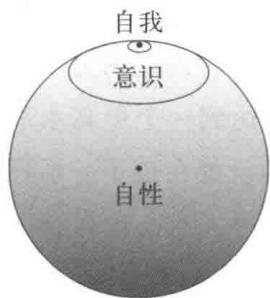

# 第九章 自性

第三章我们讲到过，荣格很早就注意到意识和无意识的互补作用,对心理整体性(psychic totality)怀有浓厚的兴趣。最能够清晰地说明荣格相关思想的是他提出的“自性”概念。这应该说是荣格心理学思想的核心，可以毫不夸张地说荣格贯穿一生都在潜心于自性的研究。按荣格自己曾经说到的那样1)，自性概念与东方的思想联系非常密切。荣格的思想像是架在东、西方文化之间的桥梁，对于致力于把西方文化带到东方来或者要想在西方传播东方文化的人来说，具有不可忽视的重要意义。首先，我们谈一下与自性有着密切关联的个性化过程。

## 1. 个性化的过程

到目前为止，我们讲到了人的类型、人格面具、阿尼玛、阿尼姆斯等等，想必大家也意识到这当中总是存在着互补关系。比如说，内向和外向、思维机能和情感机能、人格面具和阿尼玛(阿尼姆斯)等,互相与对方各处两极,但特性又互补。人类的心灵就靠着这些要素之间的动态变化支撑着，因而其构造具有整体性和统合性。荣格一直非常关注这一点。本来,我们的意识就是以自我(ego)为中心,具有一定的稳定性、统合性。正因为这样，我们作为一个独立的人格才能得到外界的承认。但是不止步于处于稳定状态的自我，即使冒着稳定性会崩溃的风险，人们也总是志于更高层次的统一性。在人类的内心世界总能找到这样的迹象。我们在第六章里谈到的幼儿园儿童的画就是心理变化的一个典型例子。在这个例子中，令人印象最深刻的是蜗牛在家里住得好好的，但好像有一种要把两者强行拉开的力量在暗中涌动。想想看，小女孩儿在家里住得舒舒服服，一直就这样子住下去不是很好吗?但就是有一种内在的力量要破坏这种稳定状态，并试图以此为起点达到一个更高水平的统合状态。过程中的努力已经形象地反映在孩子一系列的画中。像例子告诉我们的那样，实现个人内心世界存在的可能性，将自我提升到更高层次统合状态的努力过程，荣格称其为个性化过程，或者自性实现的过程，并认为自性实现是人生的终极目标。我们实施心理治疗的目的，也不外乎于此。

像幼童的例子所明示的那样，我们的意识状态即使处于稳定状态，也会产生一种突破稳定，继而引导自己向着更高层次的统合性进步的过程。这种动态的功能早已超出了意识的中心——自我的范畴，就是说，意识的状态非常稳定，自我的力量根本无法感知到变化的紧迫性。就像这个女孩子，被调皮的男孩子们欺负，被说最近很嚣张，即使冒着这样的风险，还是会有向着更高层次的统合性迈进的力量出现。荣格认为这种超越了意识领域的中心存在着可以称为自性的东西。如果说自我是意识的中心，那么自性就是包括了意识和无意识在内的心灵整体的中心。自性，是意识和无意识整合功能的中心，也可以认为是整合人的心灵内部所有对立因素—如男性的和女性的、思维机能和情感机能等—的中心。荣格在1921年出版的《人的类型》中非常明确地整理、发表了这些观点，但其萌芽早在

  
图15

1902年发表的博士论文中已经可以找到2)。在博士论文中，荣格指出，双重人格提示我们，新的人格发展的可能性遭遇到特殊困难而受到妨碍，其结果作为意识的障碍表现出来。也就是说,那时荣格就已经力图从双重人格和梦游的行为中寻找具有这种目的的意义(teleological significances)。

在那个时代，人们探究双重人格、梦游等意识障碍，基本出于临床的需求。为了说明这种现象，人们认为行为背后存在着无意识的心理过程，弗洛伊德和荣格在这方面有着共通的认识。但与弗洛伊德努力把这些还原为无意识范畴内性的动因相比，荣格基于心灵整体性导入了目的论的观点。这是两者最显著的区别。一位因同性恋和梦游而苦恼的瑞士高中男生到笔者这里来进行心理治疗，在谈到同性恋的对象时，当事人突然喊了起来：“啊，这么看来，他就是我呀！在我的内心，希望自己这样，希望自己那样，希望的样子就是他呀！”沉浸于同性爱中，睡着以后梦游去见同性爱的对象，完全是一种异常行为。但是不应仅仅从病理的视点来看这种超出常规的行为，更应该从中看到他对人生所抱的期望，看到一种不惜采取异常行为也要弥补人格中欠缺的部分，以达到更进一步的统合状态的艰苦努力。这一点非常重要。其实，通过掌握荣格有关自性的思想，我们可以从一些表面上看来有些病态或者异常的行为中，发现向着高层次努力的心灵动向。正因为这样，才能从心理治疗的工作中体验到非常重要的意义。心理治疗工作的目的不是要消灭一个高中生的同性恋行为，而是从中找出自己内心潜在的可能性，与当事人共同走过将潜在可能性整合进自我的过程。从这个观点来看，同性恋现象不失为促进这位高中生走上自性实现之路的一个起点。

就这样，荣格从双重人格等异常行为中发现了意识和无意识的互补功能，强化了他对心灵整体性的确信。特别是在接触到东方思想以后，这个观点渐渐具有了更加明确的形式。他在为1929年理查德·威廉(卫礼贤)翻译出版的德文版《太乙金华宗旨》(又译为《金花的秘密》)做的解说中更加明确地讲到这一点(3)。面对互相对立的阴阳，中国道家思想统观两者的相互作用和对立以把握全貌，可以说荣格从中受到重要的启发。他说道：“我们不能将目光仅仅放在意识的世界，要充分了解无意识的重要性，更加关注两者之间的互补作用。这样，就能够悟出我们全人格的中心已经不是自我，而是自性。”(4)也就是说，无论如何自我只能算作是意识的中心，而作为包含意识和无意识的整体的中心，产生了自性这个概念。荣格接着又解释道：“自性既是心灵的整体性，又是心灵整体的中心。自性不等同于自我，就像一个大的圆包含着小圆一样，自性包含着自我。”(5)那么，可以想来，体验这么伟大的自性一定伴随着巨大的风险。就像我们曾经讨论过阿尼玛和阿尼姆斯具有正面和负面一样，自性也同样包含着阴暗的一面。很容易想来，当自性的伟大完全吞没了自我，自我就丧失了存在的空间。换句话说，就是心灵的整体性全部沉没进无意识的世界，而无意识所具有的“时间、空间的相对性”“部分与整体的等同性”等等出现在意识范围内。精神分裂症等病症中的妄想性内容就是典型的例子，自我不具备恰当的力量时，就会面临这样的危险。与这种情形相似的还有，自性的伟大转移给自我,引起了自我与自性的同化,造成“自我膨胀”(egoinflation)。时时刻刻处于和自性正面较量的危险职业,如心理治疗师、宗教家等，比较容易陷入“自我膨胀”。本来最应该保持谦虚态度的宗教人士、心理治疗师们如果显示出俗不可耐的傲慢，也算是一种“自我膨胀”吧。也有一种人标榜自己谦虚的美德，可能没有察觉到面子上的谦虚正是靠着无意识的傲慢贴上一层衬里才得以成立。与这么危险的自性对决，自我必须足够强大。

关于在自性实现道路上自我的重要性，荣格说道：“对于自我所具有的片面性，无意识生成了补偿性的象征，意欲成为两者间的桥梁。但没有自我积极的协同姿态，事情是无法发生的。这是我们必须注意到的重要事项。”6也就是说，首先需要自我足够强大，强大到有能力主动向无意识的世界敞开大门。通过自我与自性间的对决和协作，才有可能走上自性实现的道路。从这一点可以看到，荣格在大量接受了东方文化思维的前提下，表达了与一般东方思想的不同之处。像荣格时常指出的那样，东方在很久以前就开始关注人的内心世界，特别是自性的问题，比起西方，东方思想在这些方面了解得更多。因此，东方人可能会动辄强调自性的伟大，而没有意识到这些或是以牺牲自我为前提的。为了超越个人范畴的伟大，牺牲个人存在的价值，这种观点和生活态度在东方非常有势力。或者说，被内部世界占据了整个身心，完全忘掉了和外部的联系(自我的功能正是要面对外部)。在众人面前表演水上行走的瑜伽修行者，沉到水底丢人现眼，算是一个典型的例子。不难想象，修行者一定在自己的内心世界体验过时间和空间的相对性，但把这种体验无条件地往外部世界扩展时，就出了问题。

忘记自我的存在，修行者落到水里成为大家的笑柄。那么反过来，忘记了自性存在的人又会是什么样呢？在不断地强化、发展自身意识体系的同时，无意识的事物，也就是缺乏合理性的事物、劣等的事物都被压抑住，具有强大自我的人会构建起令人瞩目的社会地位和财产等等。自己的地位、财产和工作，这些都令人感到自豪。但走到这一步的人，有可能会在某一天突然发现自己从这些东西当中再也找不到“意义”。简单说来就是，突然开始觉察到自己与自己的灵魂完全切断了关系。荣格说过，他的患者中约有三分之一就是因为搞不清楚人生的意义而来的。其中甚至还有些人外表看来对什么都很适应，但自述“就是因为适应得太好而苦恼”，这真是一个背离常理的表达。为了安抚这些人在追寻失去的心灵时表现出的焦虑，现代文明带来了很多可以暂时忘却焦虑的工具。很多人仅仅为追求刺激，看些低俗的电影或者投入赛车赛马的赌博。众多现代发明为人类节约了时间，但同时也制造出很多浪费时间的东西，如电视等等。看上去在防止走极端，但再恢复已然断裂的与心灵的接触却不那么容易。我们仅仅嘲笑落到水里的瑜伽修行者是不够的。是不是应该把电视、洗衣机什么都扔掉隐于禅寺？实际上，确实有很多人试图用禅这种日本自古的传统方法来恢复心灵，我们需要毫不含糊地承认这样做的意义。但是，要注意到很多人不是真的在寻找某一个适合自己的方法，而是到处求救，看到什么都想试一下。需要强调的是，在不失去与外界联系的前提下,对自己的内部世界也要打开窗户。消化现代文明的同时，努力与自己内心阴暗的部分建立联系，这才是最重要的。在这方面，荣格被东方的思索深深吸引的同时，坚持强调自我的重要性，主张自我与自性的相互作用和对决(Auseinandersetzung)，这些令我们不得不感受到其思想之深刻。

纸上谈兵容易，真到实际应用的场合，危险重重，路途艰难。实际上，甚至可以说，当一个人准备面对自己的自性时，也正是他最危险的时候。这时候，很多人体验到自己以往赖以生存的价值观遭到彻底的颠覆。一直对思维机能确信不疑的人，不得不面对情感机能时，束手无策，畏缩不前；非常轻视女性的男性某一天突然发现自己一举一动都带着点娘娘腔，吃惊不已。前边的几个章节中我们已经给出了很多例子，某人觉察到自己的阴影，力图将其整合进自我；具有男性人格面具的人遭遇到自己的阿尼玛。这些，都可以说是自性实现过程的一部分。而且，我想读者也早已领悟到了过程的危险性。实际上，在自性实现的道路上，我们甚至往往要背弃自己深信不疑的、绝对正确的东西。荣格说道：“什么都好的东西往往很贵，而人格发展是最高价的东西。”(7)想来这一点我们是能够赞同的。

就像前边已经探讨过的那样，当我们在内部意象的世界里追究自性实现的过程时，依次会发现阴影，接着是阿尼玛(阿尼姆斯)，然后有自性，也发现了阿尼玛和阿尼姆斯自身同样存在着阶段性，这些可以说是荣格思想的特性。但我们的目光并不局限于内部世界，借助外界和内部巧妙的结合，加之起到桥梁作用的投射机制的帮助，我们能够将内部的发展与外部发展连接在一起。因此，如果在自己的心灵内部探究阴影的人，把自己阴影的意象投射到邻近的朋友、兄弟身上，那么与这些人在现实世界中的人际关系也会很微妙地纠缠进来。内部阴影的整合取得进步时，外部的人际关系也会得到改善。内外关系错综复杂，很难说哪个是哪个的先行条件。一次荣格讲课结束后，有学生问道：“先生说的自性实在难以理解，能不能用具体的东西来说明一下自性到底是什么？”荣格回答：“现在这里的所有人，都是我的自性。”也就是说，自性实现，绝不是自己一个人的事情，这个回答非常明确地告诉我们自性实现的过程是如何与他人密切相关的。有关这个问题我们再用荣格的话重复强调一遍(8),就是“个性化具有两个主要的方面。首先是内部的和主观的综合过程，同样不可缺失的另一面是客观关系的过程。某一面在某一时刻或许会占据优势的地位，但仅有一面是绝对不能够存在的”。有人把心理分析理解为“通过分析了解自己”,好像把自己的内心放在显微镜下窥视一样。这样的人一旦开始心理分析，早早地就不得不面对改变与他人的关系，甚至与对方对决等重要的人生课题，开始品尝“心理分析”的苦酒。因为，在割裂了与他人的关系的前提下仅仅了解自己，是不可能存在的。笔者也是在分析的过程中频繁地体验到荣格所说的内部和外部过程的巧妙结合，痛感自性实现的道路上内外两面的深刻意义。“心理分析”过程，对当事人持续不断地提出要求，这就需要既活出自己的内心，也活出自己的外部世界。

荣格提出的自性实现的思想，以及思想中包含的对人类内心成长的所有可能性的信任，反映到其后很多心理治疗学派的思想体系当中(直接受影响的例子并不多见)。但在美国，人们看待自性实现时，只盯着光明的一面而忽视了荣格提到的很多阴暗部分，我个人认为有些盲目乐观的倾向。作为从事心理治疗的一员，深深了解相信人成长的可能性是非常重要的，但是也必须清醒地认识到伴随着自性实现的危险和痛苦。自性的问题，也同样表现出荣格心理学的特征。我们不应仅仅停留于对其存在的假定，而要努力把握自性的象征性表达,持续不断地研究下去9。这点，我们换一节来讨论。

## 2. 自性的象征性表现

前边说到过，自性实现是人生的终极目标。但并不意味着存在一个静止的终点，能让我们把这个终点命名为自性实现。从前一节讨论中已经可以很明确地看到，自性实现是一种持续不断发展的过程，过程本身就是人生的重要意义。现实中，我们不可能完全了解自性本身，只能通过自性的象征性表现将其功能意识化。能够这样把握到的象征会以各种各样的形式浮现出来。像我们曾经讲到过的那样，阴影、阿尼玛和阿尼姆斯会以人格化的形象出现，自性也会被人格化。自性的人格化会产生一种超出人类的性格，比如说,对男性来说是智慧老人，女性则往往以至高无上的女神形象在梦中出现。这种人格意象经常出现在童话当中，主人公陷入重重困难找不到出路的时候，会突然出现一个饱含智慧的老者，给出忠告或者建言。实际上，在我们的自我面对问题且经过意识层面的种种努力依然打不开局面陷入绝望时，自性的功能就开始启动。自性在远高于我们现在所处的层面有过解决问题的体验，因而老人出现的方式生动地表达出自性的功能。有关这样的老人，荣格在《童话中的精神现象学》中曾举例做过说明(10),他们都有着常人无法企及的洞察力。荣格举的高加索童话的例子中，王子殿下要造一座谁都挑不出缺点的完美寺院，一位老人出现了，提出意见：“太可惜了，基石不大端正。”王子听说，马上按老人的意见重建。老人又发现缺陷，又重建，就这么重新盖了三次。故事中的老人就具有这么不可思议的智慧，别人眼中完美无缺的东西他能看得出缺陷。东方文化中的仙人正是这一类人物的典型。芥川的《杜子春》中出现的仙人就是一个好例子。还有就是扑朔迷离的老子人物意象,在中国人和日本人的心目中都占据了重要的地位。在“老子”的名义之下，凝聚了东方人怀抱的“智慧老人”意象，历年经久，形成一个完善的人格形象。我们前边看到的梦中白色祭司和黑色祭司的例子，可以说也是具有这方面浓厚意义的人物形象。如果是女性，则以大地母亲、至高无上的爱神等形象出现。灰姑娘想去舞会时来帮助她的仙女，就是一种典型，在主人公束手无策的时候出手来搭救她。

自性的人格化形象，不局限于我们刚才提到的这些老人形象，有的时候也会是孩子。“具有老人智慧的孩子”，看上去很矛盾，但实际上强调的是自性实现过程的“逐渐形成”(becoming)特性。作为自性以儿童的形象出现的例子，可以参考圣克里斯托弗的故事11)。克里斯托弗非常强壮有力，所以立志伺奉最强大的人。最初做国王的随从，但看到国王很怕恶魔，就去跟随恶魔。接着发现恶魔很怕十字架，就决定如果能找到基督，那么从此就侍奉基督。寻找最强者的过程中，一位牧师指点他在一条河的浅滩那里等着。克里斯托弗听从了牧师的忠告，等在浅滩。一边把很多需要过河的人背过去，一边静候着基督的出现。一个暴风雨的夜晚，有个小孩子来请求他背自己过河，他想着小孩子这么轻，应该是很容易的一件事，就背着孩子过河。谁知道，背上的孩子越来越重，他的脚步也越来越沉重，越来越缓慢。终于到达河岸时，他感叹着“简直像背负着整个世界一样”时，突然醒悟到原来背上的正是他一直在等待的基督。接着，基督宽恕了他的罪恶，给予他永远的生命。

故事里有着儿童形象的基督意象，可以反映出自性多方面的要素。克里斯托弗尽管非常夸耀自己的强壮，但在背负一个孩子的时候却感觉到力不从心，非常形象地说明自我所谓的强大相对于自性来说是那么的无力。然后他极力负重前行，说明了自性实现的道路总是伴随着艰苦的负担。荣格说过，自性实现的代价非常高。现实当中如果可能的话，自性实现可以说是一条让人避之唯恐不及的艰难道路。神经症的患者，就是因为拒绝了自性实现的苦难而不得不体验另一种形式的苦难，这也说明患神经症的人内心具有自己还未曾察觉的发展的可能性。自性以儿童的形象出现，既说明了无限发展的可能性，反过来，也让人一眼看上去觉得非常微弱，没什么价值。克里斯托弗一开始只觉得不过是个小孩儿而已，实际上却是背负着全世界一样沉重的基督，毫不在意地把孩子放在肩上以后，才体验到事情之重大。故事当中，克里斯托弗接受了孩子的请求，背他过河。但很多人会觉得一个小孩子的话有什么好听的，不用管他。以直觉机能为优势机能的人往往比较轻视感觉机能，内向的人看不起外向的人，互相懒得搭理，就会发生这样的事情。可以说这些人就是在人生的过程中把珍贵的诞生新生命的机会生生地扼杀掉(参见人工流产的梦)。

能够正视自己内部劣势的部分并将其整合进自我，这种努力称为自性实现。当自性的象征强调这种统合性时，会以相反的事物合二为一的男女结合的姿态体现出来。正所谓阴阳的结合。很多童话都是以王子与公主结婚为主题,就是一种例证。前一章讲到的普绪喀和丘比特的故事也是这样,不得不将阿尼姆斯整合进自己的意识当中的普绪喀，经过重重苦难终于和丘比特结合在一起，故事得以完结。相对于以合二为一表达出的整体性，缺失一半的象征在童话里往往以结婚当天新娘或是新郎走失了、变成石头了等形式来表达，梦中也会出现同样的主题。当整体性的象征不以人格的形式，而是以几何图形的形式表现出来时，就是曼荼罗。

对患者梦中或者幻想中看到的以圆、方形等为主题的象征性图形，荣格注意到其中存在着从患者心灵内部自发地产生的东西。这些图形出现的意义，有些对患者本人来说可能难以理解，但经常伴随着安宁的感觉、和谐的情感，有时甚至能让人感受到治愈的起点。荣格非常重视这些现象。后来当他接触到中国西藏地区的文献，了解到在东方以圆和正方形为主题的各种各样的图形具有深刻的宗教含义，被称为曼荼罗。荣格从中感到东西方文化的呼应，被深深地吸引了。荣格从患者那里搜集过很多象征图形，这些不可能都是当事人事先对东方曼荼罗有所了解才画出来的。对提出人类集体无意识概念的荣格来说，这个现象当然具有特别的意义。原本曼荼罗是梵语，词义有很多。根据栂尾祥云的《曼荼罗之研究》(12)所述，在印度最古老的文学《梨俱吠陀》中，曼荼罗意为“区分”，而巴利圣典《长部》中则表示“圆环”，密教中则表达本质、道场、坛、聚集这四种概念的集合。关于曼荼罗代表着“本质”这一点，我们可以引用栂尾的文章(13):“原本曼荼罗(mandala)是由词干曼荼(manda)加上词尾罗(la)构成的。曼荼意为心髓本质,用于味道则指将牛奶精炼再精炼以后的醍醐味。罗是梵语的词尾,意为所有、成就，因此曼荼罗就是具有本质心髓’的意思。”

这里引用的曼荼罗的词义，与荣格的自性象征的表现有着相当高的一致性。只是东方的曼荼罗作为宗教冥想的对象而存在，具有比较高的普遍意义，而荣格提倡的思想则侧重于个人的梦和幻想(当然，东方的曼荼罗也有些是从梦或幻想中得到启发)。荣格说到，在某个人经历心灵分离或丧失统合性时，内部意欲整合心灵整体的作用便以曼荼罗的形式表现出来。“这很明显是自然产生的自我治愈(selfhealing)的尝试,并不来自意识的自我反省，而是本能的活动。”(14)幼儿园孩子画的彩色图的第Ⅳ图就是一个很好的例子，几何性的图(花坛)恰好表达出失去统合性(家和蜗牛分离开了)的心灵在内部完成“愈合裂缝，再度走向统合”过程时自性的曼荼罗。我们多加关注，就能发现儿童在面对这样的危机并试图摆脱困境时，经常会画出曼荼罗式的画(15)。或者如图11,荣格从患者们画的曼荼罗中选出来的一幅，这是成人画的，所以表现形式比起幼儿的显得更加精炼。西方患者画的曼荼罗，在荣格的著作中有不少例子，大家可以参照原文16。曼荼罗，可以是最简单的圆，也可以是前边那些比较复杂的图形，甚至有立体的曼荼罗。这些表现通常由“四”的主题构成，但也有“圆”和“三”“五”构成的超出常规的表现。虽说不是曼荼罗，第七章第五节最后梦的系列中，三位男性和一位女性的组合，由第四位陌生女性引导顺河流而下，可以解释为表达了四这个数的完整性，以及阿尼玛作为通向自性的中介所起到的作用。

一个人意识到分裂的危机或者感觉到强烈缺乏统合性，但又没有好的解决方案处于困境时，会通过曼荼罗的出现以获取心灵的平静，进而向着新的统合状态努力。我们在工作中见到这样的过程时，不得不对人类追求内心世界统合状态的趋势、人类具有的自我治愈能力而感铭于心。既有曼荼罗几何学精密的特征又贵重得难以轻易人手，这两种特性重叠起来，宝石经常就会成为自性的代表。在童话中，主人公为了寻找宝石历尽千辛万苦的故事不胜枚举。在日本，可能因为原本宝石就比较少，于是赋予了石头很重要的意义。但比起宝石的几何精密性，往往更强调石头在自然姿态下的美学和宗教意义。这些和西方的情况作一下比较，非常有趣。比如说西方的庭院，在正正方方的院子中央设置一个圆形的喷水池，四角竖起塑像，总是非常重视几何形状。而日本的庭院，几乎在所有的方面都极力回避几何的对称性。正因为双方都具有深刻的宗教含义，不同之处尤其引人关注。

如果要强调自性中至今尚未开发出的特征，其象征经常会以动物的形式表现出来(童话中总是有帮助主人公的动物出现)。这一部分我们就略去不谈了。总之，以上我们已经列出了自性主要的象征，这一节就到此结束吧。下一节我们讨论一下自性实现过程中的“时间”问题。

## 3. 自性实现中的“时间”

前边已经说到“自性实现的代价很高”，绝对不是在地上捡起个大钱包那样的甜蜜故事。自古有很多故事，描写为了找到埋藏的宝藏费尽九牛二虎之力、克服重重困难之后方得结果。自性实现的过程中一定伴随着这样的苦难。有时甚至具有很强的破坏性，使得自性实现的过程沦陷为自我灭亡。我们借助荣格举的典型例子来做一说明(17)。

这是一个一般劳动者经过多重辛苦后终于获得成功、成为企业经营者的事例。最初他仅仅是一家工厂的印刷工人，经过二十年的不懈努力，终于有了一家自己经营的大规模印刷企业。企业的生意非常兴隆，这位当事人越来越热衷于工作，所有的精力都投入其中，无暇旁顾。正是因为他热心于工作，才筑成了事业发展的基石，但这个热情也引导他走向毁灭。几十年的努力过程中，他压抑了生活中其他一切需求，专注于工作，作为补偿，记忆当中强烈地浮现出幼年时期对绘画和图案的爱好。如果仅仅把事业之外的能力与自己幼稚的欲望联系在一起，接受这个现实，让它成为一种业余爱好，应该不会出什么问题。但长年受到压抑的愿望之强烈，不允许他将其局限于平淡无奇的余暇兴趣领域里。于是，他试图将自己印刷公司的产品都做得更加具有“艺术性”，而且真的行动起来去现实中实施这个空想。按照自己幼稚的、未成熟的喜好制作自己公司的印刷产品，没过几年，事业理所当然地以破产而告终。回头反思这个过程很容易看出，在现代文明的社会里不惜牺牲一切、一心不乱地努力实现自己追求的目标，行为过于极端时，内心受到压抑的幼稚欲望积蓄起来，反倒击败了在社会上已经获得成功的自我。他倾心灌注给事业的心理能量，不断地向外扩张、流淌，当事业到达顶峰“时”，心理能量转向内心世界，开始逆流。对于本人来说，本来静静地待在内部世界，具有崇高意义的绘画、图案，终于与外部世界混为一谈，当事人试图把它们作为商品输送给外界。这正是走向毁灭的关键。如果他能划分清楚内部和外部的界限，不把事业和爱好搅和在一起，认识到内心世界幼稚的一面，并逐步摸索出与之相处的方法，我想他的自性实现过程不会迎来这么惨烈的结局。这个例子，给我们明示了自性实现的危险性，也说明全神贯注于事业发展的当事人，迎来了不得不关注内心世界的时刻。这里，我们来仔细探讨一下时间的问题。

如例所示，荣格时常反复强调人生的后半部分会出现这种重要的时机。青春期，作为人确立自我意识的重要阶段得到众多学者的重视，除此之外，荣格还强调了人生走到后半时的转换期,四十岁左右时的重要性(18)。如果把人生看作是自性实现的过程，那么它就必须具有保持发展、进步不止的性质。但实际上人生并不是一个均匀的发展过程，而是会在一些特定的时间段呈现出比一般时期更加强烈的趋势。众所周知的第一、第二反抗期，就是表现比较显著的时期。比起之前的时期，我们会更加努力地要求确立不同于以往的自主性。这种具有飞跃性的时期，必然是“危险的年龄段”。为了飞跃而积攒的能量，时常会发挥其破坏性，因而形成该年龄段多发的反社会性和反社会行为现象，将自己与他人都拉进泥坑。在这两个显著的反抗期之间，六岁(小学入学之前)和十岁左右(小学三、四年级)时，不像这两个反抗期这么明显，但也有类似的时期(可以参照第六章绘画的六岁孩子和第四章第三节的九岁洁癖男孩的例子)。我们不再继续讨论这些阶段的详细情况，但是要理解内心世界的发展阶段到某种程度具有与年龄相关的特性。

关于表现与年龄相关的发展阶段，日本人内心根植着一个理想的姿态，那就是孔子著名的语录。不惑、耳顺等等词汇已经成为年龄的别称。除了孔子的理想人生阶段的表述，格林童话中也有关于人的寿命的简单故事，直白地表达了一般人的成长阶段。这是个比较欢快的故事。上帝给了驴子三十年的寿命，驴子实在受不了每天繁重劳动的折磨，讨厌漫长的生命，于是上帝答应给他减去十八年寿命。接着，狗、猴子都开始嫌寿命太长，上帝给他们分别减去了十二年和十年。只有人觉得寿命太短实在遗憾，要求增寿，上帝就把给驴子、狗、猴子减掉的十八年、十二年、十年合起来都加给了人,这样，人就有了七十年寿命。人还不满足，但也没办法只好退下去。从此以后，人在过了三十年像人一样的日子以后,接着就是十八年驴子一样辛苦劳作的年月，然后像一只即使想咬人但是牙都掉光的老狗一样过活，最后等待人的是十年猴子一样的孩子气的生活。这个故事，形象地说明了人生的阶段。实际上，如果所有的动物都在自然状态下生活的话，也就不会发生祈愿寿命的事情，按照本能生活、按照本能死去就好。但是动物中只有人拜托上帝延长自己原有的天然寿命。有趣的是，上帝也没办法无限给你延长，只能把其他动物退回来的那些加到人头上。可以说，这个故事既承认了上帝与一般自然物不同之处，同时表明上帝也必须在自然规律的范围内行事。按照这个故事所讲，延命之后的人生谈不上非常幸福，对于现代人来说,好不容易得到的七十年的寿命总不能像故事里那样动物般地活着，得活得像个人样吧。有些人不畏惧上帝，制造出各种各样长生不老的药，期待比七十年的寿命活得更久。但无论多么乐观的人，也不会认为通过吃药(至少在科学的范围内制造出来的药)就能够永远回避死亡吧。

这样，在三十岁以后的人生阶段，如何不像驴、狗和猴子一样生活，就是我们作为人的重要生存意义。但是，人在这上边比较容易犯的错误是期待自己前三十年的生活丝毫不变地延续到七十岁。他们固执于自己前三十年的人生，依旧想以“年轻”“强壮”为卖点而努力,热心工作、扩展事业。然后就像我们刚才的例子那样，给别人看的成功到了突然止步的时刻，已然活到五十岁的人，一直无暇顾及自己的内心成长，精神上还像是三十岁的年轻人。接着，就身不由己地从年轻时代直接跌落至“猴子的年代”。为了避免这样的事态，我们不能永远执着于三十岁之前的人生，而是到了四十就过四十岁的日子，到了五十就像五十岁一样生活，充分地按适合自己年龄的样式生活。人生的时间阶段是非常重要的事情。人已经到了六十岁，为什么紧紧抱住三十岁的青春不愿意放手?六十岁一定有六十岁的味道。荣格也曾经叹息：自古以来的“老年智慧”跑到哪里去了?19在美国，老年人总喜欢以依旧年轻力壮而自豪，父亲变成了儿子的好哥哥，母亲则恨不得成为女儿的妹妹。形成这样混乱的局面，或许是以前无条件地尊重老人的逆反心理造成的，但走到这么极端的地步，也真让人闭口无语。我们如果真的想以人的姿态活过自己的完整人生，就不能一味地追求表面虚荣的成功，在人生的后半段就需要活出“用走下坡路的方式成就自己的事业”这样自相矛盾的精彩。荣格这些关于人生后半段的论述对东方人来说或许不是什么新鲜的观点。我们甚至不必搬出孔子来，看看东方的宗教、哲学等，可以说到处充满着“老人的睿智”。那么我们是不是就可以说把荣格的思想介绍给日本人是完全没有意义的呢？事情又不是这样。就像我们刚才讲到的美国父母，不能说日本就没有年轻夫妇正朝着这样的理想在努力。

刚才讲到，人一般会在特定的年龄段感觉到自性实现的迫切性。但对某一个具体的人来说，这样的“时刻”究竟什么时候会来临却是不确定的。而且经常会在本人完全料想不到的时候突然出现。过于潜心于工作、所有的精力都花费在工作上的印刷工厂经营者，少时的记忆突然浮上心头，不由地想做点什么。正好在个人的事业走完了上升之路，接着要转向急剧下坡路的节点上，这个“时刻”悄然到来。或者第四章游戏疗法中的孩子，沉浸在游戏中手、脸脏得一塌糊涂，第一次主动地去洗手，从治疗师手上接过手帕的“时刻”，也完全超出治疗师的预想，不期而至。我们要区别对待这样“具有深刻意义的时间”与时钟测定的“时间”。按照保罗·蒂里希1的定义,我们把前者的时间称为“kairos”2,即具有重大意义的时刻,后者的时间称为“chronos”3(20),即单纯的时间。自性实现的问题与“kairos”密切相关。比如说一直很外向的人到了不得不挖掘内向生活意义的时候，或者一直专心学习对于女性交往毫无兴趣的人突然遇到了倾心的异性,如果忽视了这种“kairos”的重要性，在自己自性实现的道路上就会误入歧途。但一门心思地只专注于“kairos”,而忘记了“chronos”,也蕴含着生存必需的人格面具遭到破坏的危险。上下班的时间、面试时间、剧场的开演时间、和恋人约会的时间，这些都是我们作为一个在社会上生存的普通人必须遵守的规则。当然也有目光只盯着表面的“chronos”,对不期而遇的“kairos”完全无感的人。现实当中，与恋人约会、有幸遇到令人惊叹的艺术品等等正是有可能成为“kairos”的重要时刻,却不得不遵循着无味的“chronos”的规矩，这可能是我们这个时代的悲剧吧。最能说明问题的例子就是相扑力士的对峙时间限制吧。本来，角力的精髓不就是建立于“kairos”的对峙吗？所以，原来比赛时对力士的对峙完全没有时间限制，到了现代，体育运动的时间表需要遵守的外界限制因素越来越多，反倒丢弃了本质的要素。体育运动被“chronos”支配了，但事情按照“kairos”运行才是仪式的本质。很容易能联想到，自古以来，力士的角力比赛就具有作为宗教仪式而存在的意义(奥林匹亚的仪式也同样变容为现代体育)。可以说，正是为了打破在仪式和体育、“kairos”和“chronos”之间进退维谷的窘迫状态，人们才找到了时间限制的妥协方案。因此，在相扑角力中的某些地方还遗留着一些过往的宗教性，横纲既有作为宗教仪式最高祭司的意义，现实中又代表着最强大的运动员。在崇拜者以及力士本人心中，这两者的形象交织在一起，横纲本人也会演绎出自己的人生悲剧。

在自性实现的重要“时刻”，我们往往会遇到一些不可思议的现象。一股脑地把这些现象都归结为“偶然”，这“偶然”的意义又过于深刻。比如说，一直对绘画没有任何兴趣的人，梦到跟朋友一起去画展。就这个梦跟分析师一起谈到为了发展自己的感觉机能,去看看画展可能也蛮有意义的。回到家，就接到梦中那个朋友的电话，约他一起去看画展。这就是平常人们说的梦的预言，我们在讲到预知梦的时候也举过例子。还有第一章的例子中，修洗衣机，洗衣机修好的日子刚好孩子的尿床症也治愈了。荣格非常重视这种“有意义的偶然一致”(meaningful coincidence),认为这是不同于因果律的规律，作为非因果性的一种准则，称其为“共时性原理”(21)。也就是说,所有的自然现象中,有能够用因果律解释的现象，也存在着用因果律无法解释但有意义的事情同时发生的现象。为了能够把握后者的性质，荣格提出了共时性的概念。可以说，从事心理治疗工作的人，职业就对应着人类的心理现象，会比其他行业的人更多地遇到共时现象，特别是在心理治疗迎来转机的时候比较常见。有过这么强烈的体验，连当事人本人都会发出感慨：“就这么样偶然加上偶然，再也不能说是单纯的偶然了吧！”这可以说是一种对共时性感受的形象表达。但如果再多迈出一步，企图用因果关系来说明共时现象，马上就会陷入伪科学(魔术)的泥淖。他因为梦到死去,所以死了;我因为请人祈祷了，所以病好了等等，就属于这一类吧。迈耶把共时性的概念又推进一步，认为解决当代多发的身心障碍，共时性的思想可以成为一个突破点(22)。也就是说，摒弃“因为心理有问题，所以身体受到伤害”，或者“因为身体出故障了，所以心理状态越来越差”这样的因果式的思维方式，在这个前提下去努力解决精神身体医学（psychosomaticmedicine)的现象(当然，其中有一些现象也是可以用因果律解释的)。

我们按照共时性的原理来看待问题时，不是去思考“什么是什么的原因”，而是专注于“什么和什么同时发生了，它们是通过什么样的意义联系在一起的”。后一种思维方式，中国人特别擅长。《易经》，就充满了这种类型的知识。不把事象按照因果关系排列进时间序列，而是抓住事象整体，努力从中发现反映全局的“象”。有人认为，中国自古以来文明非常发达却没有带来现代自然科学的繁荣，原因就在这里，中国人(东方人)的思维缺乏逻辑性。但笔者不赞同这一点，我认为中国人(东方人)的思维具有充分的逻辑性。自然科学在西方而不是在中国发达起来的原因不在于逻辑性，而是看待事象万物时态度的根本不同。把“象”作为“象”来把握，非常困难。所以很容易流于用因果关系去说明有关“象”的知识，这样瞬间就陷于迷信的范畴，更加阻碍自然科学的发展。在西方，自然科学得到了充分的发展，但把非常“丰富”的“象”的一面深深压抑下去，使得自我失去了与存在于心灵深处的自性的接触，将自己置于危险的境地。在西方，近年不得不花大力气去解决“人际关系淡薄”的问题，原因也就在这儿吧。

共时性的概念与自性的问题关联密切，我们在这里简单地做了一些说明。这个概念对科学方法论的发展具有重要的意义(23),有兴趣的话可以参照荣格的原著。

## 参考文献：

(1) Jung, C. G. , & Wilhelm, The Secret of the Golden Flower. Routledge & Kegan Paul, 1931.

(2) Jung, C. G. , On the Psychology and Pathology of So-called Occult Phenomena. C. W. 1, pp. 33–88.

(3) Jung, C. G.，& Wilhelm，同(1)。

(4) Jung, C. G. , Two Essays on Analytical Psychology. C. W. 7, pp. 175 – 176.

(5) Jung, C. G. , Concerning Rebirth. C. W. 9, I, p. 142.

(6) Jung, C. G., Fundamental Questions of Psychotherapy. C. W. 16, I, p. 123.

(7) Jung, C. G. , & Wilhelm,同(1),p. 92。

(8) Jung, C. G., Psychology of Transference. C. W. 16, p. 234.

(9）在意象和象征的世界里捕捉自性以及自性实现的过程，可以说是荣格一生的使命。本书几乎没能就此做出叙述。下边这些著作都非常重要，有兴趣的话可以参照阅读。

Jung, C. G. , Psychology and Alchemy. C. W. 12.

Jung, C. G. , Aion: Contribution to the Symbolism of the Self. C. W. 9, Ⅱ.

Jung, C. G. , Mysterium Coniunctionis. C. W. 14.

第一篇著作中阐明了中世纪炼金术的过程里如何投射了自性实现，第二篇探究基督形象作为自性的象征意义，第三篇著作注重于研究自性以对立事物合一而成来表达的特征。

(10) Jung, C. G. , The Phenomenology of the Spirit in Fairytales. C. W. 9. I, pp.207-354.

(11) von Franz, M-L. ,The Process of Individuation,这是荣格晚年编辑的解说集“Man and His Symbols”(Aldus Books,1964)中收录的故事(p.218)。这本书笔者也最近才拿到手,未能在本书中多加引用，非常遗憾。这本书可以说是荣格留下的唯一的通俗解说，非

常容易读懂，因此推荐给有兴趣的非专业的读者。

(12)栂尾祥雲「曼荼羅乃研究」高野大学出版部、一九三二年。

(13)栂尾祥雲、一—二頁。

(14) Jung, C. G. , Mandalas. C. W. 9, p. 388.

(15)登载有儿童画的曼荼罗的例子参见:Jung,C. G.,Man and His Symbols. p. 165.

(16)曼荼罗的例子参见： Jung, C. G.，The Archetypes and the Collective Unconscious. C. W. 9, I.

(17) Jung, C. G. , Psychological Types. Routledge & Kegan Paul, 1921, pp. 424-425.

(18) Jung, C. G. , The Stages of Life. pp. 387 − 403.

(19)同上，p.400。

(20)这里借用了保罗·蒂里希的名词，实际上，我们这里用到的意思与原义还是略有差异。

(21) Jung, C. G., Synchronicity: An Acausal Connecting Principle, C. W. 8, pp. 417 –519.

(22) Meier, C. A. , Psychosomatic Medicine from the Jungian Point of View. J. Analytical Psychol. , 8, 1963.

(23)发表共时性原理时，荣格是与著名物理学家泡利(Pauli)以论文的形式联名出版的。这个事实本身意义非凡。

Jung, C. G., & Pauli, Naturerklärung und Psyche. Rascher,1952. (英译: The Interpretation of Nature and the Psych. PantheonBooks,1955.)这里,荣格和泡利阐明：因果律之外，还需要纳入共时性原理作为说明自然物和心理现象的共同原理。
